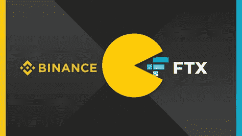
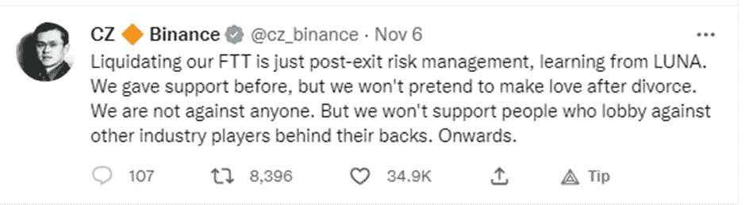
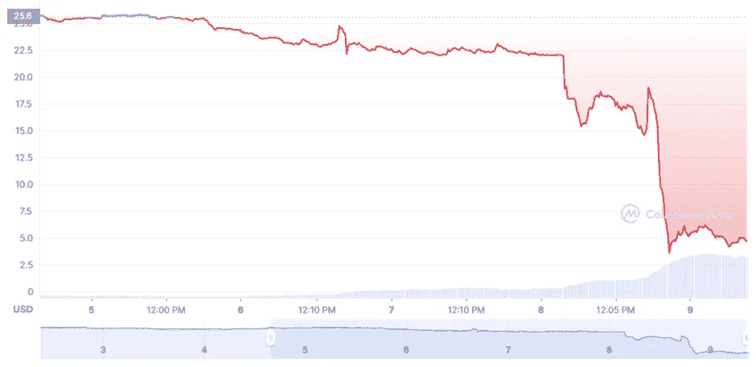
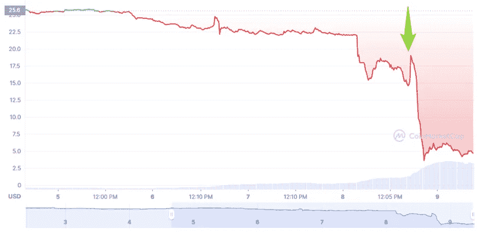
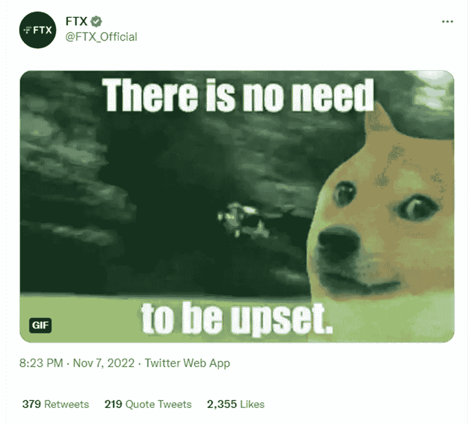

# 币安收购 FTX。昌鹏藻是新的埃隆马斯克吗？

> 原文：<https://medium.com/coinmonks/binance-to-acquire-ftx-is-changpeng-zao-a-new-elon-musk-c4d8d1a3cb21?source=collection_archive---------9----------------------->

Source: [https://coinhirek.com/binance-acquires-ftx-over-liquidity-crunch/](https://coinhirek.com/binance-acquires-ftx-over-liquidity-crunch/) — edit by Authro

当我第一次读到币安收购 FTX 的消息时，我非常困惑。所以，如果你问自己“**币安收购 FTX 是不是一个好消息**”，这是我的观点。

我一直认为，不同的交易所进入市场是必要的，以保证某种分散化。

*老实说，我没想到会这样。*

当市场开始一场胆怯的牛市运动时，我认为这可能是像埃隆·马斯克在 2021 年那样的举动。你可以看看他的一些推文[和市场的反应。](https://www.vox.com/recode/2021/5/18/22441831/elon-musk-bitcoin-dogecoin-crypto-prices-tesla)

## 让我们创造历史吧

金融是 FTX 的早期投资者，在推出后，FTX 开始变得强大，很快成为一级交易所，很快成为币安的直接竞争对手。

币安还有什么兴趣继续向一个从他们那里窃取市场份额的竞争对手投入这么多呢？

他们应该卖掉 FTX，但不想让它成为垃圾场或其他，所以他们同意在 FTT 拿走大约 20 亿美元，这是用来支付 FTX 费用的象征。FTT 实际上没有太多的流动性，所以币安发现某种 2B 美元陷入了流动性不足的市场，并从中获利。

Source: [https://twitter.com/cz_binance/status/1589374530413215744](https://twitter.com/cz_binance/status/1589374530413215744)

对于 FTX 的用户来说，币安将出售代币当然是个坏消息，尤其是对于 FTT 的持有者。但是当新闻发生时，出售并没有完全发生。可能一些来自币安的 FTT 代币在那里被出售，但是让我们看看在最后的日子里发生了什么。无论如何，一些恐慌卖家(这次完全正确)开始出售 FTT 代币。

为了保持市场稳定，阿拉梅达的做市商开始做市，以支撑价格，避免 FTT 代币出现太大的外流。但是一些关于阿拉米达实际潜在覆盖范围的泄漏正在传播，似乎阿拉米达的口袋并不像许多人认为的那么深(和满)。

FTT token price: Source: [www.coinmarketcap.com](http://www.coinmarketcap.com)

第一次销售发生在 11 月 8 日(昨天，我写这篇文章的时候)世界协调时间凌晨 1:40。

11 月 8 日，有消息传出，币安签署了一份收购 FTX 的非约束性意向书。对应于下图中的绿色箭头

FTT token price: Source: [www.coinmarketcap.com](http://www.coinmarketcap.com) edited by author

当看涨情绪出现在 FTT 代币持有者身上，也使 BTC 市场飙升时，FTT 却被浇了一盆冷水，价格下跌了 80%以上。

比特币遭受了同样的冷水，但由于比特币市场的交易量更高(且不那么集中)，下跌幅度被限制在 12%左右。

因此，当 FTX 及其创始人开始发帖表示保持沉默时，币安很可能会做出最后一步，扔掉这个代币。

Source: [https://twitter.com/FTX_Official/status/1589700016419254273](https://twitter.com/FTX_Official/status/1589700016419254273)

依我拙见，币安在 FTX 投资，他们感到不舒服，他们制造谣言，通过社交媒体制造恐慌，让他们最大的竞争对手崩溃，以尽可能低的价格收购。

## 我在这件事上的职责是什么？

我个人讨厌这种动态，因为它确实威胁到加密货币生态系统的真正去中心化。这就是为什么我一直建议我的同事将他们的加密货币放在分散的系统中(钱包、DEX 等等),以确保他们有自己的钱。否则，即使他们建议为交易所基金做 Merkle Tree，我们也永远无法确定交易所在用我们的基金做什么。

你在评估赌注吗？寻找分散的系统，不要被更大的百分比或更容易的路径所迷惑。
你在交易吗？在交易所里只保留你用来交易的活跃资金，其余的放在冷钱包里。

还有一点:币安当然可以做到这一点，因为他们是市场上最强的。但要做到这一点，成为最强者并不总是足够的:你必须足够勇敢、聪明和贪婪，才能实现这一目标。

**附加**:我不能说“幸运”或“不幸”，但也许[有人会调查这次合并](https://www.coindesk.com/policy/2022/11/08/ftx-binance-deal-draws-antitrust-concern/)。我不完全相信人类的法律，但是看起来他们也可以工作！

> 交易新手？尝试[加密交易机器人](/coinmonks/crypto-trading-bot-c2ffce8acb2a)或[复制交易](/coinmonks/top-10-crypto-copy-trading-platforms-for-beginners-d0c37c7d698c)