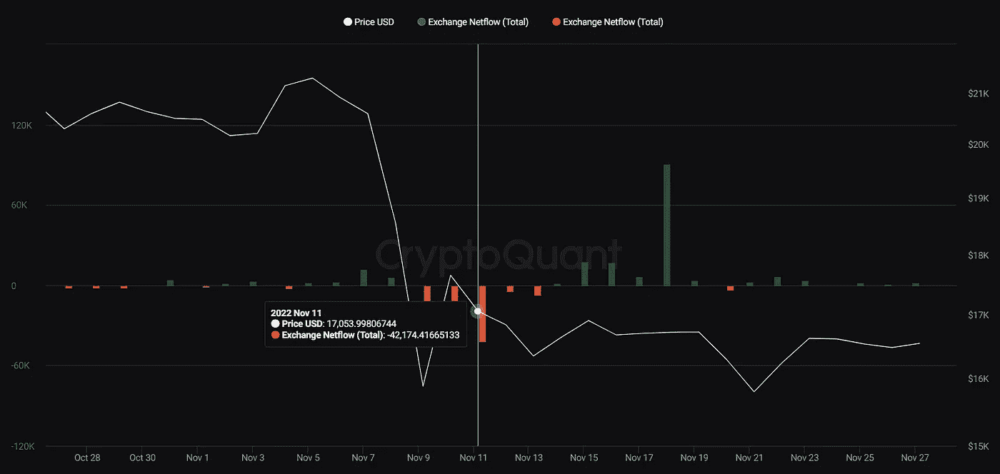
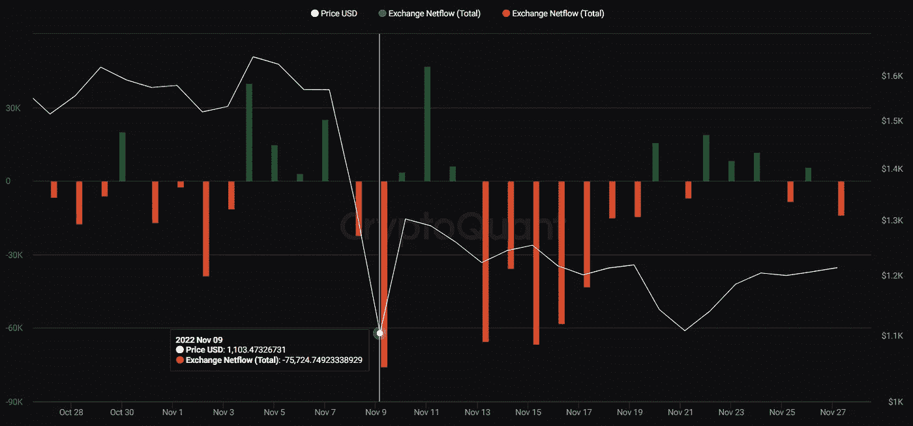
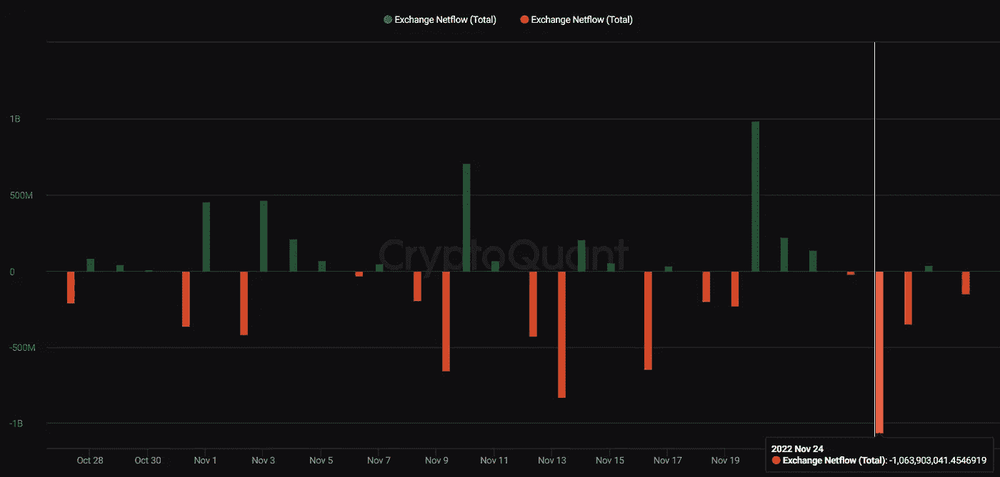

# FTX 崩盘后，币安用户纷纷退出交易所

> 原文：<https://medium.com/coinmonks/binance-users-head-out-of-the-exchange-after-ftx-collapse-ee883d92aaff?source=collection_archive---------30----------------------->

对密码行业至少有点兴趣的人都知道这个密码市场的巨人。币安首席执行官 CZ 正在积极促进其交易所的稳定性，甚至[提议为加密交易所建立一个恢复基金。](https://www.observers.com/binance-proposes-a-recovery-fund-as-exchanges-face-liquidity-crisis/)然而，FTX 的崩溃搅动了包括币安在内的整个密码行业。

从 11 月 7 日开始，币安交易所的 BTC 净流量指标(流入—流出)开始大幅波动。11 月 11 日，创下当月历史新低。用户已经从平台上撤回了超过 4.2 万个 BTC。

BTC Netflow on Binance. Source: [CryptoQuant](https://cryptoquant.com/asset/btc/chart/exchange-flows/exchange-netflow-total?exchange=binance&window=DAY&sma=0&ema=0&priceScale=log&metricScale=linear&chartStyle=column)

即使在 FTX 崩溃之前，币安平台上的以太网流量指标也是不稳定的。最有可能的是，它是由发生在九月份的[合并引起的。](https://www.observers.com/the-merge-it-happened/)尽管如此，以太网的净流量指标在这个月的大部分时间都低于零。用户在 11 月 9 日(超过 75，000 ETH)、11 月 13 日(超过 65，500 ETH)和 11 月 15 日(超过 66，000 ETH)从平台大量撤回乙醚。

ETH Netflow on Binance. Source: [CryptoQuant](https://cryptoquant.com/asset/eth/chart/exchange-flows/exchange-netflow-total?exchange=binance&window=DAY&sma=0&ema=0&priceScale=log&metricScale=linear&chartStyle=column)

Stablecoins 也不例外。在一周的时间里，超过 10 亿美元的稳定硬币被从交易所取出。

Stablecoins Netflow on Binance. Source: [CryptoQuant](https://cryptoquant.com/asset/stablecoin/chart/exchange-flows/exchange-netflow-total?exchange=binance&window=DAY&sma=0&ema=0&priceScale=log&metricScale=linear&chartStyle=column)

FTX 的崩溃极大地震动了整个密码行业。许多用户担心流动性问题可能会波及其他交易所。反对“高风险”指数的集中交易现在受到了冲击。我们继续观察接下来会发生什么。

> 交易新手？试试[密码交易机器人](/coinmonks/crypto-trading-bot-c2ffce8acb2a)或[复制交易](/coinmonks/top-10-crypto-copy-trading-platforms-for-beginners-d0c37c7d698c)