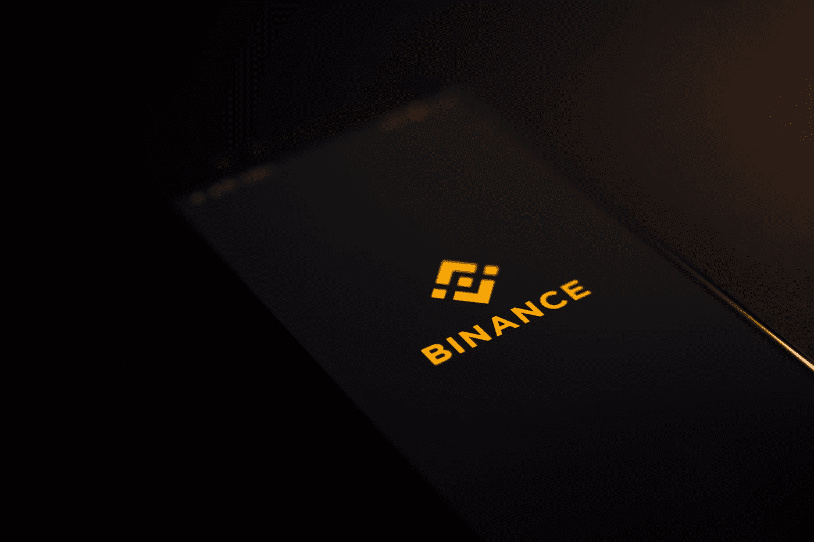

# 币安对 FTX

> 原文：<https://medium.com/coinmonks/binance-vs-ftx-bf763be97f5d?source=collection_archive---------21----------------------->

Photo by [Vadim Artyukhin](https://unsplash.com/es/@vademann?utm_source=medium&utm_medium=referral) on [Unsplash](https://unsplash.com?utm_source=medium&utm_medium=referral)

在加密中，会发生意外。

即使是最大的密码交易所也会有一秒钟的时间瘫痪。