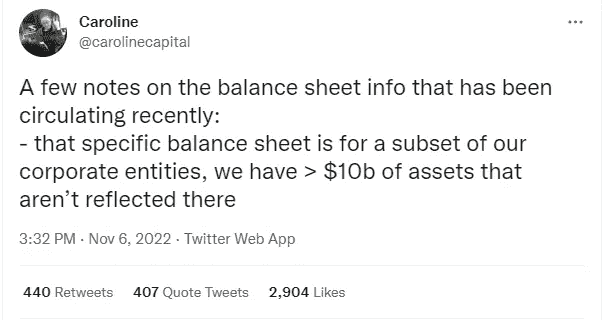

# 币安赢得了加密战，买下了 FTX

> 原文：<https://medium.com/coinmonks/binance-wins-the-crypto-war-buys-ftx-6a7665957d9c?source=collection_archive---------4----------------------->

据我所知，这是密码史无前例的一步。币安几乎杀死了他们的主要竞争对手 FTX。然后在他们的脚还在喉咙上的时候伸出橄榄枝。让我们来看看导致这种情况的事件。

# 泄露的财务报告

11 月 4 日阿拉米达研究公司泄露的财务报告很可能是币安首席执行官 CZ 寻找的银弹。山姆·班克曼-弗里德的 FTX 盔甲上的裂缝。看着这张 CZ 很可能看到了他一生中最大的机会之一。

他看到的是虽然有很多密码。Alameda Research 146 亿美元资产中的很大一部分要么是贷款。大约 80 亿美元，即 146 亿美元中的一半以上是贷款。在剩下的几十亿美元中，很多都与加密项目有关，比如班克曼自己的 FTX、FTT 代币或索拉纳。这意味着，即使他们想清算这些代币，他们也很可能无法这样做。班克曼是这些项目的一部分。

# 2022 年伟大的秘密战争打响了第一枪

这意味着 CZ 看到了一个千载难逢的机会。一个可能除掉币安主要竞争对手，同时让班克曼闭嘴的机会。至少在 twitter 上，这两位首席执行官似乎不是最好的朋友。在很多事情上看法不一致。该计划于第二天，即 11 月 5 日开始实施。这是通过币安转移他们的 2300 万美元的 FTT 代币，当时价值超过€5.8 亿美元。

> 胜之勇士先胜而后战，败之勇士先战而后谋胜——《孙子兵法》

这一举动基本上是打响了第一枪，可以说是币安向 FTX 公开宣战。正如孙子在著名的《孙子兵法》中所说。CZ 非常确信他的举动会达到预期的效果。公众的反应并没有持续很久。这么多 FTT 币被转移到币安，激起了人们的恐惧。大量的 FTT 代币即将到来，赶快卖，卖，卖。

*Source: Coinmarketcap.com*

在 CZ 公开出售代币的意图后，FTT 代币的价格确实下跌了。随着价格的跳水，除此之外，人们现在可能比以往任何时候都更厌倦中央机构的失败，以及将他们的秘密锁在他们的死亡螺旋中。人们开始了所谓的银行挤兑。每个人都试图从 FTX 撤回他们的密码。这当然对$FTT 币产生了更加不利的影响。导致它进一步下跌。

# 战争

企图求和，又回到以前公开敌对的状态。阿拉米达研究公司提出以每枚 22 美元的价格购买币安所有的$FTT 代币。从孤立的金融角度来看，这似乎是一笔好交易。币安将能够在不影响市场的情况下，以一个好价格出售所有的代币。

*Caroline Ellison CEO of Alameda Research*

但是当然，简单地清算币安大量囤积的 FTT 代币从来都不是真正的目标。杀死 FTX 是。所以 CZ 拒绝了这个提议，说他宁愿把代币拿到公开市场。确保在他建造的 FTX 棺材上钉上钉子。币安打算公开出售代币。当然，在大规模抛售发生之前，公众会抓住机会出售他们自己的代币。

是展示力量，还是绝望取决于你如何看待它。他们试图止住流血，让每个人都冷静下来。在推特上说他们事实上非常具有流动性，持有超过 100 亿美元的资产。

# 投降

在只能被视为投降的情况下，FTX 在沉默的同时也冻结了每一个客户的资产。这样一来，每一个拥有密码的人的噩梦都变成了现实。可怕的“不是你的钥匙，不是你的密码”场景。

在幕后，班克曼向他能想到的每一个演员献殷勤。找人要么购买联邦贸易委员会或能够保释他们。但随着他们的赤字越来越大，这看起来越来越不可能了。

*Probably the biggest capitulation in crypto history*

但这只能被描述为一个晚上 M. Shaymalaian 扭曲。CZ 和币安挺身而出，提出收购 FTX.com。正如他们所说，他们试图帮助流动性和“拯救”人们。签署了不具约束力的 LOI 或意向书。他们会尽职调查，或者用 CZ 的话来说就是 DD。

# 尘埃落定的余波

最重要的部分是人的密码。这无疑意味着一切正常，人们将能够再次访问他们的密码。有一些警告。最大的一个问题是拍品没有约束力。这意味着币安可以在任何时候简单地说交易取消。在我看来，最大的原因是，如果他们在收购过程中尽职调查时发现了任何黑暗的秘密。

第二个问题是，币安只提出收购 FTX.com，这意味着 FTXus 和任何其他可能存在的分支机构都不包括在这笔交易中。这使得这些客户比 FTX 的普通客户更加没有着落。他们的未来非常不明朗。

房间里的另一头大象当然是 FTX 的书。他们关于有超过 100 亿美元可供他们使用的推文只不过是绝望的尝试和谎言吗？或者那些资金在哪里？班克曼还在推特上写道，现在已经删除了？在推特上说，所有客户的资产都很好，他们没有投资客户的资产。这是更多的谎言吗？嗯，推特信息的消失说明了这一点。

这是否意味着班克曼将面临指控，如果不出意外的话，他似乎对投资者撒了谎，发布了一系列现已删除的推文，称每个客户的资产都是“安全的”。

我的另一个问题是，FTX 实际上有多少资金。它开始变得越来越像一个用霍皮姆烟斗的烟建造的空中城堡。在摄氏的血管里，FTX 一直是个骗局吗？他们只是想尽可能多的赚钱。FTX 在一个“假装直到你成功”的地方。一直存在流动性问题，只是试图装出一副勇敢的样子，希望秘密的冬天会过去。

*This also appears to confirm that Bankman lied in his previous tweets, as well as show that CZ is not the most gracious winner*

当尘埃落定，有一件事是肯定的。这场战争造成了许多伤亡。不管你是顽固的资本家还是社会主义者。从长远来看，没有竞争很可能只会伤害客户。看起来 CZ 也控制不住自己，最后不得不在班克曼的脸上擦了一下。

# 我最大的收获，希望也是你的

然而，我认为现在最重要的事情应该是显而易见的。无论你是卷入了这场加密战，还是置身事外。那就是大公司总是会做对自己最有利的事情。不管我们中有多少小人物会在这个过程中受到伤害。看看有多少人可能因为两位首席执行官互不喜欢而毁了自己的生活和积蓄。

当然，你可以说这最终是 CZ 做出的一个伟大的商业举动。我会陪在你身边。看起来的确是。仅仅通过移动一些密码并说你要卖掉它就能杀死你最大的竞争对手，这只能称之为天才之举。即使$FTT 会变成 0。它最终只会让币安损失 5 . 8 亿美元，对我来说，这是杀死你最大竞争对手的廉价代价。尤其是 FTX 的身价估计有几十亿。

但是，当巨人打架时，被践踏的是小人物。我认为不仅仅是我们这些小人物要为此背黑锅。在未来一年左右，我们的情况很可能会更糟。直到出现一个能与币安匹敌的竞争者。如果这是 CZ 允许发生的事情，我的意思是。如果它们长得太大，他可能也会把它们杀死。

总结一下，大公司不是你的朋友。不管他们说什么。到了紧要关头，他们总是会做对企业最有利的事情，不管在这个过程中谁会受到伤害。这是你永远可以依赖的一件事。在大多数情况下，这意味着像你我这样的普通人。

tweets 的链接可以在参考资料部分找到，它们按照显示的顺序出现。

我很想听听你对这场加密战的看法，你认为这一切都是以一种好的方式进行的吗？还是对普通人关心太少？以及你对此的其他想法，我的结论是错的还是你同意我的观点？如果你想支持我和我制作的内容，请考虑关注我，阅读我的其他帖子，或者为什么不两者都做。

网络上见！

图片由币安媒体推特截图提供

资源

1.  [https://www . coin desk . com/business/2022/11/02/divisions-in-Sam-bankman-frieds-crypto-empire-blur-on-his-trading-titan-alamedas-balance-sheet/](https://www.coindesk.com/business/2022/11/02/divisions-in-sam-bankman-frieds-crypto-empire-blur-on-his-trading-titan-alamedas-balance-sheet/)
2.  [https://Twitter . com/Caroline capital/status/1589287457975304193](https://twitter.com/carolinecapital/status/1589287457975304193)
3.  【https://twitter.com/cz_binance/status/1589703098762940416 
4.  [https://Twitter . com/Caroline capital/status/1589264375042707458](https://twitter.com/carolinecapital/status/1589264375042707458)
5.  [https://twitter.com/SBF_FTX/status/1590012124864348160](https://twitter.com/SBF_FTX/status/1590012124864348160)
6.  [https://twitter.com/cz_binance/status/1590013613586411520](https://twitter.com/cz_binance/status/1590013613586411520)
7.  [https://twitter.com/ChazzonKe/status/1590023557865959425](https://twitter.com/ChazzonKe/status/1590023557865959425)
8.  [https://twitter.com/cz_binance/status/1590103159506341888](https://twitter.com/cz_binance/status/1590103159506341888)

> 交易新手？尝试[加密交易机器人](/coinmonks/crypto-trading-bot-c2ffce8acb2a)或[复制交易](/coinmonks/top-10-crypto-copy-trading-platforms-for-beginners-d0c37c7d698c)