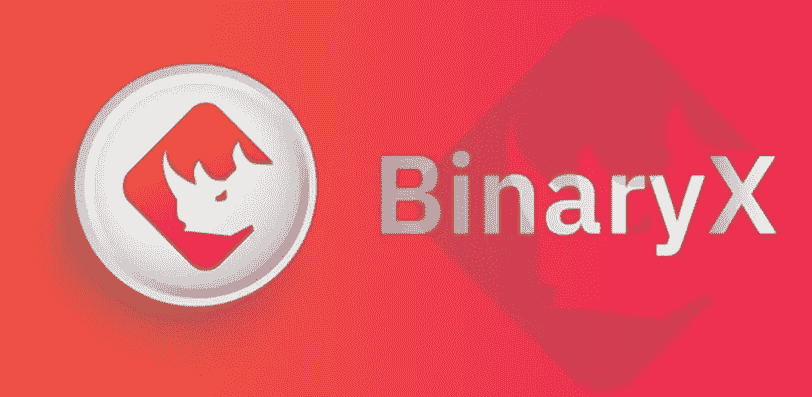
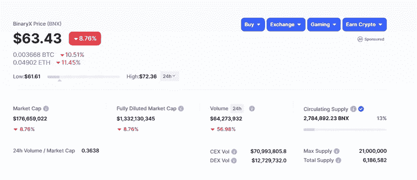
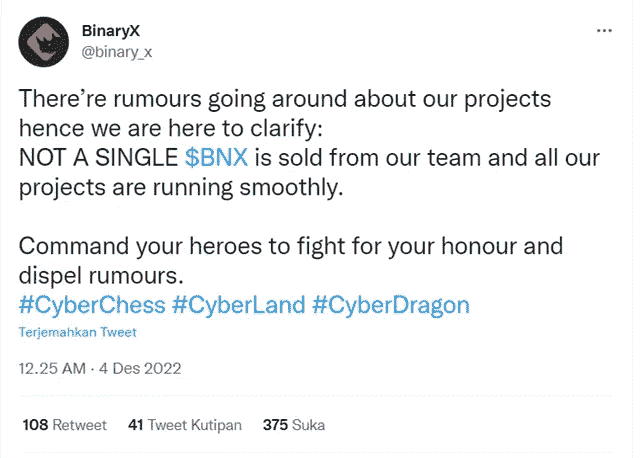
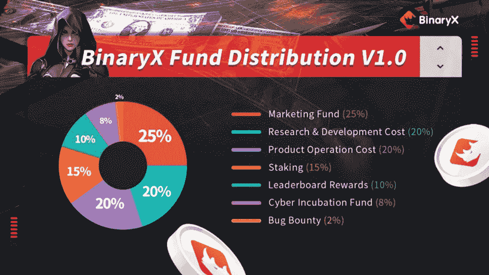
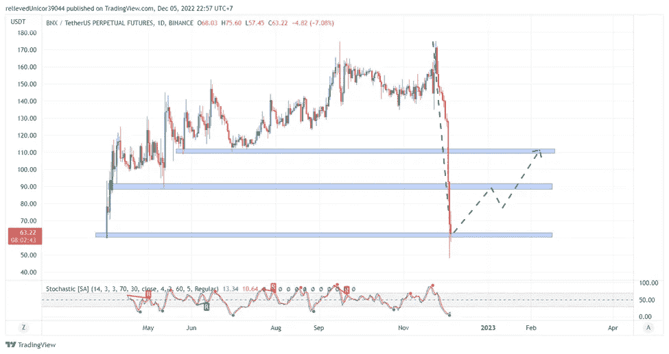
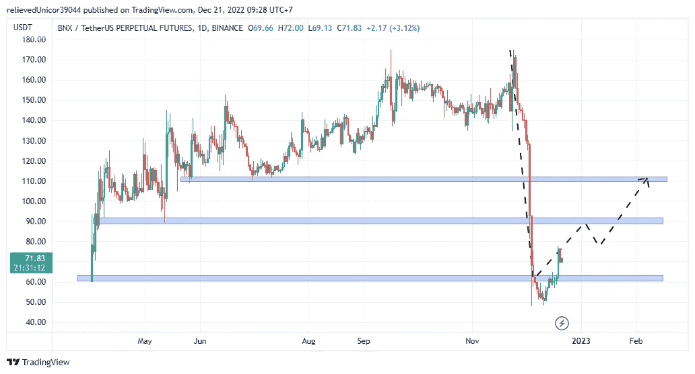

# BinaryX $BNX 潜力回到历史高点$169？？

> 原文：<https://medium.com/coinmonks/binaryx-bnx-potential-back-to-all-time-high-169-1397d23bda0a?source=collection_archive---------31----------------------->

**什么是 BinaryX ($BNX)？**BinaryX(＄BNX)是 BinaryX 生态系统中的一个加密货币平台，包括使用＄BNX 的 DAOs 和 web3 游戏平台。BinaryX 建立在 GameFi 对元宇宙游戏越来越受欢迎和兴趣的基础上。$BNX (BinaryX)是提供 IGO 服务的 GameFi 平台。

BNX 的最大供应量为 21，000，000 份，发行量为 2，784，892 份，约为最大供应量的 13%。BNX 目前仍有大量流通供应，这导致 BNX 仍有很长的路要走。

## **什么是 IGO？？**

**IGO 代表初始游戏报价(Initial Gaming Offer)，游戏项目用它在密码世界筹集资金**。IGO 与 ICO(初始货币报价)、IDO(初始 DEX 报价)和 IEO(初始外汇报价)相同。它们的功能都是筹集资金，但区别在于收集这些资金的主体。随着区块链游戏的出现，IGO 正在成为一件大事。像 Axie Infinity (AXS)、CryptoBlades(技能)和 Alien world(TLM)这样的游戏拥有成千上万的每日活跃用户。

## BNX 倾销近 70%？？？

从 2022 年 11 月 25 日开始，BNX 经历了从 169 美元到 63 美元的历史最高价格的巨大抛售。BNX 在加密货币(熊市)趋势下做出了出人意料的举动。没有发现 BNX 的内部或外部问题，甚至在 Twitter 社区中，BinaryX($ term)团队提供了一个解释。

## **令牌分发**

在整个代币发行中，Team BinaryX 持有代币供应总量的大约 65%(营销、研发和产品运营成本)。65%这个数字对于一党垄断来说是相当大的数字了。BinaryX(BNX)可能会出售他们的代币。

## **技术分析(2022 年 5 月 12 日)**

从技术上讲，BinaryX(BNX)的价格已经触及底部支撑。有可能在最后一个支撑位会出现反弹，如果支撑位已经用尽，那么价格会跌得更深。(这只是技术分析)

## **技术分析(2022 年 12 月 21 日)**

美元 BNX 的价格在其最后一个支撑位处反弹，尽管它略微越过了支撑线。美元 BNX 会走向下一个阻力 90 美元吗？

> 交易新手？尝试[加密交易机器人](/coinmonks/crypto-trading-bot-c2ffce8acb2a)或[复制交易](/coinmonks/top-10-crypto-copy-trading-platforms-for-beginners-d0c37c7d698c)