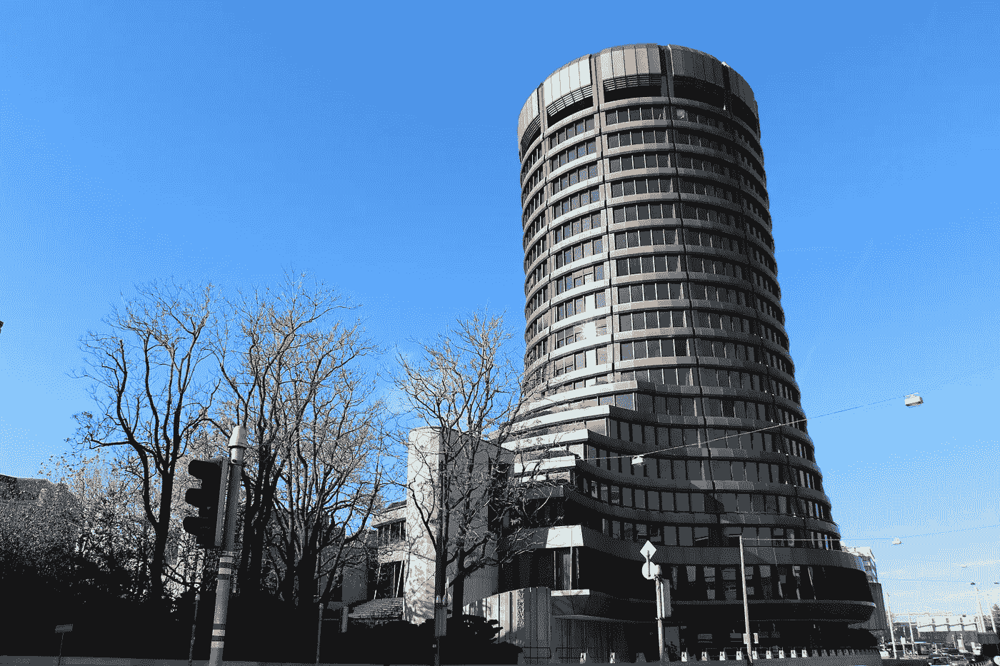

# BIS 分析显示:比特币和密码被购买主要是因为价格上涨

> 原文：<https://medium.com/coinmonks/bis-analysis-shows-bitcoin-and-crypto-are-bought-mainly-because-the-price-is-rising-b455b2b63719?source=collection_archive---------15----------------------->

## 国际清算银行(BIS)分析了人们购买比特币和其他加密货币的原因。为此，它使用了一个尚未穷尽的数据集。他们的发现发人深省。

Bank for International Settlements in Basel, Switzerland, Image credit: [Frank Romero / Flickr](https://www.flickr.com/photos/129231073@N06/27527280652)