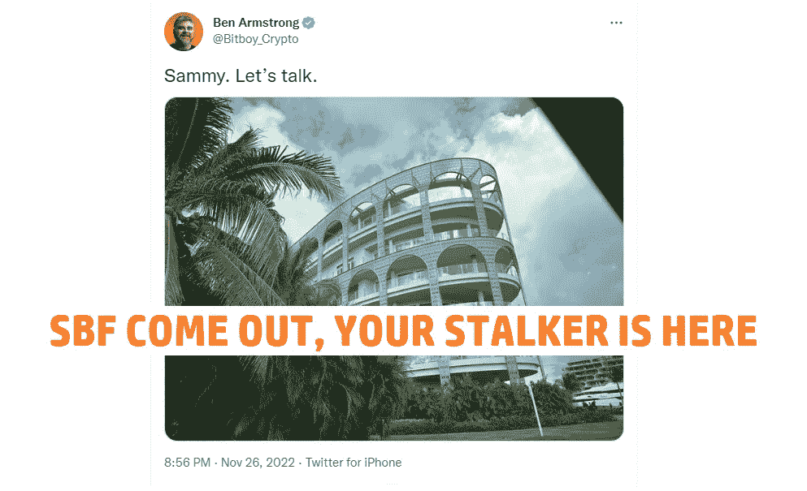
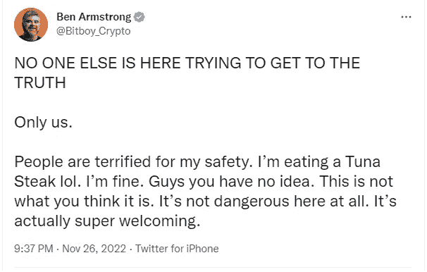
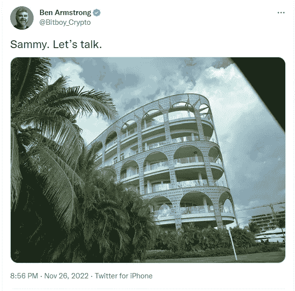

# Bitboy 前任？加密骗子试图成为人民的冠军，跟踪 SBF

> 原文：<https://medium.com/coinmonks/bitboy-former-crypto-scammer-trying-to-become-the-peoples-champion-stalking-sbf-b593f0dcbd4d?source=collection_archive---------5----------------------->

在 FTX 崩盘之后，许多事情被揭露出来。其中之一是，在 FTX 幕后进行的所有骗局和废话似乎没有结束的迹象。从灰烬中出现了新的人民的冠军比特男孩，准备在没有人看的时候得到答案。

# 比特男孩是谁？

他是一个 youtuber 和有影响力的人，通过向他的追随者推销骗局而变得富有。他已经做了很长时间的事情。当他被叫出来的时候，他试图用无聊的诉讼来吓唬弱小的人。

[**Bitboy vs. Atozy 又名 Youtuber 的战斗**](https://www.publish0x.com/things-of-note-and-other-interesting-stuff/bitboy-vs-atozy-aka-the-youtuber-fight-xddgeed?a=4zbqQ2N7bp)

事情发生时我也掩盖了。简而言之，所发生的事情是 Bitboy 试图欺负在视频中批评过他的 Atozy，以收回 Atozi 说的关于 Bitboy 的所有真实事情。但是阿托兹并没有就此罢休，而是决定反击。然后比特男孩做了大多数恶霸都会做的事，退缩了。

现在你们都知道比特男孩是谁了，让我们看看新的比特男孩 2.0，人民的冠军。

# 巴哈马的比特男孩

比特男孩决定亲自前往巴哈马，与萨姆·班克曼·弗里德当面对质，为人民寻找答案。

*Bitboy have turned into the new Mulder from X-Files*

我不知道人们对巴哈马的期望是什么，某种无法无天的荒地？这是一个避税天堂，一个富人去阻止社会其他人的地方，以便能够提取和转移他们大部分继承的所有金钱。如果比特男孩做了一些非常愚蠢的事情，我想他最多会被逮捕或者被保安带走。事实上已经发生的事情。

在我看来，这更像是比特男孩在跟踪 SBF。我想即使在巴哈马这也是违法的。或者他只是看到了一个机会，得到一个不错的巴哈马度假税减免。同时努力重塑或改变人们对他的看法。从人民的骗子到人民的救世主。希望这不是人们会买的东西。

但话说回来，如果你有一个精神错乱的人一遍又一遍地喊着同样的话，显然他们会选你当总统。所以谁知道呢？也许比特男孩真的会成为人民的冠军，一个为正义和真理而战的战士。一个好的开始是试图偿还所有被他骗钱的人。随便说说。

如果你怀疑比特男孩对品牌重塑的承诺。他犯罪的证据就在我们眼前消失了。他一直在删除推文，并在他推广骗局项目的地方制作私人视频。因此，他可能希望自己很快能够改变周围的看法，从一个骗子变成一个精神错乱的救世主。

因为有洗绿，洗白，我认为现在是我们加入一个新的名单的时候了，洗白或者感知洗白。

你对巴哈马的比特男孩这件事有什么看法？这仅仅是一个洗白的尝试，或者仅仅是一个税务报告或者是什么？请在下面的评论区分享你的想法。如果你想支持我和我制作的内容，请考虑关注我，阅读我的其他帖子，或者为什么不两者都做。

网络上见！

图片由:合理使用提供

> 交易新手？试试[加密交易机器人](/coinmonks/crypto-trading-bot-c2ffce8acb2a)或者[复制交易](/coinmonks/top-10-crypto-copy-trading-platforms-for-beginners-d0c37c7d698c)