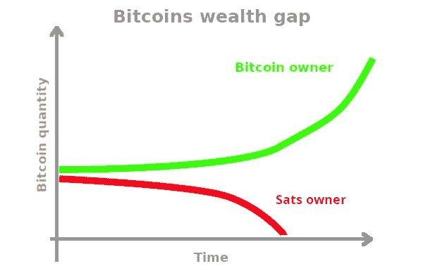
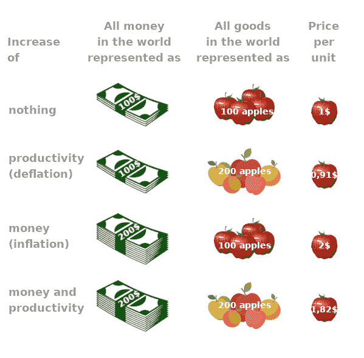
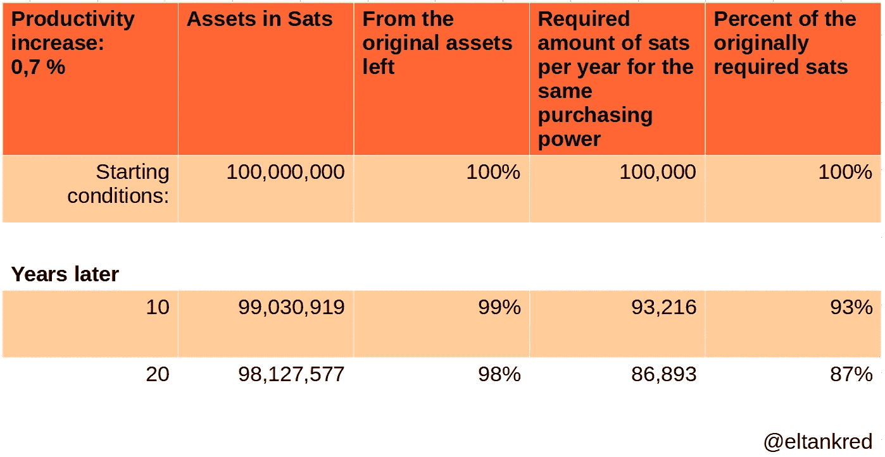

# 比特币的 3 个论点，1 个问题

> 原文：<https://medium.com/coinmonks/bitcoin-3-arguments-1-problem-a9c2217bf784?source=collection_archive---------16----------------------->

## 或者说:比特币还是要想通到底

德国版。)

他们说，比特币很复杂。为了理解它，无数贡献的作者借鉴了计算机科学、物理学、经济学和博弈论等领域的知识。只要创作者的名单还在，就缺少一种体验:

比特币对社会的影响

这些影响可能是积极的，也可能是消极的。在下文中，我想重点谈谈比特币未来将揭示的一个社会问题。我将从三个论点中推导出这个问题。到目前为止，没有人能够反驳它。到目前为止，还没有人质疑。可以吗？

在我解决比特币未来会给我们带来的问题之前，我想向你保证一件事:我爱比特币。它将解决当前的许多问题。我对此深信不疑。下面，我强调比特币在未来会产生的问题，因为我希望看到解决方案。

## 论点 1:赢家拿走所有

只有最少的人能够独自征服市场。这是由于两个条件很难满足。比特币似乎可以两者兼得:

**1。网络效应**

像电话或互联网一样，比特币作为一种电子点对点货币系统，也受到网络效应的影响。其特点是每个新用户都使网络变得更有价值[1]。对于比特币来说，这意味着越多的人用它来储蓄或支付，它对用户来说就越有价值。

**2。难以模仿的特性**

毫无疑问，比特币最重要的特征是它有一个发明者，但没有老板。没有其他加密货币能提供这种质量。自从中本聪从比特币领域退休后，一群志愿者一直在关注他的代码。然而，他们对管理比特币的规则几乎没有影响。它的权力下放并没有为政府或其他利益相关者提供一个可以满足他们要求的联系人，甚至是腐败的。所有用户的平等使比特币独立于政治，并永远保证其上限为 2100 万枚。

比特币(以及许多其他货币)的这一特征表明，它将成为世界主导货币。它会吸收所有的价值[2]。

## 论据 2:世界上唯一不朽的好东西

…为了即将到来的一切。活该悲惨地灭亡”，浮士德在歌德的同名作品中已经知道了。当你看着自然，不仅仅是生命在流逝。比萨斜塔向它的秋天弯曲，幼发拉底河和底格里斯河干涸，大陆撕裂泛古大陆。即使是让我们的生命成为可能的太阳，也会在大约 50 亿年后消亡。

在自然界，没有什么是永恒的。然而，比特币将比人更长寿。只要你不花掉它，它会保存你的存款。因为它的对等架构，它不会被你摧毁，就像其他人不会摧毁你保存的智慧一样。要摧毁比特币，所有人都必须决定反对它。这是完全不可能的。

比特币独立于政治和个人利益的优势，如果让它像癌症肿瘤一样无限生长，就变成了劣势。我认为第三个论点显示了这种危险。

## 论点 3:通货紧缩是富人购买力的无风险增长

与自然不同，比特币很可能永远不会被人类摧毁。任何人改变它的代码只会创造一个新的硬币。他们不会摧毁比特币本身，因为它首先是一个网络。

如果哪怕只有一个比特币节点和它的账本一起存活，比特币就存活了。比特币作为一种癌症会是什么样子？我想用一个思维实验来解释这一点。不过，在我开始之前，让我们快速回顾一下什么是通货膨胀和通货紧缩(如果你能区分两者，就跳过这一部分):

*— — —开始刷机————*

1.货币及其价值

货币反映了服务和商品的价值。因此，世界上所有的钱只能和世界经济产出一样多。

2.通货膨胀

通货膨胀来自拉丁语“inflare ”,意思是“扩张”。如果货币供应的扩张超过了服务和商品的扩张，我们称之为通货膨胀。价格上涨是因为有更多的钱来购买同样数量的商品和服务。因此，在通货膨胀的情况下，货币的购买力下降，因为用同样多的钱可以买到更少的商品。

inflation vs. deflation

3.通货紧缩

通货紧缩是通货膨胀的反义词，意思是“减少”。如果货币供应量的减少超过了服务和商品的减少，我们就说通货紧缩。价格下降是因为同样数量的服务和商品能得到的钱变少了。当然，如果同样多的钱得到更多的服务和商品，反过来也是一样的。因此，在通货紧缩中，货币的购买力增加了，因为用同样多的钱可以买到更多的商品。

*— — —刷完了————*

我们知道比特币的价值减半。每隔 4 年左右，每一个新的区块进入流通的比特币就会减少。目前，这是 6.25 比特币，目前对应的年通胀率为 1.7%。大约到 2140 年，比特币的通胀率将降至 0%。如果没有这种通胀，比特币不会失去任何购买力(或者在那之前很少)。所以下面我就不进一步考虑它的购买力损失了。

与通货膨胀的法定货币不同，比特币将会是通货紧缩的。这意味着随着我们经济生产率的提高，比特币将获得购买力。这是因为我们的技术和方法都在进步。示例:

徒手打猎的渔夫比拿着鱼竿的渔夫捕到的鱼少。不止这两个是被一个渔夫带回家的，他用网拖着它穿过大海。

我用实际国内生产总值(即经通胀调整后的国内生产总值)来衡量生产率增长。(如果知道更好的方法，请留言评论。)根据弗雷德的说法，从 1947 年 1 月到 2022 年 7 月，美国生产率增长平均为 0.75%(中值:0.7%；最小值:-9.3%；最高:7.3%) [4]。

下表显示了年生产率增长仅 0.7%会对比特币资产产生什么影响:

Table: impact an annual productivity growth

假设你有一个比特币(100，000，000 Sats)，你需要 100，000 Sats 作为生活费。由于购买力的增加，在接下来的几年里，你需要从你的资产中拿出越来越少的钱来维持同样的生活水平。由于你生活水平所需的预算比你的资产减少得快，你的购买力无风险地增加。当您的资产超过 14，285，Sats 时，这项福利开始生效。

(记住，法定货币不是无风险的，因为通货膨胀会降低其购买力)。

另一方面，如果你的 sat 少于 14，285，715，在同样的条件下，你的财富会减少。这是因为你不得不花更多的钱在你的生活开支上，而不是你的储蓄在购买力上的增长。

至于这对那些没有 sat 成绩的人意味着什么，我只能推测。(我假设少数在正确的时间有正确的想法的人会发财。但所有其他人都将被剥夺这种成功。他们的依赖性会增加)。最后，也无所谓了。我的思想实验的数字是否正确同样不重要。因为现象依然存在。如果你能存下比你生活所需更多的比特币，你就可以毫无风险地展望你的未来。

## 问题是:富人越来越富

不幸的是，奴隶制、封建制和资本主义告诉我们，钱生钱。目前看来，比特币无法改变这一点。自从人类在世界上占有一席之地，少数人总是利用他们的机会以牺牲大多数人为代价来获得优势。

钱可以用来捍卫自己的目标。有了自己生计不需要的储蓄，比特币鲸鱼可以购买任何对自己有利的东西。要了解这种未来，我们只需看看现在:是媒体有利可图地传播观点。无论是被收购的竞争对手，都不会危及自己的商业模式。无论是确保亲商法律的政客，等等。[5]

对于今天的非创造者或未来的低收入者来说，这意味着他们生活在自由中的机会将少于富人。只要其他人能够决定穷人的生活条件，比特币也保护穷人储蓄的事实就不会对他们有所帮助。当然，我无法说出今天的生活状况。但是财富的历史从奴隶制一直延续到资本主义。

历史会在未来继续押韵。难道现在不是防止这种情况发生的时候吗？

## 摘要

比特币的属性、网络效应和不灭性将继续推动其在未来的传播。我提出的论点不会改变这一点。恰恰相反。这些观点实际上是支持使用比特币的。

然而，我们需要一种机制来防止少数人的利益以多数人的利益为代价。比特币和财富的[再分配](/coinmonks/14-reasons-why-bitcoin-leads-to-an-unconditional-basic-income-fa44a43fb75e)就是这样一种机制。这到底是什么样子，我们需要作为一个社会来讨论。我的愿望是为每个人提供相同的起步条件和自由竞争。重要的是，每个人都要参与这场竞争，而不仅仅是那些买不起东西的人。只有这样，竞争才能进一步改善所有人的生活。

不可能有专利解决方案，因为我们将第一次为生活中的公平起始条件创造机会。你会利用这个机会吗？

***

我的 9775 个字符给了你新的见解吗？通过闪电捐赠来纪念他们。你想从我这里读到更多？用几只小智支持我的工作。理解需要时间。你的提升让我有时间整理思路，写下来。

Lightning address: LNURL1DP68GURN8GHJ7MR9VAJKUEPWD3HXY6T5WVHXXMMD9AKXUATJD3CZ7CTSDYHHVVF0D3H82UNV9UMNYWFNC2GDKG

***

**引用自己的文章**

 [## 法定货币和比特币的不平等分配

### (德国版。)

medium.com](/@ELTankred/the-unequal-distribution-of-fiat-money-and-bitcoin-56d56bf5f03c)  [## 通往胜利的漫长道路*

### 或者:社会形态的遗产以及它与比特币的关系

medium.com](/coinmonks/the-long-way-to-spoconism-51602968f3fd)  [## 比特币导致无条件基本收入的 14 个原因*

### 或者:比特币如何消除货币的非社会性

medium.com](/coinmonks/14-reasons-why-bitcoin-leads-to-an-unconditional-basic-income-fa44a43fb75e) 

**来源**

[1][https://www.lynalden.com/bitcoins-network-effect/](https://www.lynalden.com/bitcoins-network-effect/)状态:2022 年 12 月 7 日

[2][https://medium . com/coin monks/hyperbitcoinization-winner-take-all-69ab 59 f 9695 f](/coinmonks/hyperbitcoinization-winner-takes-all-69ab59f9695f)状态:07.12.2022

[3] [https://www.ecb.europa.eu/pub/pdf/scpops/ecb.op268~73e6860c62.en.pdf,](https://www.ecb.europa.eu/pub/pdf/scpops/ecb.op268~73e6860c62.en.pdf,) [https://www.ökonomundschule.de/教材/国家和经济政策/背景文本/经济增长-国际%E2%80%93-一些事实/](https://www.wirtschaftundschule.de/unterrichtsmaterialien/staat-und-wirtschaftspolitik/hintergrundtext/wirtschaftswachstum-international-%E2%80%93-einige-fakten/) 状态:2022 年 12 月 7 日

[4] [https://fred.stlouisfed.org/series/GDPC1](https://fred.stlouisfed.org/series/GDPC1) 状态:2022 年 12 月 12 日

[5] [https://www.zeit.de/2022/49/milliardaere-elon-musk-rupert-murdoch-superreichen-usa](https://www.zeit.de/2022/49/milliardaere-elon-musk-rupert-murdoch-superreiche-usa) 状态: 08.12.2022

> 尝试 [加密交易机器人](/coinmonks/crypto-trading-bot-c2ffce8acb2a) 或 [复制交易](/coinmonks/top-10-crypto-copy-trading-platforms-for-beginners-d0c37c7d698c) on [最佳加密交易所](/coinmonks/crypto-exchange-dd2f9d6f3769)