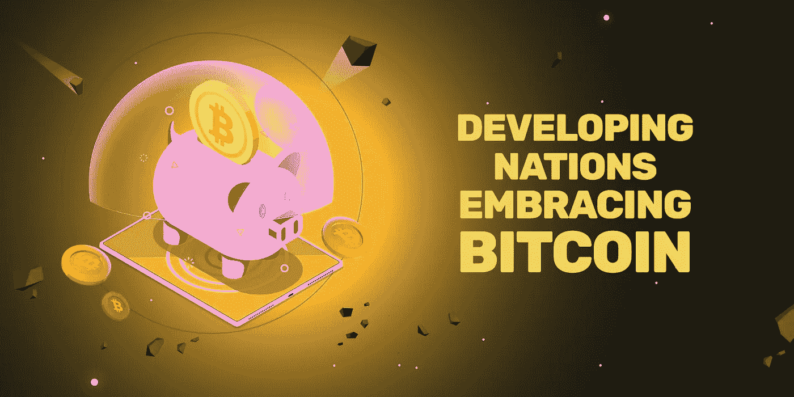

# 比特币——发展中国家的自由之路

> 原文：<https://medium.com/coinmonks/bitcoin-a-road-to-freedom-in-developing-countries-15613cf35d0b?source=collection_archive---------66----------------------->

如果你已经远离了整个加密雷达，以下事实可能会让你惊讶:2021 年，比特币被标记为世界上第八大资产——超过电子商务巨头阿里巴巴(！！！).特斯拉排名第七，仅次于比特币。这些只是可能性的一小部分证明，以及加密技术采用的速度正在飞速增长。

# **比特币案例——21 世纪的数字黄金**

几个世纪以来，黄金一直是一种很好的投资，这是因为它的可靠性。世界上第一种加密货币比特币也有类似的属性，当**用来对冲通货膨胀**。加密货币在发展中国家的主要应用令人着迷:

**尼日利亚**

面对 20.52%的恶性通货膨胀率，尼日利亚人民不顾银行禁令，正在通过加密货币开辟通往金融自由的道路。 [点对点(P2P)交易](https://cointelegraph.com/news/what-is-p2p-trading-and-how-does-it-work-in-peer-to-peer-crypto-exchanges)很受人群欢迎。**超过三分之一的 18 至 60 岁的尼日利亚人目前拥有或在过去的 6 个月里交易过密码。**

**萨尔瓦多**

萨尔瓦多因其成为第一个将比特币变为法定货币的国家的激进运动而闻名。这场运动提升了这个国家的经济，特别是在金融可及性方面，甚至导致了旅游业 30%的增长。

**越南**

**在一项针对 27 个国家的“加密所有权”调查中，越南** [**以 41%的比率排名第一**](https://coinculture.com/au/markets/vietnam-leads-the-world-in-crypto-adoption/) 。这种激增的原因是政府对数字资产的支持，以及区块链创业公司的大量涌现。

# **为什么这些发展中国家的人们倾向于加密货币？**

上面提到的国家只是一些例子。在印度、巴基斯坦、印度尼西亚以及亚洲和非洲的其他发展中国家也可以看到类似的行为。大多数这些国家的通货膨胀率处于历史最高水平，储蓄没有价值，满足基本需求如食物和交通已经成为一个相当大的挑战。人们正在寻求*的自由。*

*我们观察到的是，g24 政府和现有的体制让这些国家的人民“失望”了。金融不稳定的历史**和获取传统金融产品的障碍**和**。大多数人甚至没有银行账户。随着每个人都可以使用手机和互联网连接，crypto 已经能够给人们带来希望，t *他“进入”一个新的金融系统，这个系统是去中心化的，*和*具有成本效益的*。加密货币为企业家打开了国际商业的新大门，否则他们将不得不支付额外的汇款费用。***

# ***是什么阻碍了发展中国家采用加密货币？***

*鉴于这些国家的人民已经经历和正在经历的一切，对潜在解决方案的疯狂采用水平是可以预期的。同样不可避免的是路障。我们看到的解决办法不是禁止或限制，而是教育和鼓励。这是一个机会，我们需要教育、对消费者友好的产品和管理机构来促进采用。*

# ***对于发展中国家来说，比特币之外还有什么？***

*比特币让用户在财务自由方面获得了效用。但这个建立在区块链基础上的去中心化生态系统所能提供的，远不止是一个“交易”媒介。[NFT 就是这样一种途径](https://www.creativebloq.com/features/what-are-nfts)。*

*如你所知， **NFT(不可替代的代币)是数字资产的未来。**NFT 为从音乐到艺术的任何数字资产提供“所有权”和“创造稀缺性”,甚至可以与房地产等任何实物资产挂钩。这对于创作者来说是巨大的，甚至对于这些国家的政府来说也是巨大的。另一方面，收藏家可以投资这些项目或资产类别，并获得收入作为回报。*

*现在想象一下，有多少艺术家、音乐家、投资者和企业家可以通过做他们热爱的事情而受益并为自己创造一些东西。会为一个国家的经济创造多少新的机会？[这是一个独立的新世界。](/@YeloSocial/why-you-need-crypto-to-be-a-part-of-the-new-internet-the-web-3-0-981c9bd6ea5a)*

# ***拥抱这场改变游戏规则、不可避免的金融革命***

*加密货币和区块链一起创造了一个**去中心化的系统，由人民**治理，被认为是像政府一样的中央集权。这就是[web 3 和](https://www.freecodecamp.org/news/what-is-web3/)的关系。在 web3 生态系统中，任何人都可以是建设者、创造者或收藏家。现在剩下的就是让大家上船:)*

**'*[*YELO*](http://yelo.wtf)*让一切变得隐秘、简单、容易和可访问*'这是我们 YELO 生态系统赖以建立的精神。自从我们进入这个优步机会的兔子洞，我们就一直在构建工具和应用程序，以使这种采用对你来说更容易。*

*目标是让所有发展中国家的创造者、企业家和人民发现这项新技术如何彻底改变他们的生活。*

*我们的第一步是以低至 4.75 美元的价格满足对比特币等加密资产的轻松访问。如果您想了解更多信息，请访问-如何使用 F2C 的信用卡/借记卡购买加密软件。*

*信息仅供教育之用，并非投资建议。这不是购买或出售特定数字资产的建议。这是非常重要的，做你的分析之前，根据你的情况进行任何投资或参与加密项目。*

> *交易新手？试试[加密交易机器人](/coinmonks/crypto-trading-bot-c2ffce8acb2a)或者[复制交易](/coinmonks/top-10-crypto-copy-trading-platforms-for-beginners-d0c37c7d698c)*