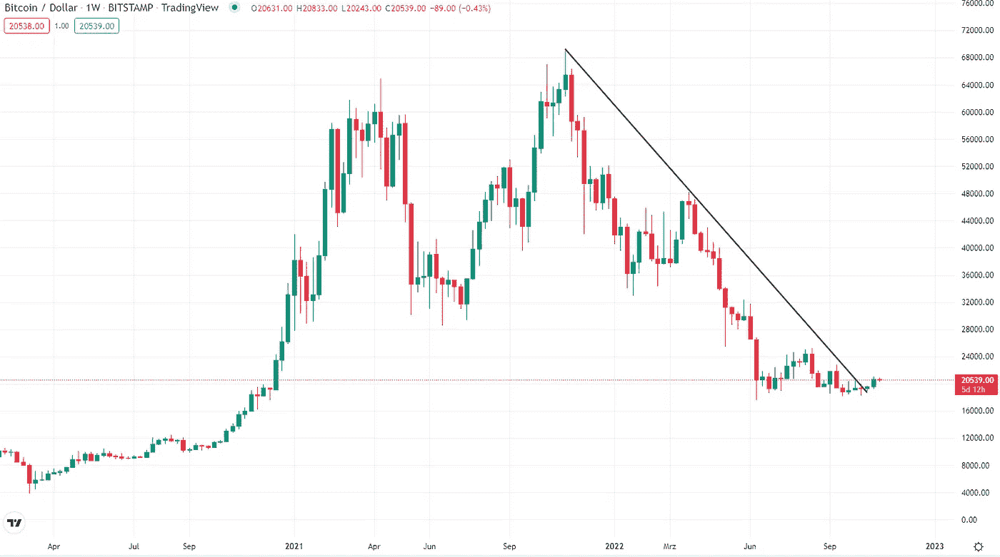

# 比特币已经走出熊市趋势

> 原文：<https://medium.com/coinmonks/bitcoin-already-broke-out-of-bear-market-trend-804e678c63a6?source=collection_archive---------25----------------------->

tradingview.com

过去几天，比特币价格飙升，打破了自 2021 年 11 月以来的长期熊市趋势。这对比特币投资者来说是个好消息，因为比特币的价格现在已经超过了 20500 美元。

比特币价格的飙升是由多种因素推动的，包括机构对比特币越来越大的兴趣，比特币市场的积极发展…