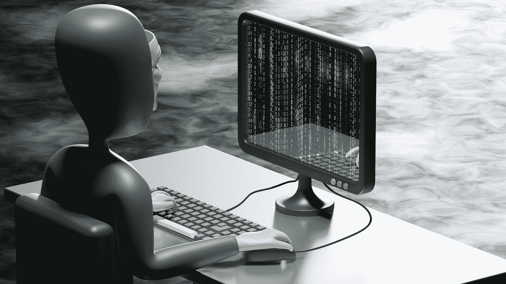

# 比特币和密码是欺诈——它们不起作用

> 原文：<https://medium.com/coinmonks/bitcoin-and-crypto-are-fraud-they-dont-work-45e0e59bd7a7?source=collection_archive---------15----------------------->

## 比特币和密码是欺诈——它们不起作用。

Photo by [Growtika Developer Marketing Agency](https://unsplash.com/@growtika?utm_source=medium&utm_medium=referral) on [Unsplash](https://unsplash.com?utm_source=medium&utm_medium=referral)

对于所有精通技术的人来说，在你进入数字世界之前，这是你需要知道的事情。当然，像比特币和以太坊这样的加密货币确实有一些潜在的好处，但它们还不是真正的货币。这并不意味着 crypto 没有价值——远非如此。它…