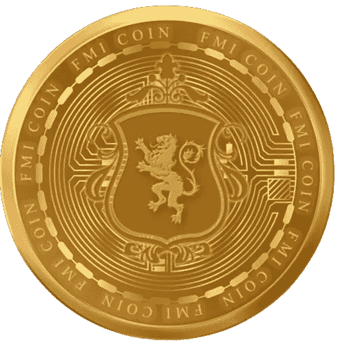

# 比特币和以太坊卷土重来，大眼币能否利用复兴的加密经济？

> 原文：<https://medium.com/coinmonks/bitcoin-and-ethereum-are-making-a-comeback-can-big-eyes-coin-capitalize-on-the-resurging-crypto-8c65eb2c1607?source=collection_archive---------33----------------------->

加密巨头比特币(BTC)和以太坊(ETH)出人意料地卷土重来。在经历了一个月的下跌趋势和逐渐贬值后，这两种顶级加密货币似乎又开始上升了。

在撰写本文时，比特币的价格为 20，632.02 美元，在过去 24 小时内从 19，000 美元左右上涨。与此同时，以太坊已经从大约 1300 美元涨到了 1500 美元以上。

事实上，十月是加密技术蓬勃发展的月份。一年多前，比特币达到最高点，达到 64284.59 美元，而以太坊超过 4000 美元。

然后在 11 月，这两种加密货币都达到了有史以来最有利可图的价格。

关键是秋季是投资仍在预售中的硬币的最佳时机，比如大眼睛硬币(Big)。目前在 crypto big boys 中持有股份是没有意义的，因为初始投资成本更高。

无论如何，随着加密经济即将经历一个紫色补丁，像大眼硬币这样的新来者可能会从对加密行业日益增长的兴趣中筹集更多的资金。

Big Eyes Coin 是现场的新密码，但随着预售期间筹集了超过 850 万美元的资金，并获得了 1 级 CEX 发布，Eyes Coin 在市场上有着惊人的潜力。

印有可爱猫咪的大眼睛硬币将与狗币(DOGE)和柴犬币(SHIB)竞争，这些硬币在历史上一直主导着经济。

首先，大眼睛硬币打算发布前十名 NFT。他们的 NFT 寿司团队将允许投资者拥有一系列可爱的物品，同时在一个充满乐趣的爱猫人士社区中互动。此外，大眼睛硬币希望通过清理海洋对环境产生积极的影响。猫币打算将其总供应量的 5%捐赠给海洋拯救慈善机构，这意味着更少的全球变暖和更多的健康鱼类。

还看了关于新币: [*FMI 币*](http://www.fmicoins.com/)

[FMI](http://www.fmicoins.com/) 是建立在币安智能链上的数字货币。FMI 是为公司 FMI 网络而构建的。更具体地说，它包括自己的产品，如投资不同类型的项目，创造新的项目等。FMI COIN (FMI)是一种加密货币，部署在币安智能链(BSC BEP-20)上

合同:[0x9d 427 e 2 Fe 3a D2 CB 93 f 83118d 472 a 6068 b4a 778d 6](https://bscscan.com/token/0x9d427E2fe3ad2Cb93F83118d472A6068B4a778D6)

你可以在 [Pancakeswap](https://pancakeswap.finance/) 或者 [Bitkeep App](https://bitkeep.com/download) 上购买 FMI 币。
你可以通过这个来了解详细情况👇

[https://FMI coins . medium . com/how-to-create-FMI-wallet-on-bit keep-app-e 44 a2 a 998 e6a](https://fmicoins.medium.com/how-to-create-fmi-wallet-on-bitkeep-app-e44a2a998e6a)

看看我们的[网站](http://www.fmicoins.com/):[https://fmicoins.com/](https://fmicoins.com/)

给我们接通[电报](https://t.me/fmicommunityofficial):[https://t.me/fmicommunityofficial](https://t.me/fmicommunityofficial)

> 交易新手？尝试[加密交易机器人](/coinmonks/crypto-trading-bot-c2ffce8acb2a)或[复制交易](/coinmonks/top-10-crypto-copy-trading-platforms-for-beginners-d0c37c7d698c)