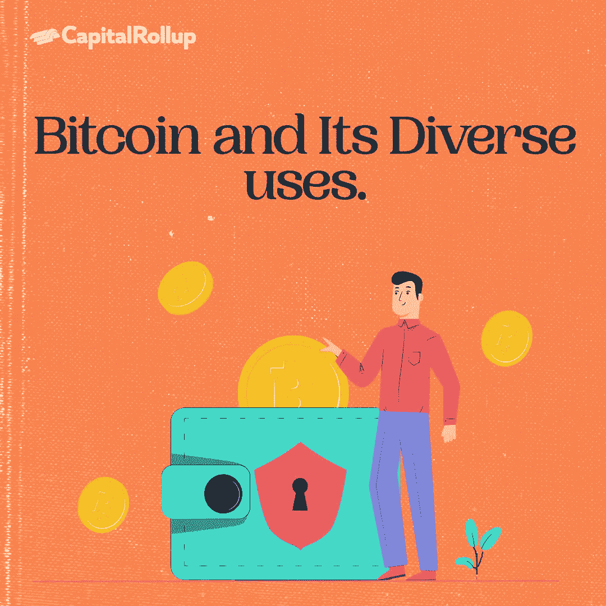
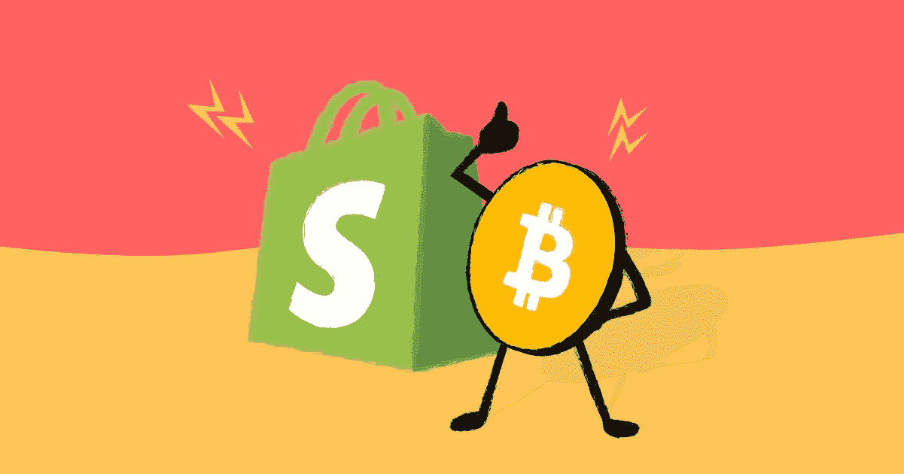
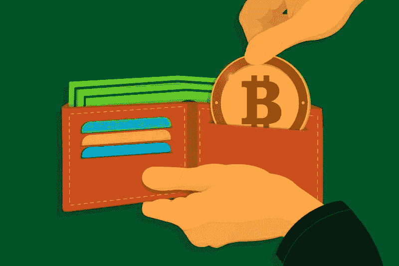

# 比特币及其多种用途。

> 原文：<https://medium.com/coinmonks/bitcoin-and-its-diverse-uses-96ab287f4b9e?source=collection_archive---------49----------------------->

欢迎来到最新一期的 CapitalRollup Digest！今天的文摘是 7 月 29 日的，阅读时间大约需要 5 分钟。我们马上开始。

*   今天的市场看起来怎么样？(前 5/10 大流行加密货币)

Price Market Update

# 比特币及其多种用途。

自十年前问世以来，**比特币**已经发展成为一种受欢迎的价值储存手段，并不断改进其交易处理能力。在线和面对面的企业现在都接受比特币(BTC)作为支付方式。

尽管 BTC 费用高于其他加密货币，但其安全性使其成为大型交易的有用货币。在比特币存在的过程中，社区通常认为加密货币是当今使用的中央支付系统的可行替代品。与黄金或股票不同，BTC 主要用作长期投资。

# 你可以用比特币获得几样东西/服务。

## 以下网店接受比特币

*   **Overstock**——一家接受并支持比特币支付的知名在线零售商。
*   家得宝(Home Depot)——美国最大的家装连锁店。
*   新蛋是一家接受比特币支付的电子零售商。
*   Shopify——一个类似于 Etsy 和易贝的电子商务平台，允许用户创建自己的在线商店。
*   世界上最大的公司之一微软允许用户将比特币添加到他们的账户中。

虽然大多数主要的在线零售商不接受比特币支付，但有一种方法可以使用数字货币购买产品:礼品卡可以用来购买比特币产品。

比特币相关交易通常涉及购买礼品卡。使用加密货币从全球和本地企业购买产品的最简单方式是通过离线和在线礼品卡。

# 接受比特币的服务提供商

没有特定的市场普遍接受比特币作为支付选择；相反，各行各业的企业都希望通过提供数字货币来扩大客户群:

*   **AT & T** —一家手机服务提供商。
*   **Twitch** —流媒体直播平台。
*   Dish Network 是一家美国直播卫星服务提供商。
*   ExpressVPN —一个高速、安全的 VPN 网络。
*   **NordVPN** —来自马耳他的无登录 VPN 提供商。
*   **ProtonMail** —一个端到端的加密邮件提供商。
*   Vultr——一家虚拟主机公司。
*   一个允许用户创建网站和博客的开源内容管理系统。
*   Reddit——你可以用比特币购买高级功能。
*   **Namecheap** —虚拟主机和域名提供商。
*   **彭博，芝加哥太阳时报**——使用比特币订阅在线新闻。

# 用比特币购买电子游戏

视频游戏正在成为数字财产，就像数字货币本身一样，因此越来越多的领先游戏销售平台接受比特币是很自然的事情。电子游戏曾经在实体店购买，但现在大多数游戏玩家都在网上购物。

*   **Xbox**——使用比特币支付游戏、附加软件和 Xbox Live 订阅。
*   简陋的捆绑包(Humble Bundle)——一家将部分收入捐给慈善机构的数码商店。
*   **大鱼游戏**——一家位于华盛顿州西雅图的休闲游戏公司。

# 接受比特币的旅游公司

大多数旅游相关服务都提供非常相似的工具。提供替代支付方式是吸引新客户的好方法。一些可以用比特币预订梦想假期的服务包括:

*   **Expedia** —全球最大的在线旅游预订机构之一，目前接受 BTC 预订酒店，并计划将其作为机票、活动等的支付选项
*   **air Baltic**——首家接受比特币支付各种航班的航空公司。
*   **维珍银河**——亿万富翁商业巨头理查德·布兰森拥有的世界上第一条商业太空线路接受比特币。

# 接受比特币的非营利组织

*   **维基媒体基金会** —一个致力于鼓励免费、多语言教育内容的增长、发展和分发的非营利组织。
*   **维基解密** —是一个国际非营利组织，发布由匿名来源提供的秘密信息、新闻泄漏和机密媒体。
*   **Giving Block**——一个让非营利组织和捐赠者分别容易接受和给予加密货币捐赠的平台。

向慈善机构捐款的过程往往会产生巨额费用，有些人出于各种原因更愿意匿名。比特币是避免这两个问题的一种方式。

# 接受比特币的餐厅和超市

*   **地铁** —你可以在世界各地用比特币买三明治。
*   汉堡王(Burger King)——一家大型跨国快餐连锁店，出售汉堡、薯条等。
*   全食超市——一家出售有机食品的连锁超市。

# 分队

> 比特币被全球多家出租车调度和机场交通服务机构接受。

# 教育

*   **tree house**——一家互动教育专家，接受比特币用于各种课程。
*   **科廷大学** —澳大利亚一所大型大学，课程涵盖建筑、商业、工程、信息技术等。
*   **国王学院**——是一所位于纽约市的基督教文科学院。
*   **欧洲管理与技术学院(ESMT)** —是一所拥有众多国际学生的德国大学。

塞浦路斯一所私立学校在 2013 年开始提供区块链和数字货币硕士项目，你可以用比特币支付学费。

# 比特币商店聚合器

*   **使用比特币**——一个拥有超过 5000 家接受 BTC 的上市商家的平台。
*   **coin map**——全球接受比特币的商业地图。
*   **spenda bit**——一个能够找到可用比特币购买的特定商品的搜索引擎。

# 比特币的奢侈消费方式

*   **BitCars**——一个使用比特币销售汽车的在线市场。
*   自动兑换系统(auto concars)——一个出售汽车的在线市场，列出汽车在 BTC 的价格，以及其他加密和法定货币。
*   **Bithome**——一个基于瑞士的在线房地产市场，在这里你可以用比特币买卖房地产。
*   **Prestige Cars Kent**——一家允许客户用比特币购买汽车的经销商。
*   声望时间(Prestige Time)——一家允许你用比特币购买奢侈手表的商店。
*   **丹尼森游艇销售**——是一家允许你用比特币购买游艇的公司。

近年来，许多企业已经接受了加密货币，使客户更容易买东西或支付服务费用。

# 琐事🤔

**你觉得比特币总部在哪里？**

A.在伦敦城。

B.没有比特币总部

C.在中国北京。

D.比特币总部

在下一期的 CapitalRollup Digest 中找到答案。😉

**上一个琐事的答案是 b .)业务逻辑层**

# 每日一词！

💡**股票代码**

每种数字货币都有自己的报价器，这是一种用来识别和区分其他数字货币的速记符号。

**句子中使用的术语:**
*—****股票代号*** *为以太坊 ETH。*

# 社区更新📢

我们与 3 位行业领袖组织了一次 Twitter 空间会议，我们在会上讨论了“分享您的熊市经验& CeDeFi 内爆”，您可以在这里[收听](https://twitter.com/i/spaces/1YpKkZzakbNxj?s=20)

# 我们今天在读什么📰

加密货币的 10 种令人敬畏的用途。 [***阅读更多***](https://paxful.com/university/what-are-tokens-coins-virtual-currencies/)

**比特币的用途** [***阅读更多***](https://cryptocurrencyfacts.com/uses-bitcoin/)

## **与朋友一起学习和投资加密💰**

当您邀请您的朋友开始使用 CapitalRollup 进行有利可图的投资时，您将获得独特的奖励。

💬对 CapitalRollup Digest 有什么反馈吗？ [**告诉我们！**](mailto:hi@capitalrollup.com)

> 交易新手？尝试[加密交易机器人](/coinmonks/crypto-trading-bot-c2ffce8acb2a)或[复制交易](/coinmonks/top-10-crypto-copy-trading-platforms-for-beginners-d0c37c7d698c)