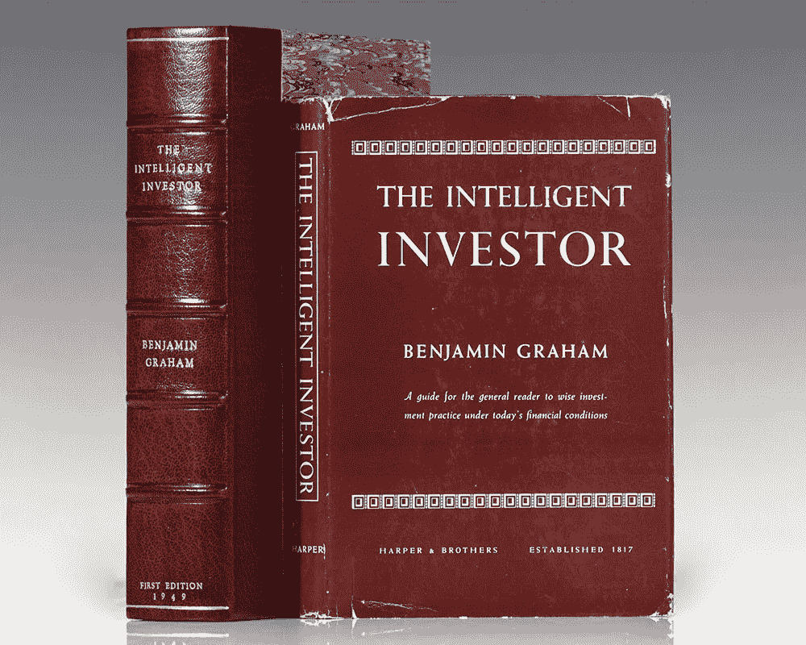
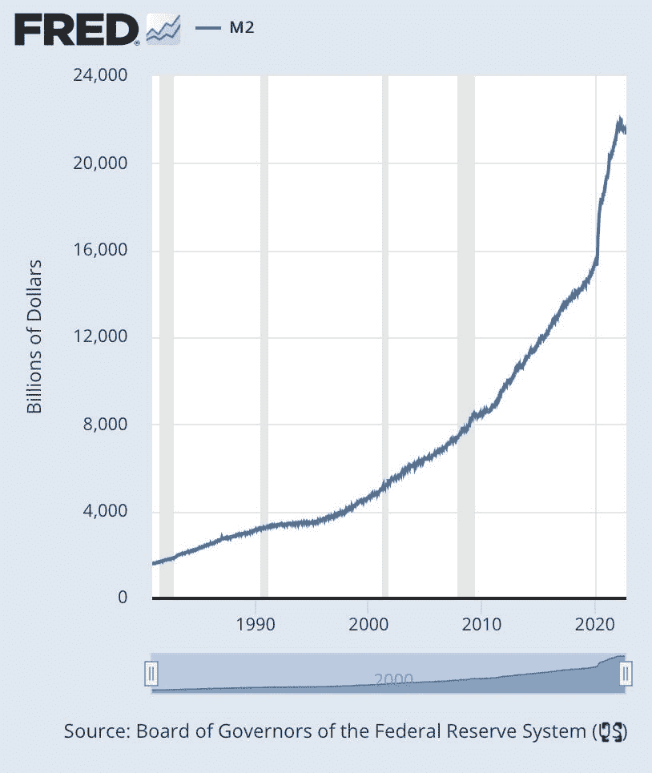
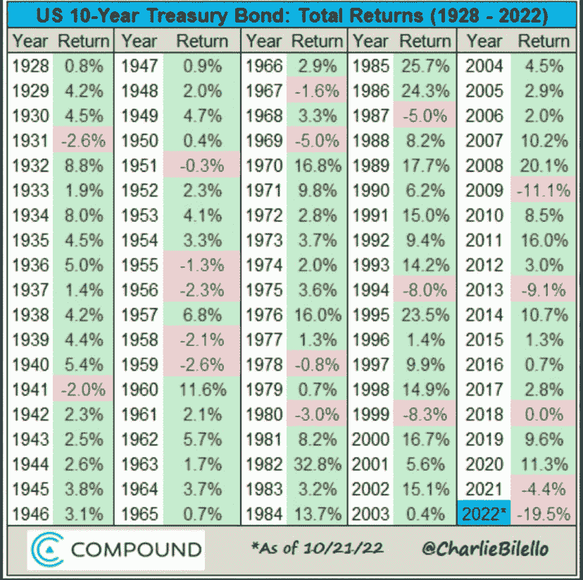
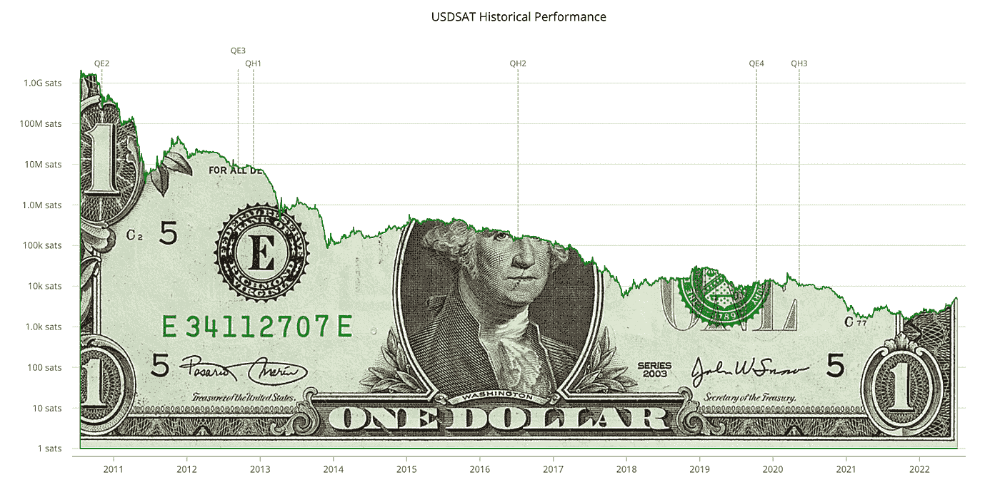

# 比特币是新的债券

> 原文：<https://medium.com/coinmonks/bitcoin-are-the-new-bonds-f09cde8116a6?source=collection_archive---------15----------------------->

Bitcoin City ( [Source](https://arquitecturaviva.com/works/bitcoin-city-en-el-salvador) )

**聪明的投资者**

1949 年，出生于英国的美国经济学家、教授和投资者本杰明·格拉哈姆出版了《聪明的投资者》，这本书被认为是价值投资的创始文本之一，也是金融文献的经典。在书中，格雷厄姆教导投资者如何保护投资组合免受重大损失，并制定长期战略。他的原则之一是“平衡的投资组合”应该由 60%的股票和 40%的债券组成，因为他认为债券可以保护投资者免受股票市场的重大风险。这条规则已经成为投资界的一条不成文的法律。债券是一种金融工具，发行者(通常是政府或公司)借入资金，并有义务在到期日偿还债券持有人借入的金额以及特定时间内的利息(称为息票)。根据[证券业和金融市场协会](https://www.sifma.org/resources/research/fact-book/) (SIFMA，2022)，全球债券市场的规模估计约为 120 万亿美元。

最常购买的债券是政府债券，如美国国债([阿玛迪奥，2022](https://www.thebalancemoney.com/what-are-treasury-bills-notes-and-bonds-3305609) )。由于美国政府作为债务人违约的概率较低，这些债券被认为是最佳风险调整债务工具之一。公司债券市场是债券世界的第二大部分，允许公司从公众那里借钱。债券已成为我们金融体系不可或缺的一部分，因为除其他原因外，它们让民族国家有能力借款，并在历史上允许投资者将资金配置到低风险金融资产，因为民族国家的违约概率较低。

( [Source](https://www.zvab.com/erstausgabe/Intelligent-Investor-Graham-Benjamin-Harper-Brothers/30982378216/bd) )

**世事变迁**

尽管格雷厄姆描述的许多内容在今天仍然有意义，但我认为债券，尤其是政府债券，已经失去了在投资组合中作为对冲工具的地位。主要是因为债券收益率跟不上货币通胀。此外，我们的金融体系(债券是其中不可分割的一部分)正系统性地面临风险。构成我们金融体系核心的许多政府的财政健康正处于危险之中。当政府资产负债表状况良好时，政府违约的隐含风险几乎为零。这有两个原因。首先，他们的征税能力。其次，也是更重要的，他们创造货币来偿还债务的能力。在过去，这种说法是有道理的，但最终创造货币(出于各种原因)已成为一个严重的问题，正如 Greg Foss (2021 年)在他的论文“为什么每个固定收益投资者都需要将比特币视为投资组合保险”中所解释的那样。

[Read Greg’s Paper](https://rockstarinnercircle.com/wp-content/uploads/2021/04/Why-Every-Fixed-Income-Investor-Needs-To-Consider-Bitcoin-As-Portfolio-Insurance.pdf)

**点钞机走 brrr**

中央银行比以往任何时候都要流通更多的货币。美国中央银行系统美联储的数据显示，被称为 M2 的广义美元存量[从 2020 年初的 15.4 万亿美元](https://fred.stlouisfed.org/graph/?g=Onyz)上升到 2021 年 12 月底的 21.18 万亿美元(圣路易斯联邦储备银行，2021)。增加的 5.78 万亿美元相当于美元总供应量的 37.53%。在过去的三年里，M2 的年增长率达到了 15%。[美国国债收益率下降](https://www.bloomberg.com/markets/rates-bonds/government-bonds/us)(彭博，2022)。

Billions of Dollars in existence. Chart by the St. Louis FED (fred.stlouisfed.org).

**系统性风险**

在过去的几十年里，世界各地的中央银行一直保持着非常宽松的债务政策，各国政府大举借债。正如投资者斯坦利·德鲁肯米勒(Stanley Druckenmiller)指出的那样，市场上存在大量不负责任的信贷。阿根廷和委内瑞拉已经违约。有可能会有更多的国家出现债务违约。这并不意味着他们不能通过创造更多的钱来偿还债务。然而，这将使一个国家的货币贬值并导致通货膨胀，这将使大多数收益率相对较低的债券更加缺乏吸引力( [Foss，2022](https://www.youtube.com/watch?v=FusKoeWmDzY) )。

**明斯基时刻**

债券奏效了，因为我们正经历着历史上最长的资产泡沫之一。多年来，央行一直通过购买债券(通过增加货币供应融资)来操纵债券市场。最新的例子包括日本银行和英格兰银行。据估计，日本银行现在拥有政府发行的几乎一半债券([德岛，2022](https://www.asahi.com/ajw/articles/14723287) )。英国银行最近宣布，在英镑走软后，它在一天内购买了价值 11.95 亿英镑的英国债券，以“安抚市场”([路透社，2022](https://www.reuters.com/markets/currencies/bank-england-buys-1195-billion-pounds-bonds-2022-09-30/) )。然而，我们的“明斯基时刻”可能即将到来。美国经济学家海曼·明斯基(Hyman Minsky)认为，当债务推动的资产泡沫崩溃，资产变得难以以任何价格出售时，就会出现临界点。市场崩溃随之而来。这是一个真正的风险，开始在债券市场情绪中得到反映( [Foss，2021，第 19 页](https://rockstarinnercircle.com/wp-content/uploads/2021/04/Why-Every-Fixed-Income-Investor-Needs-To-Consider-Bitcoin-As-Portfolio-Insurance.pdf))。10 年期美国国债即将迎来历史上最糟糕的一年，年初至今下跌了 20%。([布德尔曼，2022](https://www.linkedin.com/feed/update/urn:li:activity:6989829218524090368/?commentUrn=urn%3Ali%3Acomment%3A(activity%3A6989829218524090368%2C6990297596447576064)&dashCommentUrn=urn%3Ali%3Afsd_comment%3A(6990297596447576064%2Curn%3Ali%3Aactivity%3A6989829218524090368)) )。

US 10-Year Treasury Bond: Total Returns (1928–2022) ([compoundadvisors.com](https://compoundadvisors.com)).

**比特币**

当通货膨胀被计入价格时，债券已经成为一种亏损的合同义务。债券持有人获得了名义金额，但正在失去购买力( [Foss，2021，第 6 页](https://rockstarinnercircle.com/wp-content/uploads/2021/04/Why-Every-Fixed-Income-Investor-Needs-To-Consider-Bitcoin-As-Portfolio-Insurance.pdf))。央行稳定债券市场的唯一选择是创造货币回购债券。然而，如果债券的回报率低于货币通胀率，那么持有债券有什么意义呢？此外，还存在系统性失败的风险。全球金融体系不可逆转地崩溃了，作为其基础的债券正处于高风险之中([勒克莱尔，2021](https://podcasts.apple.com/us/podcast/read-516-conclusion-of-the-long-term-debt-cycle/id1359544516?i=1000517163396) )。在这种环境下，持有债券没有任何经济意义。对于任何想要保护自己财富的理性代理人来说，理性的经济激励是寻找不会贬值或被印刷的资产。比特币的发行时间表完全没有弹性，是一个完美的选择。

[格拉汉姆的哲学首先是保护资本，然后努力让资本增长](https://www.investopedia.com/articles/basics/07/grahamprinciples.asp)。有了比特币，就有可能以绝对零交易对手或信用风险的自我主权方式存储价值。

A person holds a cold wallet at the Bitcoin cultural center on March 17, 2022, in Buenos Aires, Argentina ([Source](https://www.forbes.com/sites/rufaskamau/2022/05/30/how-to-safely-self-custody-your-bitcoin/?sh=2920950c6431)).

**比特币 vs 菲亚特**

最终，法定货币注定会贬值，而债券投资者实际上只是这一现实的“衍生品”。与比特币相比，债券是一种劣质资产，在现实的前瞻性投资组合中已经失去了一席之地。我认为金融机构购买债券的唯一原因要么是因为他们有必须拥有的政府债券配额，要么是因为他们希望通过接受固定 2%收益率的低质量金融资产来保护自己的投资组合业绩免受股市波动的影响。这在短期内可能在纸面上看起来不错，但从长期来看，它根本没有任何经济意义。许多传统金融老手现在都得出这个结论。去年，在接受彭博采访时，资产管理公司 Bridgewater Associates 的创始人[雷伊·达里奥(2021)](https://www.bloomberg.com/news/articles/2021-05-24/bridgewater-s-ray-dalio-says-he-prefers-bitcoin-to-bonds#xj4y7vzkg) 表示，他宁愿拥有比特币，而不是债券。在过去的几十年里，达利奥已经成为我们这个时代最优秀的投资者和实用经济学家之一。考虑到这两种资产的风险回报状况，他的说法非常有道理。

USD/SAT Historical Performance. A sat (satoshi) is the smallest denomination of bitcoin, equivalent to 100 millionth of a bitcoin. The dollar has depreciated by 99.85% against bitcoin over the past decade ([usdsat.com/](https://usdsat.com/)). Bonds don’t help you maintain the purchasing power of your savings. Bitcoin does.

**结论**

比特币是数字时代最好的价值储存手段。一种绝对稀缺的数字本地无记名资产，没有交易对手风险，不能膨胀，可以在世界上最强大的计算机网络上轻松运输和转移。比特币旨在扮演债券在历史上为贷方扮演的角色。低风险的长期储蓄机会。比特币的最大风险是失去你的访问权、你的私钥，或者变得依赖于第三方，并有可能在潜在的欺诈、黑客攻击或破产中失去你的硬币。[网络本身是有史以来最安全的数字系统](https://river.com/learn/can-bitcoin-be-hacked/#bitcoin-security)。我们都听说过这样一句话，过去的表现不能代表未来的表现，这可能是真的。但比特币的情况并非如此。由于市盈率的原因，股价越高，风险就越大。不是比特币。当比特币价格上涨时，由于流动性、规模和全球主导地位，配置比特币的风险变得更低([勒克莱尔，2021](https://podcasts.apple.com/de/podcast/read-516-conclusion-of-the-long-term-debt-cycle/id1359544516?i=1000517163396) )。比特币网络现在已经达到了一个很可能通过林迪效应继续存在的规模，林迪效应是一种理论，即不朽的东西存在越久，它在未来就越有可能存在。
现在这是一种自我实现的[滚雪球式的网络效应，吞噬债券和其他资产作为价值储存手段的货币溢价。](https://twitter.com/croesus_btc)

如果截至 2021 年 12 月 18 日，比特币在 10 年的基础上平均每年的回报率为[155%](http://casebitcoin.com/),或者说中期内每年约为 60%至 70%[Livera，2021](https://bitcoinmagazine.com/culture/why-we-cant-completely-abandon-fiat-for-bitcoin-yet) ，那么很明显你为什么要最大化你的比特币敞口。我明白，对于大多数基金和金融机构的投资策略来说，比特币的波动性是有问题的，这些投资策略是以短期表现来衡量的。如果你是管理别人钱的专业人士，我建议把你管理的资金的 2-5%配置到比特币上。这让你可以参与比特币的上涨潜力，而不会受到其波动性的负面影响。

PS:我经常读到所谓金融专家的批评，认为比特币不像债券，不会产生任何收入。确实如此。这是不应该的。它旨在保护其长期购买力。以收益为导向的心态是社会习惯于货币不断贬值的结果。健全的货币和比特币一样，由于其货币属性，供应有限，需求很高，不需要任何额外的收益率，其购买力的增加就是“收益率”。一旦你明白了这一点，你就明白了为什么比特币优于债券。在《比特币标准:中央银行的分散化替代方案》(The bit coin Standard:The Decentralized Alternative to Central Banking)一书中，Saifedean Ammous (2021)提供了 167 个县的数据，显示 1960—2020 年间货币供应量的年均增长率为 29%。在此期间，瑞士的平均增长率最低，为 6.5%，美国第二低，为 7.4%，瑞典第三低，为 7.9%。收益率为 5%的债券有什么用？

如果你喜欢这篇文章，你可以在 [Twitter](https://twitter.com/leonamschel) 上关注我，访问我的[主页](http://www.asystemofrules.org/)或者给我发一些 sat:【law@getalby.com】T4

**其他资源**

*   [为什么每个固定收益投资者都需要将比特币视为投资组合保险](https://rockstarinnercircle.com/wp-content/uploads/2021/04/Why-Every-Fixed-Income-Investor-Needs-To-Consider-Bitcoin-As-Portfolio-Insurance.pdf)

*本文收录了我于 2022 年 11 月 29 日发表在《比特币》杂志上的一篇文章的部分内容，标题为* [*《为什么比特币是终极财富保值技术》*](https://bitcoinmagazine.com/culture/bitcoin-is-ultimate-wealth-preservation) *。我想在此基础上深入探讨细节，因为这个话题是如此的多面性。*