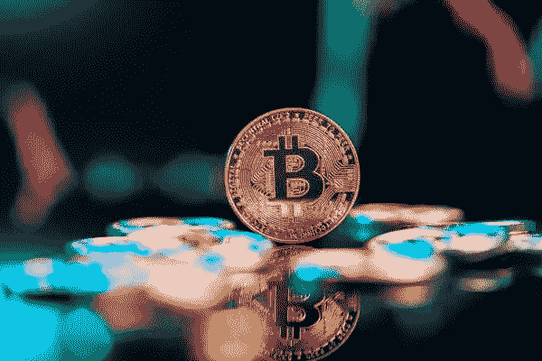

# 比特币击败以太坊，尽管即将“合并”

> 原文：<https://medium.com/coinmonks/bitcoin-beating-out-ethereum-despite-upcoming-merge-36e2ab7d69a1?source=collection_archive---------50----------------------->

我想任何阅读这篇文章的人都已经很清楚即将到来的[以太坊 2.0](http://fxempire.com/crypto/eth) 是什么，不需要我来解释细节。以太坊区块链的升级或者更准确地说是硬分叉已经被广泛期待了很多年，它的延迟是一段时间以来最受批评的方面。

然而，围绕转换到 PoS 的集中化问题多年来一直为人所知，最近才成为人们关注的焦点。除了最近才出现的可能的安全和审查问题，以太坊在比特币获得收益的最后两天设法进行了亏损交易。

# 比特币 vs 以太坊对比

首先，我想强调这种情况是多么罕见。上一次[比特币](https://www.fxempire.com/crypto/btc)连续两天上涨而以太坊连续两天下跌还要追溯到 2021 年 11 月初。当时比特币的交易价格约为 65000 美元，与今天的价格相差甚远。

上图展示了最近一次以太坊交易走高、BTC 交易走低(红线)或以太坊交易走低、比特币交易走高(绿线)的情况。大多数情况发生在“多奇”蜡烛代表很少或没有变化的日子。此外，这些事件很少连续发生。

# 为什么交易者可能害怕以太坊

很多这种新的恐惧，关于合并可能如何影响以太坊，围绕着赌注服务利多，以及它如何构成所有赌注以太的近三分之一。当一个单独的实体控制了至少 51%的网络时，他们可以向链中添加他们想要的任何块，或者审查他们不想要的块。

当你考虑到绝大多数 Ether stacked 正在使用一个在美国运行的集中交易所时，这 51%可以很容易地实现。鉴于这些交易所多次站在他们居住的政府一边，并考虑到最近美国对 Tornado Cash(一种以太坊混合工具)的制裁，美国政府可以通过将我们的地址添加到黑名单中来有效地审查任何交易，并从本质上使用户的以太坊不再有效。

出于这些原因，我觉得可以有把握地假设，目前比特币的反弹和以太坊的回调是由于上述问题造成的，这种叙事可能会在未来几天和几周内继续，这将对比特币构成利好。

任何有兴趣阅读更多关于比特币的文章的人，只需点击这个[链接](https://www.thegoldforecast.com/bitcoin)。

*最初发表于*[*【https://www.fxempire.com】*](https://www.fxempire.com/forecasts/article/bitcoin-beating-out-ethereum-despite-upcoming-merge-1124719)*。*

> 交易新手？尝试[加密交易机器人](/coinmonks/crypto-trading-bot-c2ffce8acb2a)或[复制交易](/coinmonks/top-10-crypto-copy-trading-platforms-for-beginners-d0c37c7d698c)