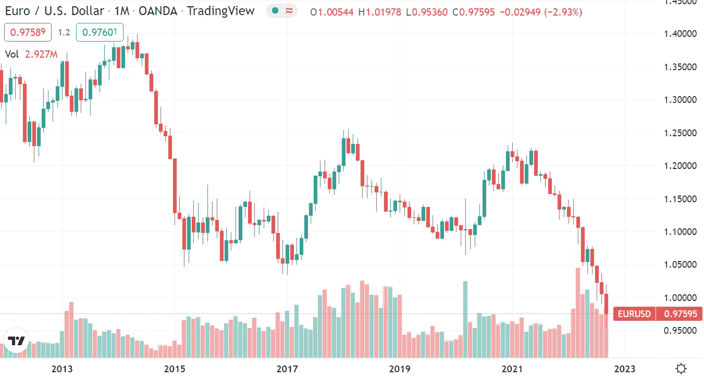
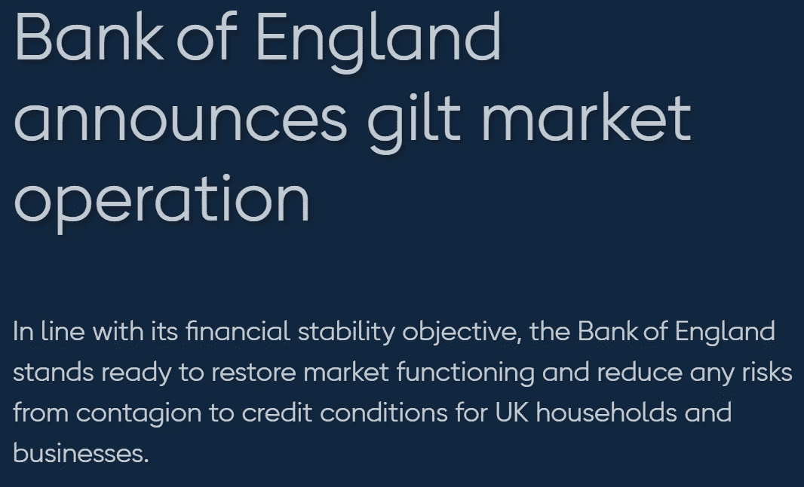
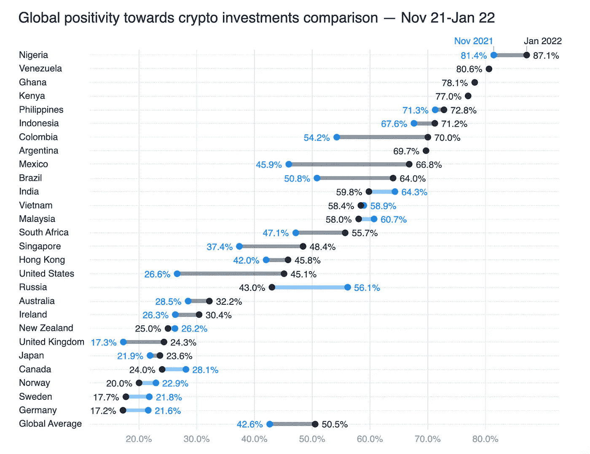
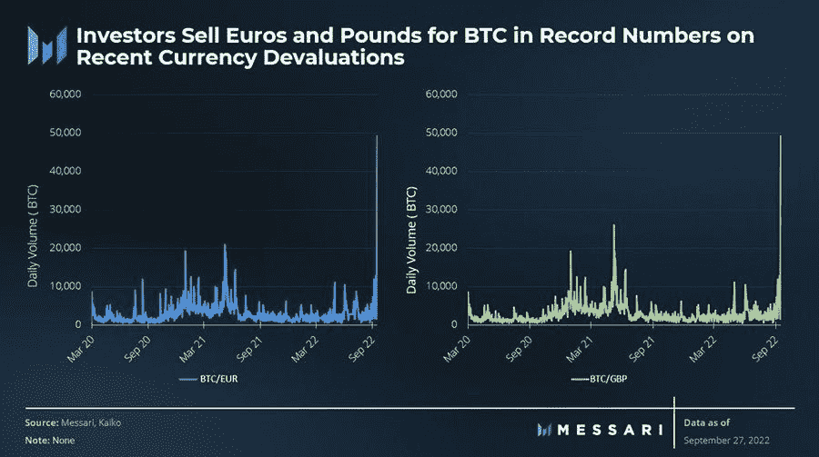

# 随着菲亚特系统的崩溃，比特币成了救生筏

> 原文：<https://medium.com/coinmonks/bitcoin-becomes-a-life-raft-as-the-fiat-system-breaks-2e6e2251656c?source=collection_archive---------1----------------------->

在这篇文章中，我将向你解释，打破我们到目前为止所习惯的菲亚特系统将如何很快推动比特币走高。高得多。

我将涉及以下几点:

⚠️The 2 导致西方国家菲亚特危机的主要因素。

🧐为什么欧元，日元，GPB 等正在贬值。

💢为什么政府和中央银行需要介入以防止系统崩溃。

💸量化宽松将以另一个名字回归。

🌊为什么危机来临时比特币会是救生筏。

💡关于晚期菲亚特，我们能从阿根廷、黎巴嫩和津巴布韦学到什么？

这是一个非常复杂的话题，我试图用一种简单的语言来分解它。如果有不清楚的地方，请随时问我问题。因为我相信理解我在这里所说的话的含义对你来说是至关重要的。

好了，解决了这个问题，让我们进入正题吧！

# ⚠️引发西方国家菲亚特危机的两大因素

过去几周，欧元、英镑、日元和大多数其他货币对美元的汇率大幅下跌。

但这是为什么呢？

这里有各种因素在起作用。

*   总体而言，美联储大幅加息正导致美元走强，因为欧洲和日本央行的行动要犹豫得多。
*   除此之外，还有一些特殊的原因，比如欧洲正在发生的能源危机，这场危机摧毁了欧洲的竞争力，也摧毁了欧元(之前)坚挺的基础。日本也面临同样的问题，尽管程度不如欧洲。

顺便说一句，如果你想要更多关于加密和投资的免费内容，请查看我的 Twitter。

Click me.

但是我们是怎么到这里的呢？

造成这种情况的主要因素有两个。

## 1.能源短缺

一个国家的经济增长和维持需要能源。没有足够的廉价能源，经济就会停滞并最终萎缩。

2000 年代初，大多数西方国家不再是净能源生产国。因此，他们不得不从其他地方进口更多的能源，这使得他们的能源费用更高。

这与过去二十年我们在西方国家看到的增长停滞不前相吻合。如下图所示，自 21 世纪初以来，西方国家的经济增长一直停滞不前。峰值来自 COVID 危机后的反弹。灾难性的当前数字没有包括在内。

为了保持增长，西方政府试图通过向金融体系注入越来越多的资金来刺激经济。随着政府向其公民发放资金以补偿飙升的能源价格，这种情况变得更加严重。

所有这些的问题是:停滞或萎缩的经济无法吸收所有新创造的货币。结果，到处都形成了泡沫。

## 2.我们所知的全球化的终结

全球化在 2010 年代中期达到顶峰。全球化的承诺是，通过将生产外包给更便宜的国家，西方国家仍然可以获得用硬通货购买的廉价商品，从而维持他们的生活水平。

问题是使这成为可能的超全球化正在慢慢瓦解。简而言之，世界现在分为三块:

*   西方国家希望事情保持原样，并希望保护他们的地盘。
*   俄罗斯-中国-伊朗集团希望击退西方对现有体系的力量和影响。
*   不结盟或松散结盟的国家，如印度、巴西、印度尼西亚和尼日利亚，与另外两个国家做生意，并在一旁观望事态如何发展。

我们如何走到这一步是一个很长的故事，我将非常简要地总结一下。

获取廉价能源就是力量。当大多数西方国家在 21 世纪初开始成为能源净进口国时，它们逐渐失去了曾经对世界其他地区的影响力。这导致西方的领导权受到中国等新兴大国的质疑。冲突加剧了(例如鲁瓦战争和台湾的紧张局势)。

我们现在看到西方集团及其对手在社会、政治和经济上相互疏远的明显努力。

所有这些都发生在 COVID 锁定对全球经济的影响尚未完全消除的时候。

⛓️Many 的供应链仍然中断。🛢️Material 短缺依然存在。
🏭公司破产。

同样，西方政府试图通过印更多的钱来解决这些问题。

所有的印钞最终导致了明显的后果:通货膨胀。

Source: [tradingview.com](https://www.tradingview.com/chart/?symbol=OANDA%3AEURUSD)

# 🧐:为什么欧元、日元、英镑等正在贬值，而美元是最后一个坚挺的货币(目前)

通货膨胀是货币失去购买力的另一种说法。大多数国家都受到了影响。明显的例外是俄罗斯卢布和美元。

*   俄罗斯是一个能源净出口国，工业基础(相对)良好。
*   美国是这个星球上最强大的经济体，美元是世界货币储备，他们还有大量廉价的化石能源储备。

但是欧元区、日本和英国发生了什么变化呢？为什么它们的货币突然同时暴跌？

一个重要因素是信任的丧失。

当买家对一种货币的购买力失去信心时，他们就会停止购买政府和企业债券，即政府和企业债券。事实上，他们停止购买债券是因为他们不相信政府和企业会偿还他们的债务。

毕竟，法定货币是由…除了对发行它们的政府的良好信任之外，别无其他支持。与此同时，许多公司的经济前景也急剧恶化。

在过去的几十年里，对政府的信任和对经济将永远增长的信念，足以让这个体系保持运转。但我们现在到达了一个点，市场参与者意识到，在经济陷入困境的同时，仅靠诚信已不足以支撑欧元、日元和英镑等法定货币。

*   由于缺乏廉价的高密度能源，欧元区(德国)正处于去工业化过程中。德国企业正在关闭并离开这个国家。
*   日本也深受能源短缺之苦——尽管程度不如欧洲。但是这个国家也有自己的一系列问题导致了日元的贬值。
*   由于全球化，英国很久以前就失去了工业基础。因此，英镑没有多少支撑。它也是能源的净进口国。

随着对许多西方货币的信任度同时下降，我们面临着一个新问题。

# 💢为什么政府和中央银行需要介入以防止系统崩溃

过去几周，许多国家的信用违约互换(CDSs)价格上涨。这意味着债券持有人和交易员认为违约风险更高。

举个例子，当美国投资者出售英国债券时，他们会收到英镑作为回报。然后，投资者卖出英镑，买入美元，这给英镑带来了更大的压力，导致英镑下跌。

英国——或者更具体地说，英格兰银行对此能做些什么？

这个。

Source: [bankofengland.co.uk](https://www.bankofengland.co.uk/news/2022/september/bank-of-england-announces-gilt-market-operation)

英国央行:*“如果这个市场的功能失调继续或恶化，英国的金融稳定将面临重大风险。这将导致融资条件的不必要收紧，以及流向实体经济的信贷减少。*

*根据其金融稳定目标，英国央行随时准备恢复市场功能，并降低英国家庭和企业信贷状况蔓延的任何风险。*

*为实现这一目标，英国央行将从 9 月 28 日起临时购买长期英国政府债券。”*

换句话说，英格兰银行作为购买英国债券的最后买家介入。与此同时，由于央行通过注入更多资金来解决量化紧缩，流动性短缺正在各地涌现。

这些问题影响着所有西方政府和央行。这是因为全球金融部门高度相互关联。这意味着一旦一个地方的事情开始崩溃，它也会影响到其他地方的系统。事实上，现在发生的事情让许多投资者想起了 2008 年，当时金融体系开始迅速瓦解。

顺便说一下，全球金融资产或负债估计至少为 587 万亿美元。所以这将是一个真正的大事件。这就是为什么在某个时候，甚至美联储也不得不出手救市。

# 💸量化宽松将以另一个名字回归

目前正在进行的这一过程正在金融市场造成巨大破坏。这给整个系统带来了重大风险。十年前，大金融危机将全球金融体系和全球经济带到了崩溃的边缘。政府再次面临同样的问题。

为了保持系统运行——其中很大一部分是为了防止他们货币的终结——政府和中央银行将选择剩下的唯一选择:印更多的钱。让你的货币贬值比完全失去它要好。

是的，这很讽刺——但也很明显。

因为通货膨胀使他们能够偿还债务。毕竟，他们用的不是自己的钱。

但是我们的通货膨胀率是 10%,政府和中央银行不是说他们要对抗通货膨胀吗？

是的。但他们宁愿忍受高通胀，也不愿冒系统内爆的风险。

这就是为什么我们很快就会看到量化宽松政策以另一个名义回归，而通胀数据仍然很高。德国刚刚推出了 2000 亿欧元的“纾困计划”来对抗通胀...这只是开始。他们将不得不动用巨额资金来防止这一次金融体系崩溃。

这就是比特币登场的地方。

Source: [finbold.com](https://finbold.com/billionaire-investor-s-druckenmiller-says-mistrust-in-central-banks-could-lead-to-crypto-renaissance/)

# 🌊为什么危机来袭时比特币会是救生筏

包括我在内的许多人都认为比特币是一种对冲通胀的工具。从 2020 年 3 月到 2021 年末，当比特币从 1 美元 4K 涨到 69，000 美元，而全球各国央行向世界各地投放大量法币时，我们是对的。

为了降低通胀率，各国央行提高了利率，比特币也相应采取了行动。

很快，当政府和中央银行不得不介入拯救系统免于崩溃时，洪水之门将再次打开。而比特币会飙升。

因为一些基本的东西会改变。

市场需要时间来调整自己的思维，但一旦发生，就没有回头路了。一旦投资者意识到央行别无选择，只能让货币贬值，这将改变投资的普遍心态。

在过去的几十年里，债券和股票是投资者投资的地方。但当你处于高通胀环境和经济萎缩(也称为滞胀)时，债券会受到挤压，股票的表现会比过去差得多。

相反，你需要在这种环境下增值的东西。比特币的某种联系。

比特币的固定供应为不断贬值法定货币的绝望的央行提供了另一种选择。换句话说:对于西方国家的许多人来说，比特币将成为一个救生筏，让他们在经济上漂浮，而其他人都淹没在廉价的菲亚特中。

事实证明，这方面已经有很多榜样了。

Source: [trustnodes.com](https://www.trustnodes.com/2022/03/30/the-wind-of-change-crypto-adoption-grows-globally-while-america-dogecoins)

# 💡西方人能从阿根廷、尼日利亚和印度尼西亚学到什么

上图显示了各国对加密投资的乐观情绪。注意到什么了吗？

大多数对加密货币持积极态度的国家都遭遇了法定货币疲软的问题。

阿根廷、尼日利亚、印度尼西亚和其他国家的人民已经经历了几十年的本币贬值。解决这个问题的一个方法是购买比特币。因为它有一个有限的供应，是可分的，是数字便携的。

高通胀环境下的生活会很艰难。去年，我写了一篇关于这对普通西方人意味着什么的文章。你应该去看看！👇👇

 [## 通货膨胀将如何影响 2020 年和 2030 年

### 未来几十年的宏观经济趋势以及它们如何影响我的投资策略。

medium.com](/coinmonks/how-inflation-will-impact-the-2020s-2030s-af7315c64396) 

直到最近，这些情景对大多数西方人来说还是不可思议的。但是，当两位数的通货膨胀到来并且不会消失时，那些习惯于拥有硬通货的人将不知道是什么打击了他们。

虽然大多数西方人仍然不知道发生了什么，但我们可以看到一些人正在采取措施保护自己。

梅萨里的图表显示，抛售欧元和英镑买入比特币的人数突然激增。

Source: Messari

虽然这是一个令人鼓舞的发展，但它仍然在小范围内发生。与西方国家相比，发展中国家的比特币购买率要高得多。

TLDR:西方国家的中央银行别无选择，只能印刷他们的货币。菲亚特购买力会崩溃，比特币会飙升。

免责声明:本文仅用于信息和教育目的，不应被视为投资建议。

> 交易新手？试试[密码交易机器人](/coinmonks/crypto-trading-bot-c2ffce8acb2a)或者[复制交易](/coinmonks/top-10-crypto-copy-trading-platforms-for-beginners-d0c37c7d698c)