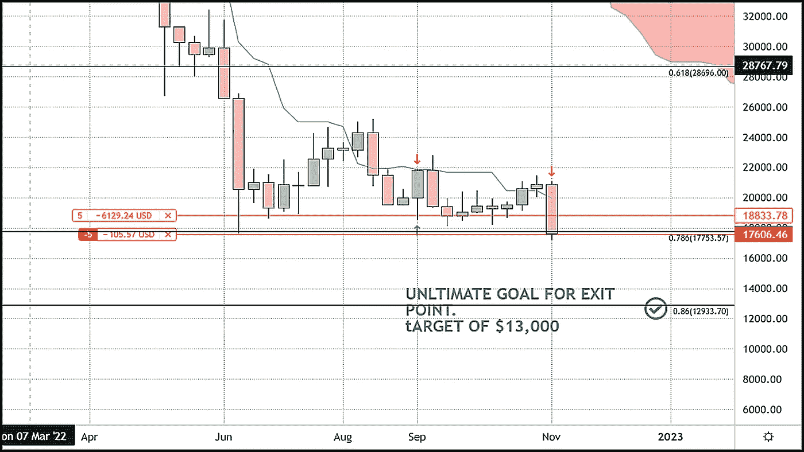
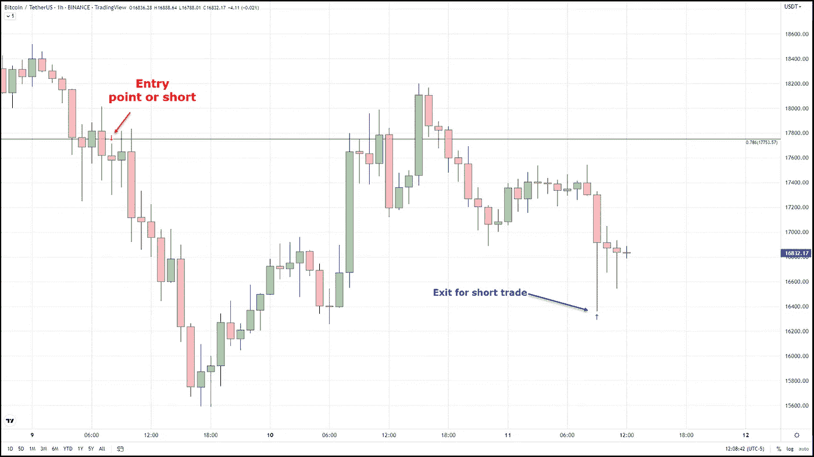
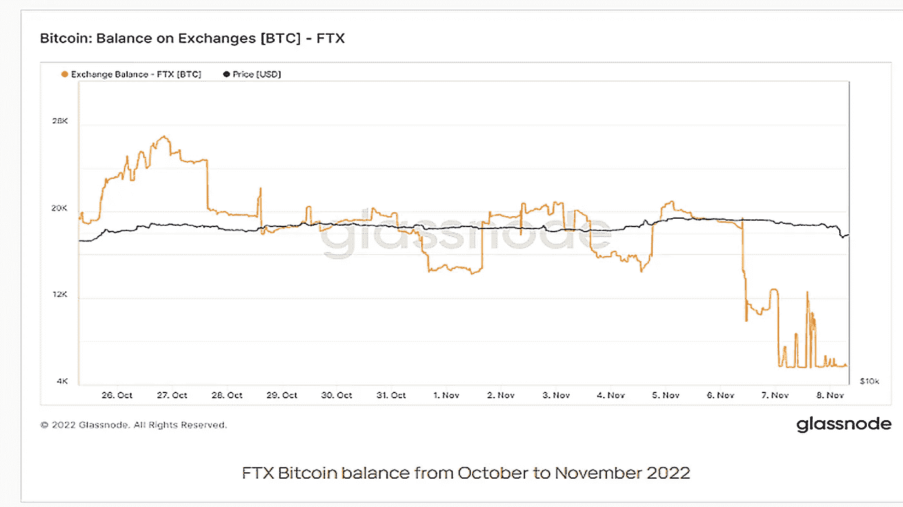
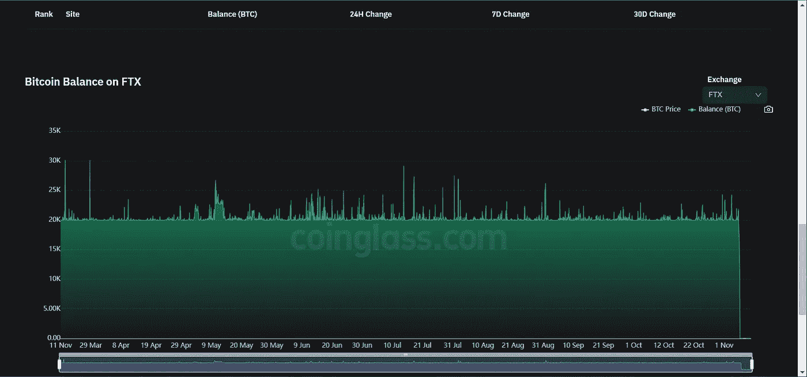
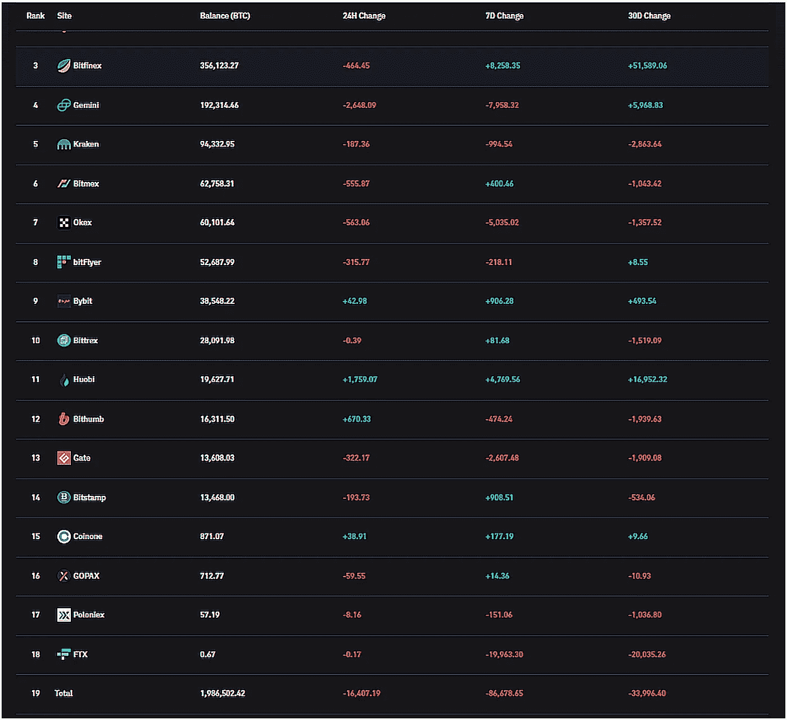
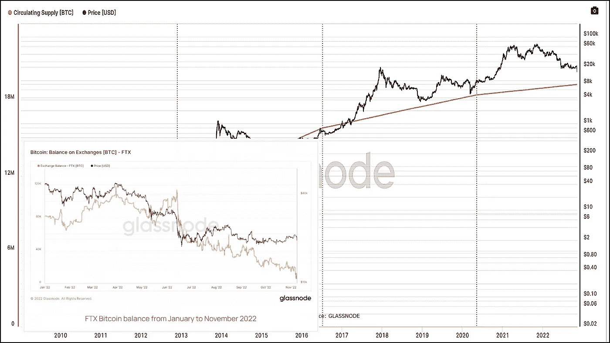

# 比特币在长期 78% Fib 突破底部。水平

> 原文：<https://medium.com/coinmonks/bitcoin-breaks-through-bottom-at-long-term-78-fib-level-7a0763f93a79?source=collection_archive---------29----------------------->

随着价格从 11 月 8 日开始跌至新低，维持了两年的比特币底部被打破。从 11 月 8 日开盘到 11 月 9 日的低点，比特币的价格下跌了 5000 美元，两天内下跌了近 25%。第二天，比特币略有回升，但无法收于 17，800 美元的 78%回撤上方，我们认为发布数月来的首次交易警报是谨慎的。在 Thegoldforecast.com/bitcoin 与我们签约的任何人都会收到交易警报，要求以 17600 美元的价格出售比特币。接听电话的交易者可能经历了几百美元以内的进场价格。我们在 18883 美元设置了保护性止损。我们最初的目标是 14，000 美元，但屈服于昨天发出的另一封电子邮件的原因，将我们的止损点从 18，883 美元下调到 18，400 美元，并将我们的止损点修改为 16，400 美元。

截至目前，交易者应该在今天早些时候以每比特币 1200 美元的利润在 16400 美元退出交易。任何仍然活跃的人都可以在当前价格下生存。

似乎每个人都知道是什么导致了这次大规模的衰退，但我不确定他们知道。有一点是肯定的，从 2020 年 3 月低点到历史高点的 78%回撤不再是支撑，似乎已经成为阻力。

**FTX 的流动性或缺乏流动性能解释 BTC 的下跌吗？**

过去一周，比特币和其他加密货币的大幅疲软被归咎于一个已经失败或即将失败的加密交易所 FTX 的流动性紧缩。FTX 在 2022 年 6 月的高峰期持有近 12 万比特币(Glassnode)。8 月份，他们的持有量降至 4 万比特币以下，11 月份，他们的持有量不足 2 万比特币。

另一个来源(Coinglass)显示，自 2022 年 3 月以来，FTX 从未拥有超过 2 万枚比特币。

现在，与世界各地交易所持有的近 200 万枚比特币或多年来开采的其余 1900 万枚比特币(减去丢失的比特币)相比，路透社报道的一家交易所亏损 80 亿美元导致的所有这些巨大疲软并不完全合理。

即使在过去几天的大规模抛售之后，比特币的流通供应量(包括可能已经丢失的硬币)仍然保持在 3250 亿美元。一个负债约 100 亿美元的交易所对总资本接近 8500 亿美元的加密市场产生如此巨大的影响，这是不合理的。

对此的一种解释是，抛售是注定的，交易员只是在等待一个催化剂来采取行动。或者这是另一个类似于航海家资本、三箭或 Terra Luna 的事件，对 cryptos 的声誉和吸引力造成的损害是真正的打击，而不是流动性紧缩。

在 FTX 遭遇惨败后，越来越多的人将硬币放入硬钱包，并从集中交易中取出硬币。这是这个阴暗的一周中唯一的一线希望。

> 交易新手？试试[加密交易机器人](/coinmonks/crypto-trading-bot-c2ffce8acb2a)或者[复制交易](/coinmonks/top-10-crypto-copy-trading-platforms-for-beginners-d0c37c7d698c)