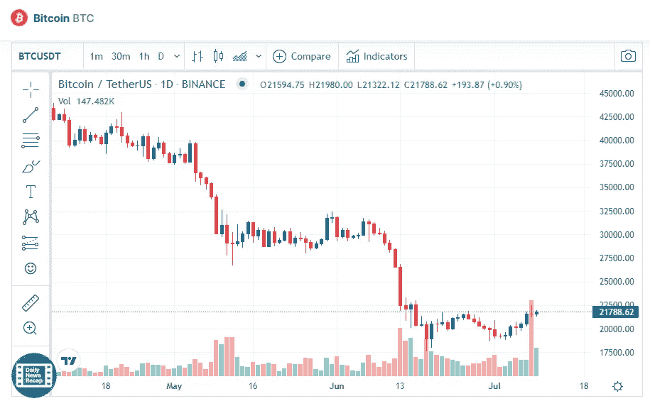

# 7 月 9 日比特币(BTC)价格分析

> 原文：<https://medium.com/coinmonks/bitcoin-btc-price-analyse-9th-of-july-fd3813692ffe?source=collection_archive---------21----------------------->

Source photo [Bitcoin price today, BTC to USD live, marketcap and chart | CoinMarketCap](https://coinmarketcap.com/currencies/bitcoin/)

本周，BTC/USDT 上涨了 13.4%，因为加密货币继续面临 21670 美元以上的阻力。在过去的三个月里，货币一直在下降的价格通道内交易，尽管最近在接近 6 月中旬的价格通道的较低角度附近找到了支撑。