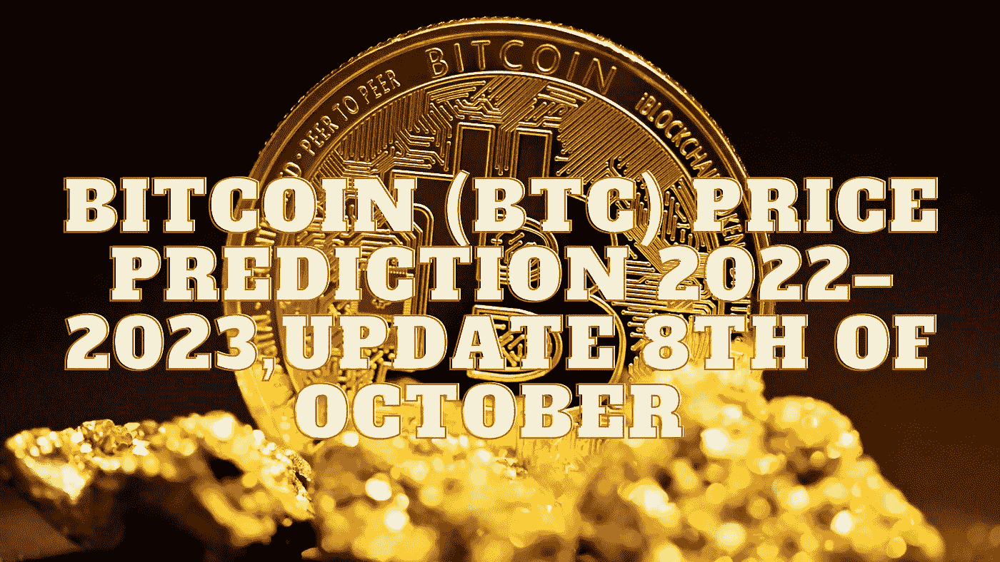

# 比特币(BTC)价格预测 2022–2023，10 月 8 日更新

> 原文：<https://medium.com/coinmonks/bitcoin-btc-price-prediction-2022-2023-update-8th-of-october-b07809a7e7e8?source=collection_archive---------15----------------------->

Source photo Unsplash.com

# 比特币是什么？

比特币是一种完全在线操作的加密货币，渴望与国家法定货币竞争。并通过其分散的结构和快速支付的点对点技术给人们更多的代理。比特币是中央金融系统的分散化替代物。比特币的价值纯粹取决于…