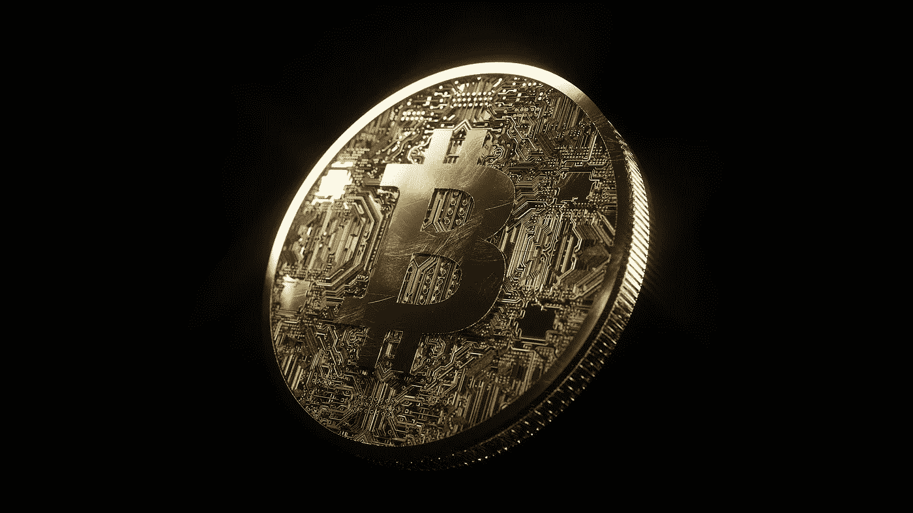

# 比特币(BTC)价格预测 2022–2025，11 月 11 日更新

> 原文：<https://medium.com/coinmonks/bitcoin-btc-price-prediction-2022-2025-update-11th-of-november-7e64398058d6?source=collection_archive---------5----------------------->

Source photo [Cryptocurrency Blockchain Bitcoin — Free photo on Pixabay](https://pixabay.com/photos/cryptocurrency-blockchain-bitcoin-3123849/)

## 比特币:这是怎么回事？

比特币等数字货币希望最终取代国家法定货币。由于它的分散性和点对点技术，它有能力在用户之间进行快速支付。比特币是去中心化的，因此独立于任何中央机构或单一机构运行