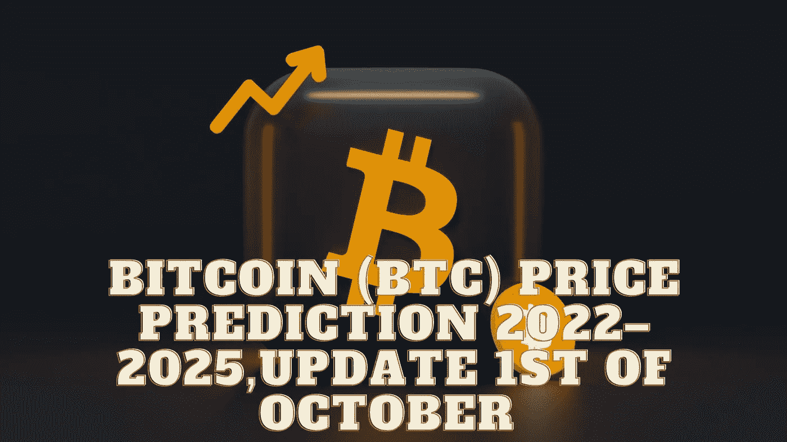

# 比特币(BTC)价格预测 2022–2025，10 月 1 日更新

> 原文：<https://medium.com/coinmonks/bitcoin-btc-price-prediction-2022-2025-update-1st-of-october-8778cd47c806?source=collection_archive---------8----------------------->

Source photo Unspash.com

# 比特币是什么？

简单来说，比特币是一种渴望在全球范围内与法定货币竞争的数字货币。并通过其分散的结构和快速支付的点对点技术给人们更多的代理。比特币是一种去中心化的数字货币，独立于任何央行、管理员或用户运行。比特币的…