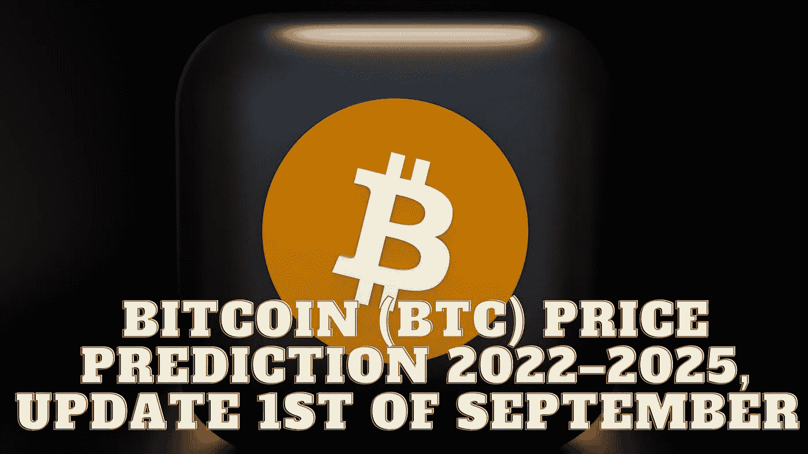

# 比特币(BTC)价格预测 2022–2025，9 月 1 日更新

> 原文：<https://medium.com/coinmonks/bitcoin-btc-price-prediction-2022-2025-update-1st-of-september-bbe72cc92d2c?source=collection_archive---------6----------------------->

Source photo Unspash.com

# 比特币是什么？

比特币是一种数字货币，有可能在全球范围内挑战法定货币。此外，它有能力促进人与人之间的即时支付，并且是分散的。比特币是中央金融系统的分散化替代物。比特币的价值纯粹由市场决定…