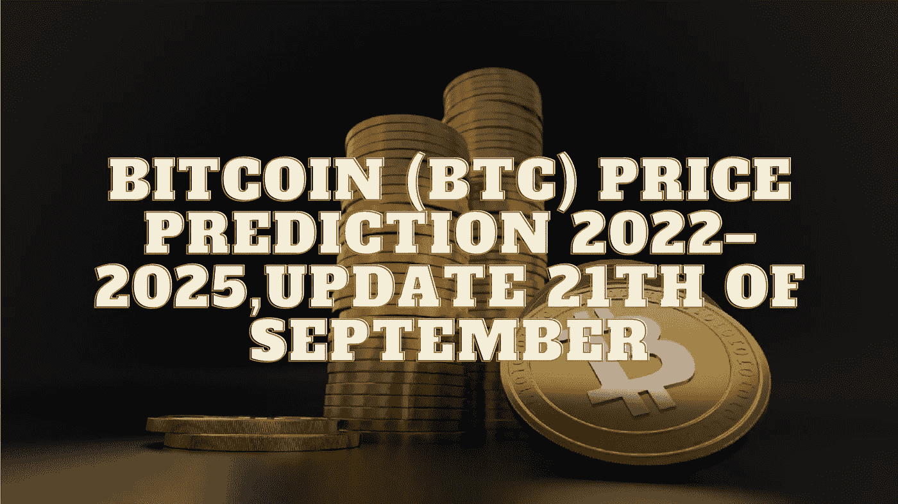

# 比特币(BTC)价格预测 2022–2025，9 月 21 日更新

> 原文：<https://medium.com/coinmonks/bitcoin-btc-price-prediction-2022-2025-update-21th-of-september-a77502a2d1d8?source=collection_archive---------44----------------------->

Source photo Unsplash.com

# 比特币到底是什么？

简单来说，比特币是一种渴望在全球范围内与法定货币竞争的数字货币。它有可能通过其分散的结构和快速支付的点对点技术来解放人们。与传统金融系统不同，比特币既不受任何中央监管…