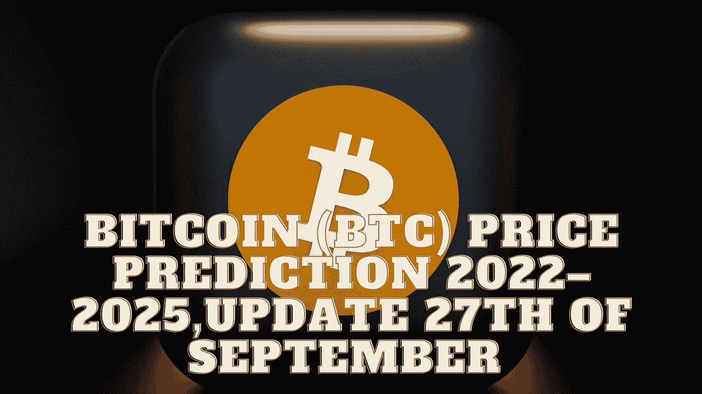

# 比特币(BTC)价格预测 2022–2025，9 月 27 日更新

> 原文：<https://medium.com/coinmonks/bitcoin-btc-price-prediction-2022-2025-update-27th-of-september-447585bddde5?source=collection_archive---------34----------------------->

Source photo Unsplash.com

# 比特币是什么？

比特币是一种数字货币，有可能在全球范围内挑战法定货币。此外，它是分散的，使用点对点技术进行快速支付，这将权力还给人。比特币去中心化；没有中央权力机构或私人实体负责其价值。比特币的价值…