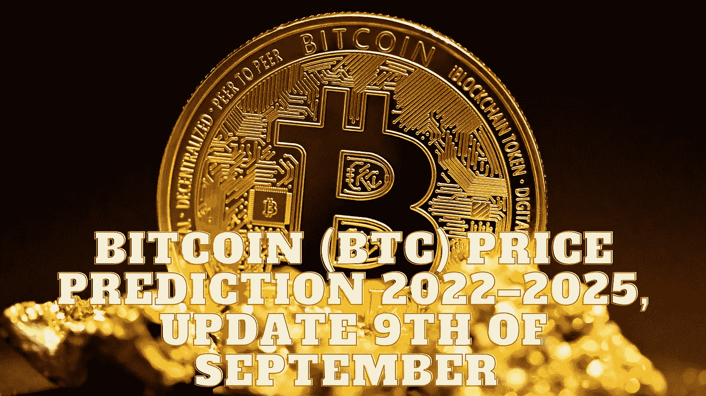

# 比特币(BTC)价格预测 2022–2025，9 月 9 日更新

> 原文：<https://medium.com/coinmonks/bitcoin-btc-price-prediction-2022-2025-update-9th-of-september-5411d225a146?source=collection_archive---------13----------------------->

Source photo Unsplash.com

# 比特币是什么？

简单来说，比特币是一种渴望在全球范围内与法定货币竞争的数字货币。通过去中心化和使用点对点技术进行即时金融交易，它给了人们更多的权力。与传统的货币体系不同，比特币既不受任何中央监管…