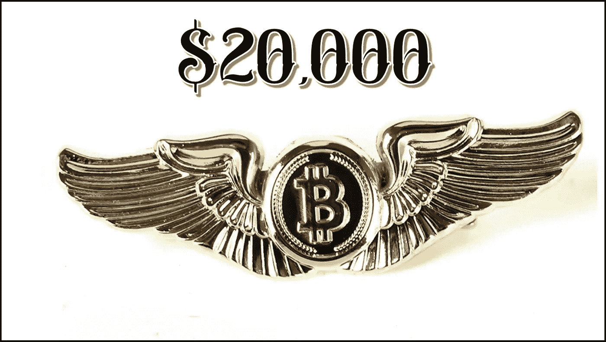
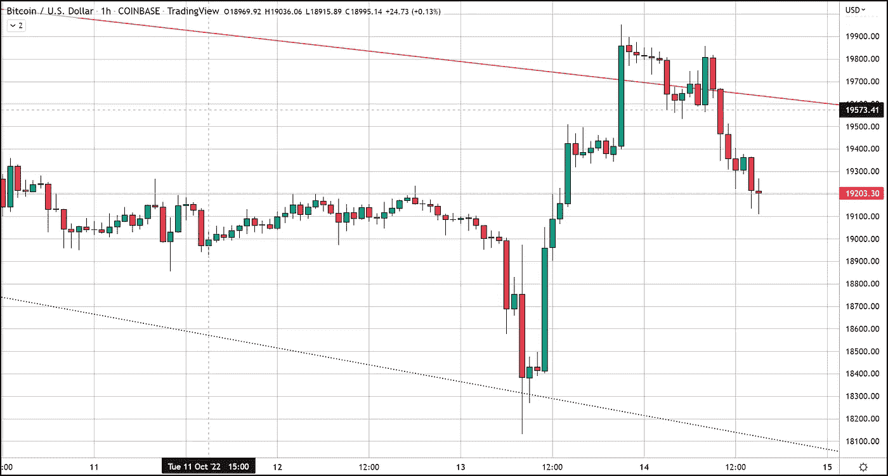
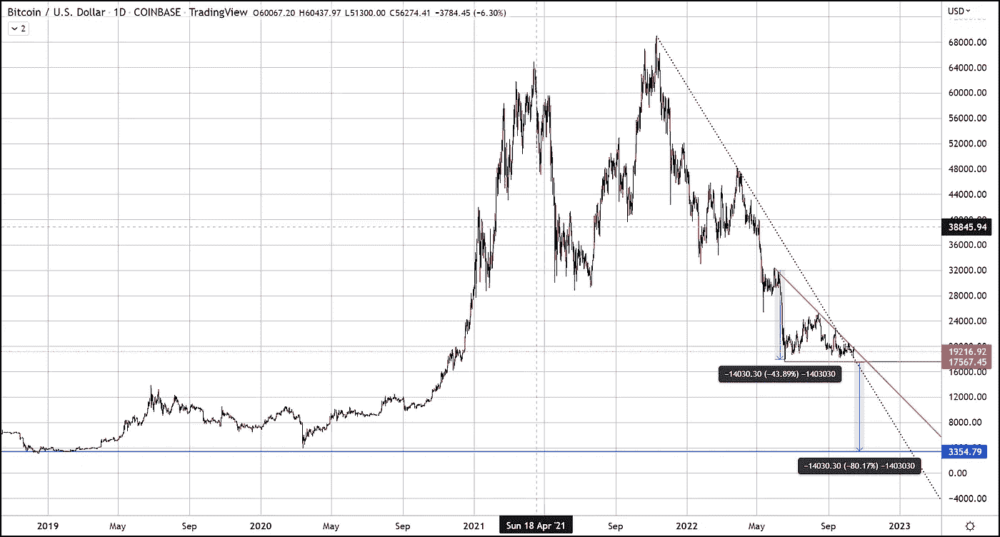

# 比特币多头试图重新索赔 2 万美元

> 原文：<https://medium.com/coinmonks/bitcoin-bulls-attempt-to-re-claim-20-000-5b1f23def72e?source=collection_archive---------58----------------------->

# 比特币突破了其阻力趋势线，但掉头向下

美国东部时间晚上 11 点左右，BTC 在阻力趋势线上交易，同一时间触及本周高点 19，954 美元。在回到下降三角形之前，BTC 在上方阻力趋势线上方坚持了将近 6 个小时。多头能够再次在阻力趋势线上方移动，形成略低的高点 19，800 美元。然而，在纽约市场开始时，空头重新控制了局面，把我们带回到下降三角形。

一个有趣的指标组合是，50 天简单移动平均线与上方趋势线的当前位置一致。在过去的一个月里，BTC 只在 50 日均线上方运行过一次。

# 技术人员在下降三角形中寻找什么？

既然我们已经给比特币贴上了下降三角形的标签，我觉得讨论它到底是什么是谨慎的，但更重要的是技术人员如何看待这些模式的交易？

下降三角形是一种熊市形态，在下跌过程中是一种延续形态。下降三角形可以在上涨结束时作为反转形态出现，尽管它们通常是延续形态。下降三角形，不管出现在哪里，都是暗示分布的熊市形态。

该模式的持续时间从几周到几个月不等，平均持续时间为 1 至 3 个月。一旦突破发生，价格预测是通过测量形态的最宽距离并从阻力突破中减去它来预测的。

如果模式确实以标准的异常格式运行，并且分解很可能移动到模式中最宽的点，这是一个可怕的命题。当我们做这个计算时，我们看到它将要求再下降 80%。如果我们看到这种情况发生，很多比特币交易者都会感到震惊。

令人毛骨悚然的是，这种规模的移动将把我们带到 2019 年的确切底部和 2020 年的 Covid 崩溃。因此，这里有一些交汇表明这实际上是可能的。再跌 14000 美元不是我的呼吁，我一直呼吁 14000 美元的价格是底部，而不是 14000 美元的下跌。尽管如此，这是交易者需要注意的事情。

任何对我们致力于比特币交易的免费服务感兴趣的人，只需点击这个 [**链接**](https://www.thegoldforecast.com/bitcoin) 。

*原载于*[*https://www.fxempire.com*](https://www.fxempire.com/forecasts/article/bitcoin-bulls-attempt-to-re-claim-20000-1163180)*。*

> 交易新手？试试[加密交易机器人](/coinmonks/crypto-trading-bot-c2ffce8acb2a)或者[复制交易](/coinmonks/top-10-crypto-copy-trading-platforms-for-beginners-d0c37c7d698c)