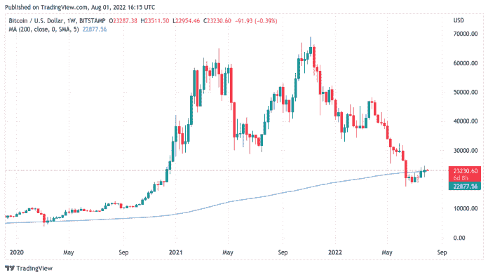

# 看涨比特币的人持有 2.3 万美元的 BTC 价格，因为他们避开了看涨比特币的人

> 原文：<https://medium.com/coinmonks/bitcoin-bulls-hold-23k-btc-price-as-they-ward-off-bears-calling-for-additional-downside-2a41d0f765ff?source=collection_archive---------38----------------------->

比特币(BTC)价格走势避免了令人失望的月度收盘，但大型市场投资者要求更多基本面强劲的证据。

比特币( [BTC](https://bumblebeecrypto.com/crypto-prices/) )在 8 月 1 日的华尔街公开赛上测试了 23，000 美元的价格作为支撑，重点是关键的移动平均线。

# 比特币 200 周均线仔细观察

比特币前一天创下了自 6 月中旬以来的最高周收盘价，鼓舞了多头，其月蜡烛线也创下了自去年 6.9 万美元的历史高点之前以来的最大涨幅。

在许多分析师和交易员看来，重要的是市场能够在多几支蜡烛的情况下保持高位。

尽管重新获得了重要的趋势线，如 200 周移动平均线(MA)和已实现价格，但在没有重新测试这些水平(200 周 MA)的情况下，比特币将不会脱离困境，直到它开始产生整周蜡烛线。比特币在历史上很少交易低于 200 周均线，因为它通常是一条支撑线。

比特币目前的上涨可以被描述为熊市反弹，因为它发生在更大的下降趋势线上。许多交易者现在正在寻找 200 毫安线作为比特币的支撑。如果比特币未能守住 200 周均线，这可能被视为一个看跌指标，可能会看到比特币继续其长期下跌趋势。

来源:BumbleBeeCrypto.com

# 分享这个:

> 交易新手？试试[密码交易机器人](/coinmonks/crypto-trading-bot-c2ffce8acb2a)或[复制交易](/coinmonks/top-10-crypto-copy-trading-platforms-for-beginners-d0c37c7d698c)