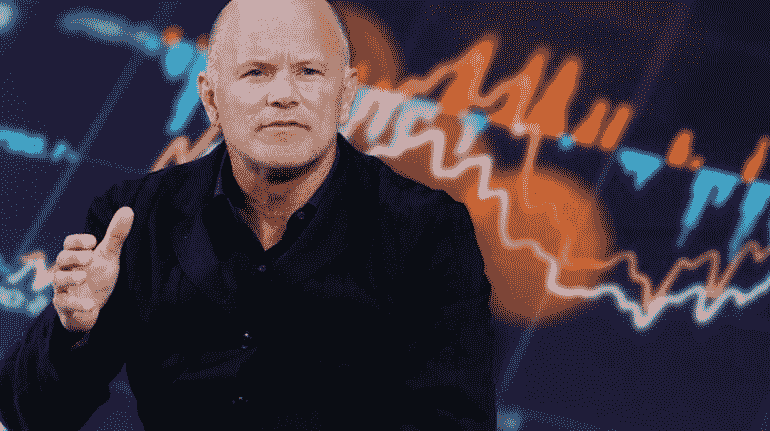

# 亿万富翁投资者迈克·诺沃格拉茨说，比特币可能在 5 年内达到 50 万美元

> 原文：<https://medium.com/coinmonks/bitcoin-can-hit-500-000-in-5-years-says-billionaire-investor-mike-novogratz-b1237a4d781?source=collection_archive---------36----------------------->

## 虽然迈克·诺沃格拉茨声称加密货币最糟糕的时期已经过去，但市场仍在因特拉区块链的崩溃以及主要加密公司 Celsius、Three Arrows Capital 和 Babel 的倒下而动荡不安

File image of Wall Street billionaire Mike Novogratz. He is bullish on Bitcoin