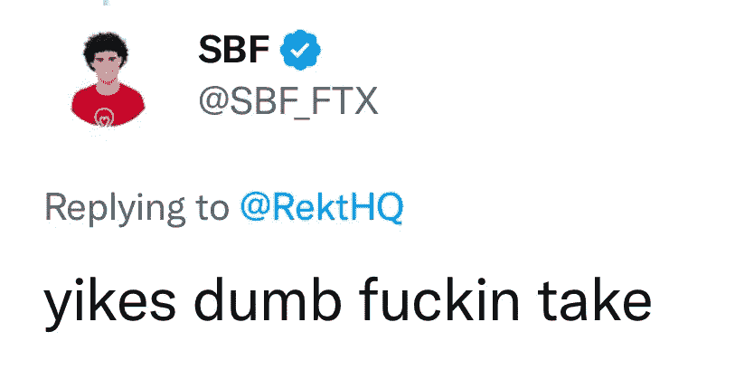

# 2022 年，比特币仍可在 10 万美元以上交易

> 原文：<https://medium.com/coinmonks/bitcoin-can-still-trade-above-100-000-in-2022-18d8624e06f5?source=collection_archive---------15----------------------->

比特币去年突破了 68000 美元，如果你经历了那个时刻，你会对这个空间自那时以来的变化感到敬畏。更可怕的是，当你读到这篇文章的时候，事情已经到了这个地步。但这是如果你没有跳到第一段来达到我列出比特币将在未来 50 天内攀升至 15 万美元的原因的地步。

这里有个剧透，那部分不存在。你仍然可以在加密 Twitter 的角落里找到一些 hopium。加密空间增加了埃隆·马斯克新游乐场的相关性。至少，在经过验证的用户开始支付他们的 8 美元之前，他可以有一些钱来运营这艘船。好吧，这是不相关的，但火箭人最近登录了一个 Twitter 空间，只是为了说“Doge to the moon”！

即使你不爱 Twitter，你也会爱上马斯克先生。绝对的绅士！不要读两遍。

除了 Twitter 和排行榜，加密货币今年遭受了严重打击，这是有史以来最严重的一次。没用的名声，不透气的实力。它曾经看起来像一个非常强大的空间。如果我们考虑百分比损失，它仍然比 2017 年的崩盘要好，但这不是给任何购买顶部的人讲的故事。听说 Nayib Bukele 的比特币储存在 FTX。这原来是一个笑话，但这将是一个怎样的故事。

特斯拉确实测试了比特币的流动性，在卖出了数十亿美元的比特币的情况下也无法推动市场。这曾经是令人印象深刻的，我猜不会了，如果现在有人尝试类似的事情，我们可以降到零。

如果说有什么建议几乎完全错了，那就是鼓励你投资“蓝筹股”的建议，事实证明，蓝筹股就是蓝色地毯。不过没关系，至少我们还有 NFT 让我们继续前进。聪明的 FTX 投资者确实展示了 NFT 的最佳案例——洗钱。可能是以我们所见的方式操纵价值的单一用例。

下一个投降的是谁？我猜不会，罗纳尔多和币安 not 的搭档终于出现了。有史以来最伟大的足球运动员将在大众交易所展示一些罕见的艺术作品和镜头。随着其他交易所分崩离析，币安目前表现强劲，NFTs 可能会再次启动，NFA。

但是，还有什么可能出错呢？无聊的类人猿宣布他们的猴子图片真的一文不值，底价暴跌至小数点后两位，而比特币跌破 10，000 美元。离 10 万美元只差一个零。即使是用一个秘密摇滚明星的话来说，这也是一个可怕的假设。

但鼓声仍在响起。感恩节快到了，但事情看起来还是很吓人。万圣节延长了。是时候放弃梦想，面对现实了。如果你在 2021 年顶部附近购买了比特币，你肯定会亏本结束这一年。但是一个比特币永远等于一个比特币。这是一个有缺陷的算法，但对开发了加密货币投资微观策略的人仍然有效。

不管怎样，现在是一年的最后一个季度，疯狂的事情发生了。柴犬也有可能卖到 1 美元。

[跟进加密货币脚本](https://linktr.ee/cryptoscripts)通过全面的文章和重要提示了解加密领域的最新动态。
[雇佣自由撰稿人](https://www.upwork.com/services/product/comprehensive-seo-optimized-contents-for-your-project-1514476886622093312?ref=project_share&tier=0)

> *交易新手？试试* [*密码交易机器人*](/coinmonks/crypto-trading-bot-c2ffce8acb2a) *或* [*复制交易*](/coinmonks/top-10-crypto-copy-trading-platforms-for-beginners-d0c37c7d698c)
> 
> *分散密码持有量，了解* [*币安替代品*](https://coincodecap.com/binance-alternatives)
> 
> *加入 Coinmonks* [*电报频道*](https://t.me/coincodecap) *和* [*Youtube 频道*](https://www.youtube.com/c/coinmonks/videos) *获取每日* [*加密新闻*](http://coincodecap.com/)

# 另外，阅读

*   [复制交易](/coinmonks/top-10-crypto-copy-trading-platforms-for-beginners-d0c37c7d698c) | [加密税务软件](/coinmonks/crypto-tax-software-ed4b4810e338)
*   [网格交易](https://coincodecap.com/grid-trading) | [加密硬件钱包](/coinmonks/the-best-cryptocurrency-hardware-wallets-of-2020-e28b1c124069)
*   [密码电报信号](/coinmonks/top-3-telegram-channels-for-crypto-traders-in-2021-8385f4411ff4) | [密码交易机器人](/coinmonks/crypto-trading-bot-c2ffce8acb2a)
*   [最佳加密交易所](/coinmonks/crypto-exchange-dd2f9d6f3769) | [印度最佳加密交易所](/coinmonks/bitcoin-exchange-in-india-7f1fe79715c9)
*   [开发者最佳加密 API](/coinmonks/best-crypto-apis-for-developers-5efe3a597a9f)
*   最佳[密码借贷平台](/coinmonks/top-5-crypto-lending-platforms-in-2020-that-you-need-to-know-a1b675cec3fa)
*   [免费加密信号](/coinmonks/free-crypto-signals-48b25e61a8da) | [加密交易机器人](/coinmonks/crypto-trading-bot-c2ffce8acb2a)
*   杠杆代币的终极指南