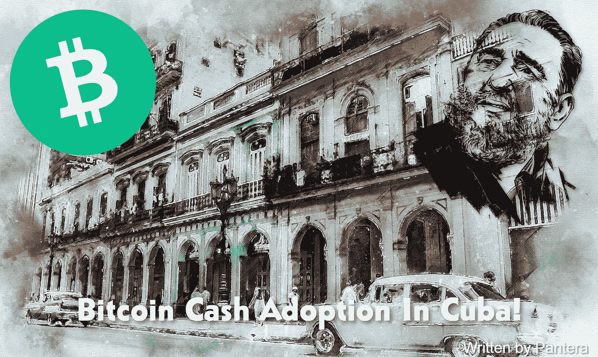

# 古巴采用比特币现金

> 原文：<https://medium.com/coinmonks/bitcoin-cash-adoption-in-cuba-merchants-adopt-bitcoin-cash-a2818ece98ff?source=collection_archive---------19----------------------->

## 加勒比海地区商家采用比特币现金的现象日益增多！

来自加勒比海岛国圣基茨和尼维斯及圣马丁岛采用比特币现金作为法定货币的消息迅速传遍全球。

圣基茨和尼维斯总理特伦斯·德鲁博士在比特币现金…