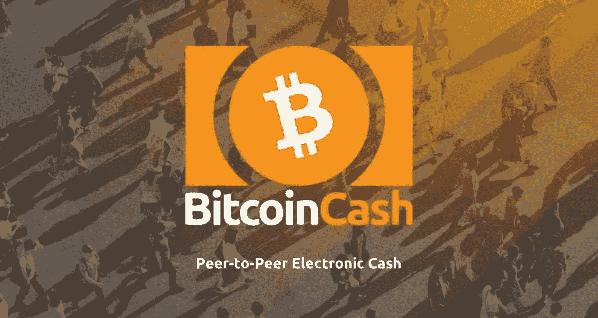

# 比特币现金(BCH):一个点对点的电子现金系统

> 原文：<https://medium.com/coinmonks/bitcoin-cash-bch-a-peer-to-peer-electronic-cash-system-2c859df56cb1?source=collection_archive---------45----------------------->

比特币现金(BCH)加密货币是一种简单的点对点电子现金系统，专注于成为可靠的全球货币，具有小额费用、快速支付、隐私和高交易能力(大块)。与印度卢比或美钞等实物货币直接交给被支付人的方式相同，这些 [**比特币**](https://procommun.com/2021/10/technology/why-is-the-world-getting-obsessed-with-bitcoin/) 现金(BCH)加密货币商品、服务和在线现金支付直接从一个人发送到另一个人。

作为一种无许可和去中心化的加密货币，比特币现金(BCH)加密货币不需要可信的第三方和中央银行。与其他传统的法定货币不同，比特币现金(BCH)加密货币独立于支付处理器和银行等货币中介。此外，比特币现金(BCH)加密货币进行的交易无法受到其他中央集权企业或政府的审查。同样，资金不能被冻结或扣押，因为金融第三方对比特币现金(BCH)加密货币网络没有控制权。

# 比特币现金(Bch)加密货币是用来做什么的？

比特币现金(BCH)加密货币结合了 [**黄金般的稀缺性**](https://procommun.com/2021/10/finance/how-much-loan-can-i-get-on-gold-in-2021/) 和现金的可消费性。此外，由于供应量有限，约为 2100 万枚硬币，比特币现金(BCH)加密货币可以证明是稀缺的，就像实物现金一样，它可以有效地使用。交易也很迅速，费用通常不到十分之一美分。任何人都可以用电脑或智能手机接受比特币现金(BCH)加密货币的支付。

此外，比特币现金(BCH)加密货币有不同的使用案例。通过两个人之间的点对点支付，比特币现金(BCH)加密货币可用于支付参与商户的店内和在线费用。有一些微薄的费用可以实现微交易经济，比如给内容创作者小费，奖励应用用户几分钱等等。比特币现金(BCH)加密货币还减少了结算时间以及汇款和跨境贸易的费用。此外，其他用例包括令牌、简化的智能合同以及使用 CashFusion 和 CashShuffle 等工具的私人支付。

# 比特币现金(BCH)加密货币与比特币加密货币不同吗？

在 2017 年，比特币项目及其社区分成了两个关于比特币可扩展性的问题。其结果是创造了比特币现金(BCH)加密货币的辛勤工作，这是一种新的加密货币，被支持者认为是比特币项目作为点对点电子现金的合法延续。分叉时的所有比特币持有者(块 478，558)自动成为比特币现金(BCH)加密货币的真正所有者。

> 交易新手？试试[加密交易机器人](/coinmonks/crypto-trading-bot-c2ffce8acb2a)或者[复制交易](/coinmonks/top-10-crypto-copy-trading-platforms-for-beginners-d0c37c7d698c)

假名 Satoshi Nakomoto 发明了比特币，它仍然是一种独立的加密货币。与比特币加密不同，比特币现金(BCH)加密货币旨在快速扩展以满足全球支付系统的需求。此外，在分割时，比特币现金(BCH)加密货币块大小从 1 MB 增加到 8 MB。随着块大小的增加，比特币现金(BCH)加密货币可以轻松地处理每秒更多的交易，同时保持交易费用极低，这进一步解决了比特币网络上一些用户遇到的支付延迟和高成本问题。根据 2021 年 10 月的数据，比特币现金(BCH)加密货币的块大小约为 32MB，而比特币加密货币的大小为 1 MB。

# 如何挖掘比特币现金(Bch)加密货币？

挖矿，简单来说就是新的比特币现金(BCH)加密货币交易被确认的过程，新的区块也被加入到比特币现金区块链中。矿工们还利用计算能力和电力来解决复杂的难题。通过这样做，他们获得了产生一些新交易的能力。此外，如果他们的一个区块被网络接受，矿池或矿工将获得新发行的比特币现金的区块奖励。

随着市场上比特币现金价格的上涨，采矿竞争非常激烈；因此，更多的矿商受到激励，将更多的散列率带入日益激烈的矿商生产区块的竞争中。这些区块使它们被比特币现金(BCH)加密货币网络接受。矿工越多，通过增加和分配散列率，网络就变得越安全。这也防止了单个矿工控制所有网络。

> 原载于 procommun.com

> ***加入 Coinmonks* [*电报频道*](https://t.me/coincodecap) *和* [*Youtube 频道*](https://www.youtube.com/c/coinmonks/videos) *了解加密交易和投资***

# **另外，阅读**

*   **[3 商业评论](/coinmonks/3commas-review-an-excellent-crypto-trading-bot-2020-1313a58bec92) | [Pionex 评论](https://coincodecap.com/pionex-review-exchange-with-crypto-trading-bot) | [Coinrule 评论](/coinmonks/coinrule-review-2021-a-beginner-friendly-crypto-trading-bot-daf0504848ba)**
*   **[莱杰 vs n 格拉夫](/coinmonks/ledger-vs-ngrave-zero-7e40f0c1d694) | [莱杰纳诺 s vs x](/coinmonks/ledger-nano-s-vs-x-battery-hardware-price-storage-59a6663fe3b0) | [币安评论](/coinmonks/binance-review-ee10d3bf3b6e)**
*   **[加密交易机器人](/coinmonks/crypto-trading-bot-c2ffce8acb2a) | [Bingbon 评论](https://coincodecap.com/bingbon-review)**
*   **[Bybit Exchange 审查](/coinmonks/bybit-exchange-review-dbd570019b71) | [Bityard 审查](https://coincodecap.com/bityard-reivew) | [Jet-Bot 审查](https://coincodecap.com/jet-bot-review)**
*   **[3 commas vs crypto hopper](/coinmonks/3commas-vs-pionex-vs-cryptohopper-best-crypto-bot-6a98d2baa203)|[赚取加密利息](/coinmonks/earn-crypto-interest-b10b810fdda3)**