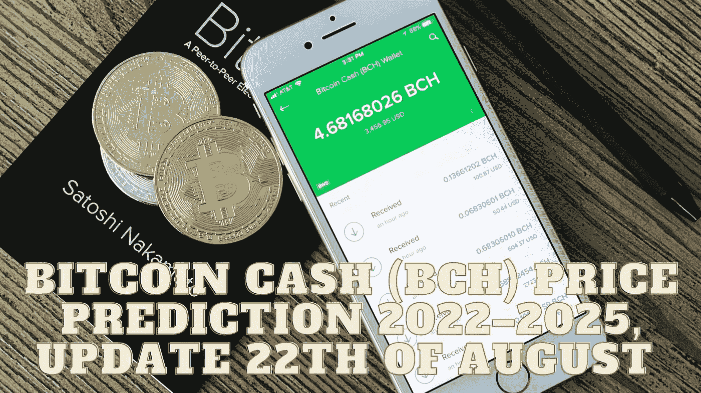

# 比特币现金(BCH)价格预测 2022–2025，8 月 22 日更新

> 原文：<https://medium.com/coinmonks/bitcoin-cash-bch-price-prediction-2022-2025-update-22th-of-august-57c0e5f55d62?source=collection_archive---------22----------------------->

Source photo Unsplash.com

# 什么是比特币现金(BCH)？

2017 年 8 月 1 日，比特币发生硬拆分，创造了比特币现金(BCH)。一旦 fork 实现，网络就向所有比特币钱包分发 BCH。为了实现其作为一个分散的电子支付系统的目标，Blockchain.Com 只需要复制原始的信息来集中…