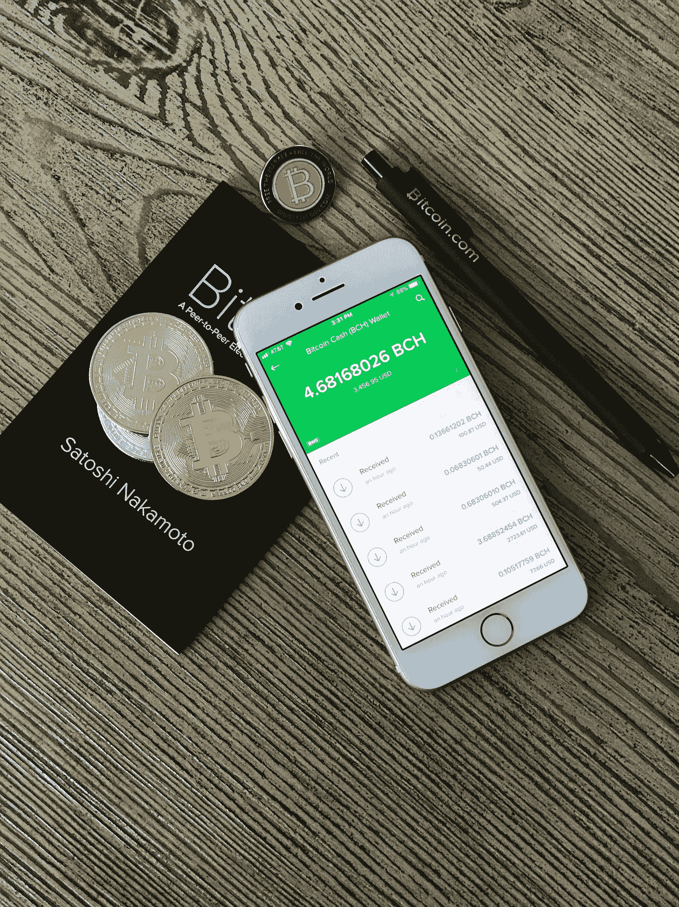

# 比特币现金(BCH)价格预测 2022 年 12 月–2025 年

> 原文：<https://medium.com/coinmonks/bitcoin-cash-bch-price-prediction-december-2022-2025-ee2f1aa27985?source=collection_archive---------16----------------------->

Source photo [silver iPhone 6 beside two coins photo — Free Fintech Image on Unsplash](https://unsplash.com/photos/4_41-79dHvE)

## 什么是比特币现金(BCH)？

2017 年 8 月 1 日，比特币经历了一次硬分叉，创造了比特币现金(BCH)。该网络向所有比特币持有者分发 BCH，作为追踪分叉的奖励。通过简单地复制最初的 Blockchain.com，它能够把重点放在链上伸缩和作为 P2P 电子现金系统的可用性上。块大小…