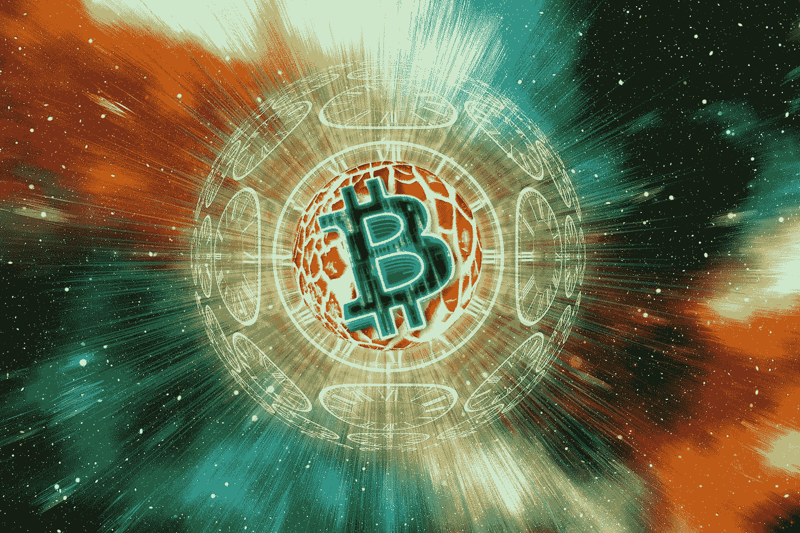

# 比特币现金是对抗 CBDC 十字军的最后一战

> 原文：<https://medium.com/coinmonks/bitcoin-cash-is-the-last-stand-against-the-cbdc-crusade-80cd69ebdcbd?source=collection_archive---------5----------------------->

## 美联储和欧洲央行过度关注遏制金融自由

比特币在 BTC 版本中从内部跌落。

比特币开发商削减了用户体验和交易自由，高昂的费用和堵塞的网络不符合金钱的标准，而萨尔瓦多的闪电网络…