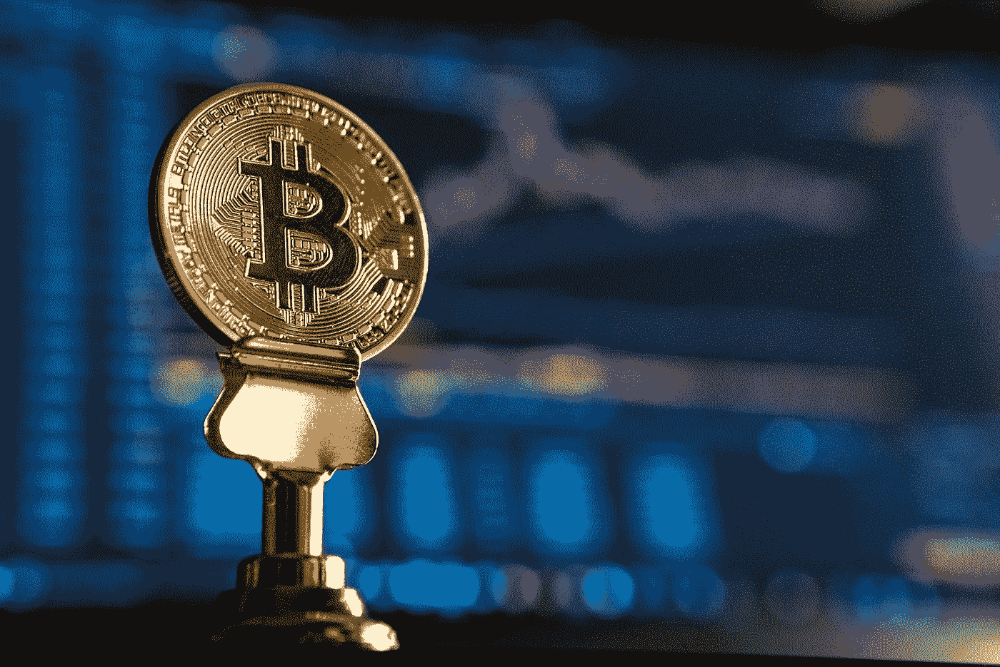

# 比特币改变了我的生活，但不是以你想象的方式

> 原文：<https://medium.com/coinmonks/bitcoin-changed-my-life-but-not-in-the-way-you-think-1cb80b906dbe?source=collection_archive---------24----------------------->

## 希望分享一些积极乐观的我的故事！

Photo by [André François McKenzie](https://unsplash.com/@silverhousehd?utm_source=medium&utm_medium=referral) on [Unsplash](https://unsplash.com?utm_source=medium&utm_medium=referral)

我来自阿根廷，南美一个相当贫穷的国家。我们已经有超过 40%的年通货膨胀率四五年了，虽然不像委内瑞拉那样糟糕，但仍然相当糟糕。