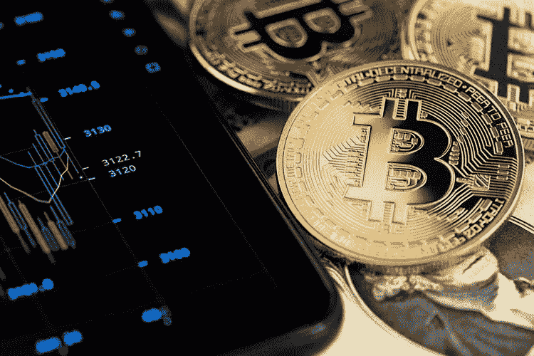

# 比特币继续下跌:周末价格跌破 1.85 万美元

> 原文：<https://medium.com/coinmonks/bitcoin-continues-to-fall-rate-goes-below-18-5-thousand-over-the-weekend-a080ac58db2d?source=collection_archive---------33----------------------->

***比特币汇率跌破 1.85 万美元。截至 9 月 19 日，第一种加密货币的交易价格为 1.846 万美元。过去一周，人民币贬值了 8%。***

该资产的价格跌至 6 月 20 日以来的最低水平，当时交易价格为 1.82 万美元。比特币的市值一夜之间减少到 3550 亿美元，日交易量为 330 亿美元。在此期间，加密货币的总市值下降了 7.1%，至 9450 亿美元。

继比特币之后，其他加密货币的利率也下降了。以太坊的价格在 24 小时内下跌了 11%，至 1.29 美元，币安硬币(BNB)下跌了 6.2%，至 260 美元，卡尔达诺下跌了 9.6%，至 0.43 美元。

考虑到从 9 月 12 日到 16 日的过去一周，加密货币市场并不乐观。比特币亏损 9.59%。BTC/USDT 组合跌至 1.94 万美元。9 月 13 日星期二，美国 8 月份通胀报告公布后，比特币价格暴跌。消费者价格指数显示出高于市场预期的数值。 [**加密货币**](https://topforex.trade/academy/top-cryptocurrencies-for-day-trading) 在美元反弹中随着股票一起崩溃。

自美国统计数据发布以来，已经过去了相当长的时间，密码交易员和投资者仍然无法恢复过来。市场参与者正在等待的下一个重要事件是 9 月 21 日美国美联储的会议。通胀数据出来后，市场人士开始考虑加息 100 bp。根据芝加哥商业交易所的数据，这种上升的可能性为 24%，而一个月前为 0%，上升了 75 个基点。— 76%.有趣的是，在 11 月 2 日的会议上，加息 100 个基点或 4%的可能性为 57%，这令市场感到紧张。

交易员的头寸遭受了巨大损失。他们试图保持每比特币 1.95 万美元的水平，但没有成功，周一交易价格低于 1.85 万美元。比特币与股票市场紧密相连，因此它的方向将由股票指数的动态决定。技术分析， [**S & P 500 指数**](https://topforex.trade/academy/forex-index-trading) 数值在 3925 点附近突破趋势线。比特币汇率跌破 2.05 万美元水平，此前起到阻力作用。

下周， [***TopForex。贸易***](https://topforex.trade/) 专家预计主要是加密资产下降趋势的延续。现在，加密货币市场参与者的注意力集中在 FOMC 会议和将于 9 月 21 日周三公布的美国利率数据上。将利率提高 75 个基点已经包含在价格中，但如果利率立即大幅提高 1%，目前股票和加密货币市场的价格将在销售中面临压力。

主要加密资产转移的最接近目标是 BTC 的 1.75 万美元和以太坊的 1.23 万美元。在这些价位的购买兴趣很高，任何重大的市场下跌都会被玩家积极寻找。比特币的年度最低限额极有可能更新，但未来几周市场可能会基本保持在当前水平。

***以太坊矿工都去哪了？***

9 月 15 日，以太坊社区期待已久的事件发生了——从采矿到打桩的转变。合并更新已经成功完成，ryptocurrency 挖矿设备的拥有者开始重新配置它开采其他硬币。

在合并后的前三个小时，以太坊经典网络(ETH)的计算能力增加了一倍多，达到每秒 210 万亿次哈希(Th/s ),而在乌鸦币(RVN)区块链上，哈希速率已经上升到每秒 21 次，尽管全年该数字都在每秒 3-4 次的水平

与此同时，区块链开发团队宣布即将推出 EtherumPow 网络的一个分支，它将支持 ETHW 令牌的挖掘。

来自以太坊的计算能力主要转移到以太坊经典(ETC)和瑞文币(RVN)上，由于计算能力的提升，挖掘的复杂度也成比例增加。

矿工向这种硬币的过渡将导致其生产的盈利能力降低，而这种盈利能力此前不如以太坊，但与此同时，这将迫使效率低下的玩家离开市场，进而导致哈希率稳定。

***美国白宫提出监管加密货币的概念***

白宫首次提出了监管美国**加密货币市场的概念。在美国总统乔·拜登(Joe Biden)今年 3 月敦促当局研究加密货币的风险和好处并提交官方报告后，新提议已经酝酿了六个月。**

**其中一点旨在打击数字货币行业的非法活动。特别是，建议考虑修订《银行保密法》、反披露法和禁止无照转账的法律，以便与数字资产服务提供商直接相关。**

**白宫的提议还特别提到了央行数字货币(CBDCs)的潜力。这个想法是，数字美元可以积极影响美国的支付系统，并为进一步创新奠定基础，实现更快的跨境交易。**

**美国政府指出，在 TerraUSD 加密货币崩溃的情况下，需要对数字货币，特别是稳定货币进行监管，这导致了一系列破产，累计损失近 6000 亿美元。**

# **顶级外汇学院**

*   **[外汇交易顶级 VPNs】](https://topforextrade.medium.com/top-vpns-for-forex-trading-comparison-of-high-speed-providers-for-safe-fx-market-exchange-at-the-b75f0bf7e740)**
*   **[外汇市场流动性](https://topforextrade.medium.com/liquidity-in-forex-market-explained-basic-terms-affecting-factors-and-top-fx-brokers-for-9a1fa4c56b45)**
*   **[如何从外汇经纪人那里获得奖金](https://topforextrade.medium.com/how-to-get-a-forex-bonus-and-benefit-from-it-ce998e4d81e7)**
*   **[加密交易的替代方式](https://topforextrade.medium.com/alternative-ways-of-crypto-trading-benefits-of-entering-the-digital-assets-market-with-cfds-and-c2edd7723bd7)**
*   **[加密货币初学者终极指南](https://topforextrade.medium.com/ultimate-beginners-guide-on-cryptocurrency-top-platforms-to-buy-and-trade-bitcoin-ethereum-xrp-5b64b3d8a55d)**
*   **[指数交易讲解](https://topforextrade.medium.com/indices-trading-explained-basic-concepts-famous-world-indices-and-comparison-of-top-forex-d5a75c8aa15d)**
*   **[使用 VPN 和 VPS 进行外汇交易](https://topforextrade.medium.com/secure-forex-trading-with-vpn-and-vps-free-offers-of-top-fx-brokers-8c13a3ece0d3)**
*   **[外汇期货交易](https://topforextrade.medium.com/forex-futures-trading-expert-guide-key-terms-and-how-to-make-a-profit-8f30fd902223)**
*   **[外汇风险管理](https://topforextrade.medium.com/forex-risk-management-effective-strategies-for-safe-fx-trading-for-beginners-adab8eee597f)**

> **交易新手？试试[密码交易机器人](/coinmonks/crypto-trading-bot-c2ffce8acb2a)或者[复制交易](/coinmonks/top-10-crypto-copy-trading-platforms-for-beginners-d0c37c7d698c)**