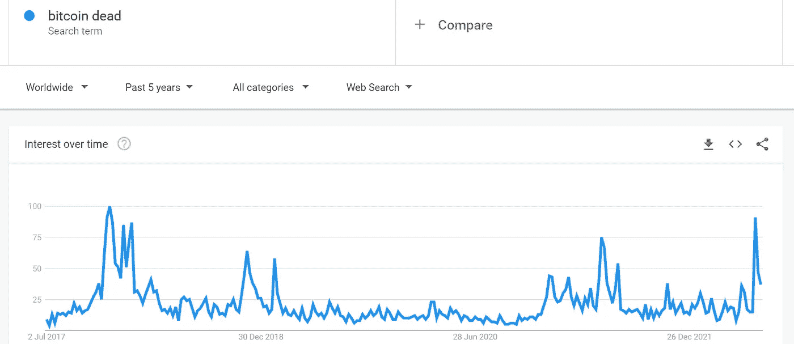
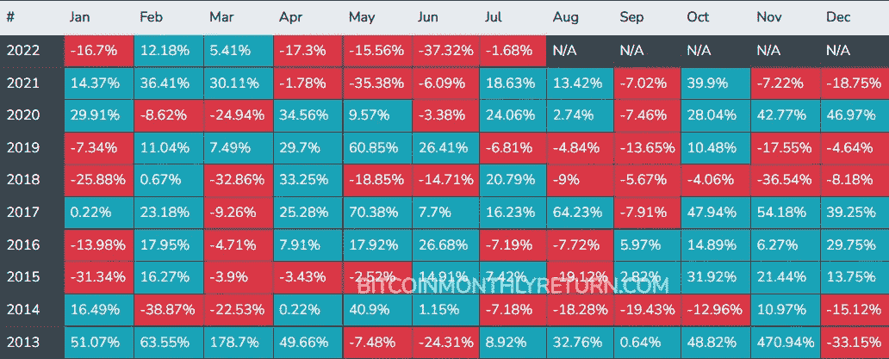
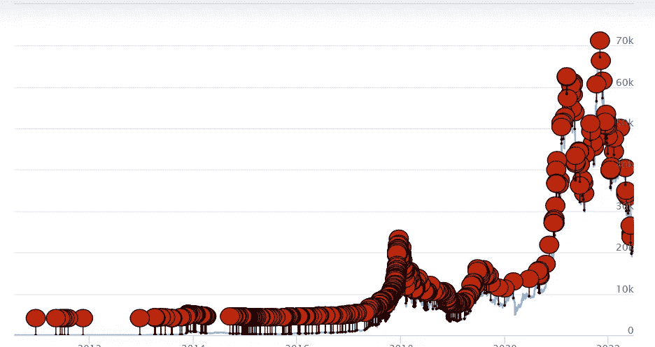
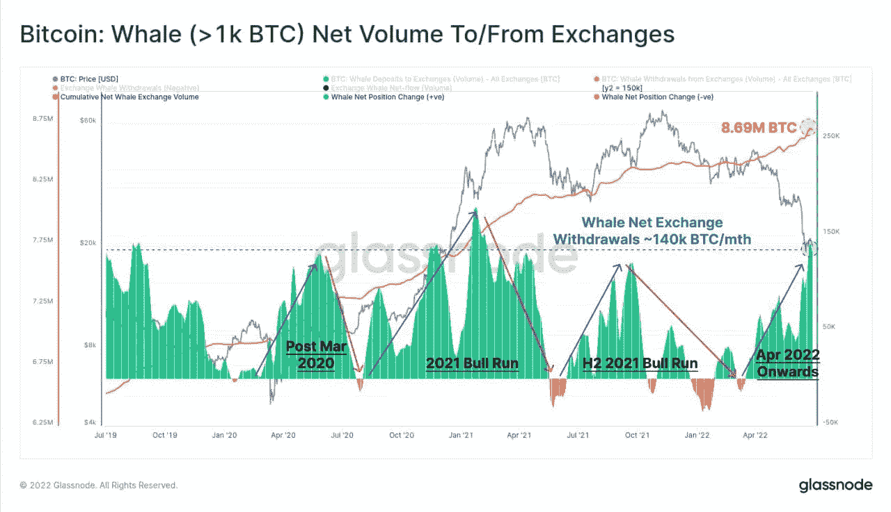

# 比特币 Ded

> 原文：<https://medium.com/coinmonks/bitcoin-ded-ccf195a1e5b4?source=collection_archive---------59----------------------->

**谷歌趋势数据**强调，在当前的市场崩溃期间，对*“死比特币”*的查询数量飙升至**的历史新高。**

投资者在 BTC 遭受了超过**70 亿美元的损失**在更高的价格水平上积累了硬币，在上一次崩溃期间，资产达到了 17，500 的水平，这是一个超过 18 个月没有人访问的区域，而**取得了自 2013 年以来最差的月度表现。**

这些崩溃往往伴随着一系列事件和可疑的有效叙述，在我们的情况下，这种反应可能首先由美联储的政策变化引发，通过提高利率，自动施加下行压力，对风险较高的资产不感兴趣，此外还必须加上 Terra-Luna 系统的内爆，Celsius 的破产等等。

最近，欧洲议会和欧洲理事会就第 2021/0241 号欧洲法律提案**达成了一项协议，该提案名为“资金和某些加密资产转移附带的信息”**，源于打击加密货币领域非法活动(尤其是洗钱)的需要

**欧内斯特·乌尔塔森，**西班牙生态社会主义政治家，欧洲议会成员，这几天发布了一条新的推特，“成交！”(……)，关于密码资产转让的一些规定。

这条推文完整地解释了这些新法规如何旨在解决加密市场的无监管问题。

目标是监管来自加密自动取款机和任何加密资产提供商的资金流动，以毛细血管的方式收集信息，以便追踪每一欧元进入加密系统以来的来源。

> 交易新手？试试[加密交易机器人](/coinmonks/crypto-trading-bot-c2ffce8acb2a)或者[复制交易](/coinmonks/top-10-crypto-copy-trading-platforms-for-beginners-d0c37c7d698c)

*(有趣的事实)*对于金额超过 1000€的转账，必须核实未托管钱包的受益所有人的身份*(显然都符合 GDPR 条例)*

显然，对于不受监管的 CASP，将会进行公开搜索，这些 CASP 将会在公共登记册中报告，并根据法律与那些人保持任何类型的关系。

所有这一切似乎都直接破坏了去中心化的概念，因为这些新市场按照传统市场的形象和相似性进行了改造，正如我们所知，传统市场将货物的每一次转移与原产地和接受者的相关信息相匹配。

…

**那又怎样，crypto 死了吗？**不，我们不这么认为，这些新规定(仍在审批中)肯定会改变我们处理 DeFi 的方式，会吓住最敏感的投资者，而且无疑会伴随着许多世界末日的叙述。

如果我们去分析我们最喜爱的资产的过去，事实上，我们注意到，在比特币 12 年的生命中，它在一些场合(准确地说是 459 次)被认为是死的，在一些文章和内容中，有大量受众将它定义为无用、无价值或者准确地说是死的。

Bitcoin Obituary Stats

让我们引用传说中的彼得·希夫(最讨厌 BTC 的人)的话来举例:

尽管如此，比特币和加密货币市场总是设法消除神话，否认仇恨者，重新鼓励卖空者，并回到比以前更强大的领域与传统金融竞争，无论这需要几周、几个月或几年时间。

事实上，尽管许多新玩家在这些阶段感到害怕，但其他更有经验的玩家似乎并没有停止积累。

鲸鱼(> 1k BTC)正在继续积极增加他们的头寸，直接从交易所获得 14 万 BTC/月，这给了我们一个市场聚集区的信号

但是散户投资者也不是开玩笑，包含至少 1 个 BTC 的地址不断增加，使“整币者”的总数达到 865，254 个！

长话短说……有史以来最好的投资者之一曾经说过:

***“在别人贪婪的时候恐惧，在别人恐惧的时候贪婪！”***