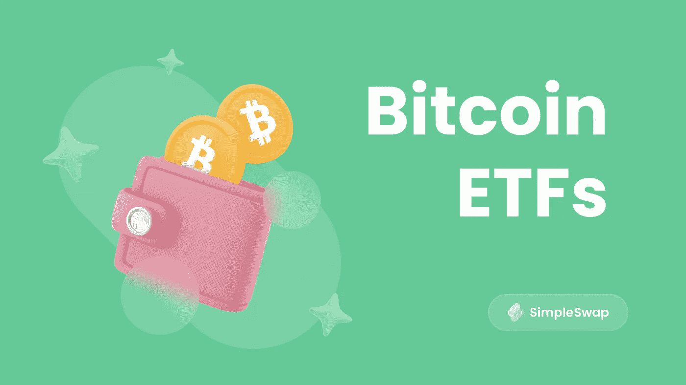

# 比特币交易所交易基金:它们是什么以及如何使用它们

> 原文：<https://medium.com/coinmonks/bitcoin-etfs-what-they-are-and-how-to-use-them-c55e1cbba92?source=collection_archive---------30----------------------->

itcoin ETFs 终于来了！有经验的投资者可能会对这种新的投资工具非常感兴趣。[什么是 BTC](https://simpleswap.io/blog/what-is-bitcoin?utm_source=medium&utm_medium=portal&utm_campaign=bitcoinetfs) 什么是比特币 ETF？这一切是如何运作的？让我们在这篇文章中学习如何投资它们。

## **什么是 ETF？**

ETF 代表“交易所交易基金”,事实上它对市场来说并不新鲜。从 1993 年开始，金融界的玩家就已经知道了这个特性[。ETF 适合不同类型的投资者，它是许多人喜欢使用的方便工具。为什么？与其他金融选择相比，它的风险更小，而且建仓不需要很大的投资。](https://www.investopedia.com/terms/s/spiders.asp)

ETF 是一种由各种金融工具组成的证券，例如债券和期货合约。它像股票一样在传统交易所交易。它也可以固定在一种资产的价格上，比如比特币。基本上，ETF 允许交易者毫不费力地分散他们的投资组合。

因为这个工具的工作原理和股票差不多，所以它对保证金交易和空头头寸开放。ETF 以当前市场价格交易，因此不仅投资者，交易者也对其感兴趣。

## **什么是比特币 ETF？**

如果我们把表现最好的加密资产和 ETF 这样的便利工具混合在一起，会发生什么？这将是一个非常有趣的组合！

简单来说，比特币 ETF 就是一个股票指数。股票指数的主要目的是创造一个指标，投资者可以用它来了解资产运动的大致方向和“速度”。它通过使用期货合约来监控 BTC，正因为如此，你可以用它来建立买卖头寸。

如果你想在投资组合中拥有比特币，而不是在加密交易所购买，那么 ETF 是一个完美的解决方案。

SEC 于 2021 年 10 月推出了第一只比特币交易所交易基金。它是由 [ProShares](https://www.proshares.com/our-etfs/find-strategic-etfs?strategy=all-etf&product=Product+Overview+&search=bito) 创建的。

## **比特币 ETF 的利弊**

作为任何投资工具，比特币交易所交易基金都有其优势和劣势。我们在下面列出了其中的一些。

**优点**

*   比特币交易所交易基金是一种比实际加密更安全、更容易的投资工具。你不需要成为加密货币的专家，也不需要知道它们是如何工作的，相反，你可以购买一只 ETF。此外，它受到当局的监管，这为我们提供了更多的安全保障。
*   比特币是一种与传统金融工具无关的全新资产。尽管比特币被认为是一种高风险投资，但交易者喜欢用它来丰富自己的投资组合。然而，比特币交易所交易基金是一个更安全的多样化选择，因为与加密市场不同，传统交易所交易基金的流动性要高得多。
*   有了 ETF，你就有机会在传统交易所交易。不需要加密货币交易。如果交易员认为比特币正在下跌，他们可以迅速卖出自己的 ETF。

**缺点**

*   通常比特币 ETF 需要收取费用。
*   你不能使用冻结在 ETF 中的比特币。
*   交易时段是买卖 ETF 的唯一机会。
*   ETF 可能不太准确，由于加密波动性，很难跟踪市场指数。

## **有哪些比特币交易所交易基金**

我们已经列出了一些现在市场上可以买到的比特币交易所交易基金。

[*按位 10 私募指数基金*](https://bitwiseinvestments.com/crypto-funds/bitw) 。它提供十种加密货币，不仅仅是 BTC，而且每年都要接受审计。基金佣金 2.5%。

[*目的比特币 ETF*](https://www.purposeinvest.com/funds/purpose-bitcoin-etf) 。这个加拿大基金在 2021 年上线。在第一周，它筹集了大约 5 亿美元的投资。基金佣金 1%。

[*BTCetc 实物比特币等*](https://etc-group.com/products/btcetc/) 。这只比特币交易所交易基金在德国注册，符合德国的法规。佣金是 2%,最低购买金额是 10 亿美元

[*进化出比特币 ETF*](https://evolveetfs.com/product/ebit/) *。仅次于 BTCC 在多伦多证券交易所上市。佣金 1%(第一周是 0.75%吸引投资人)。*

[CI 银河比特币 ETF](https://funds.cifinancial.com/en/funds/alternative_investments/CIGalaxyBitcoinETF.html?currencySelector=1&seriesId=14104)。在加拿大多伦多证券交易所上市。为了引起人们的兴趣，佣金已降至 0.4%。

## **如何购买 ETF**

如果你正在考虑购买交易所交易基金，那么你应该进入可以交易交易所交易基金的市场。最有可能的是，你需要一个特定国家的银行账户和一个有执照的经纪人。但由于 ETF 与普通股票非常相似，每个投资者都有机会购买它们。

另一种方法是使用一个可以进入许多市场的交易平台。

## **结论**

秘密世界和传统金融世界越来越融合。没有人知道这将走向何方，因为我们只是在合并过程的开始。然而，许多投资者密切关注它，了解新的趋势。

**购买或兑换硬币最简单的方法是使用** [**SimpleSwap 服务**](https://simpleswap.io/?utm_source=medium&utm_medium=portal&utm_campaign=bitcoinetfs) **。**

**SimpleSwap 提醒您，本文仅供参考，不提供投资建议。所有购买和加密货币投资都是你自己的责任。**

**原载于** [**Publish0x 博客**](https://www.publish0x.com/simpleswap-blog/bitcoin-etfs-what-they-are-and-how-to-use-them-xeevklp) **。**

> 交易新手？尝试[加密交易机器人](/coinmonks/crypto-trading-bot-c2ffce8acb2a)或[复制交易](/coinmonks/top-10-crypto-copy-trading-platforms-for-beginners-d0c37c7d698c)