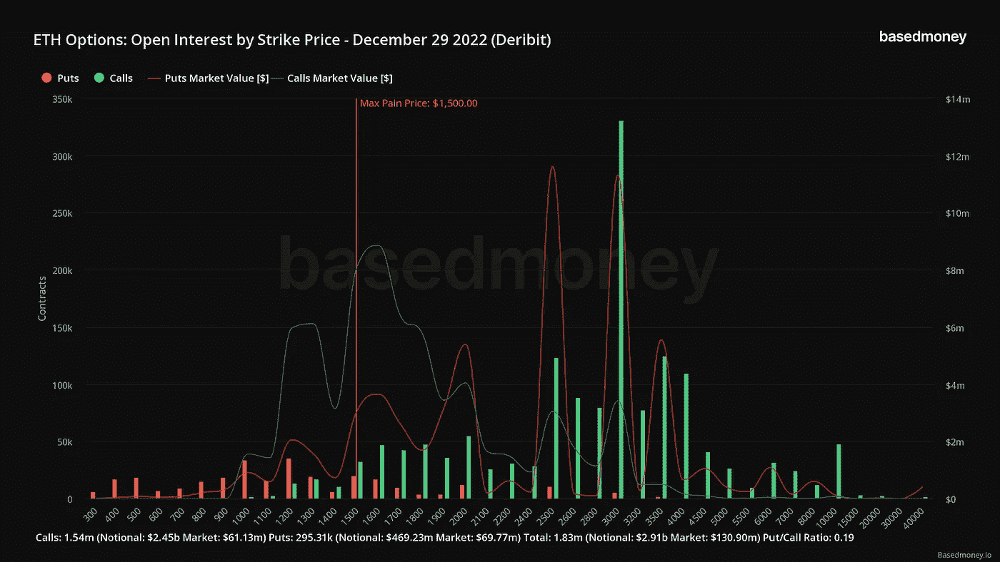
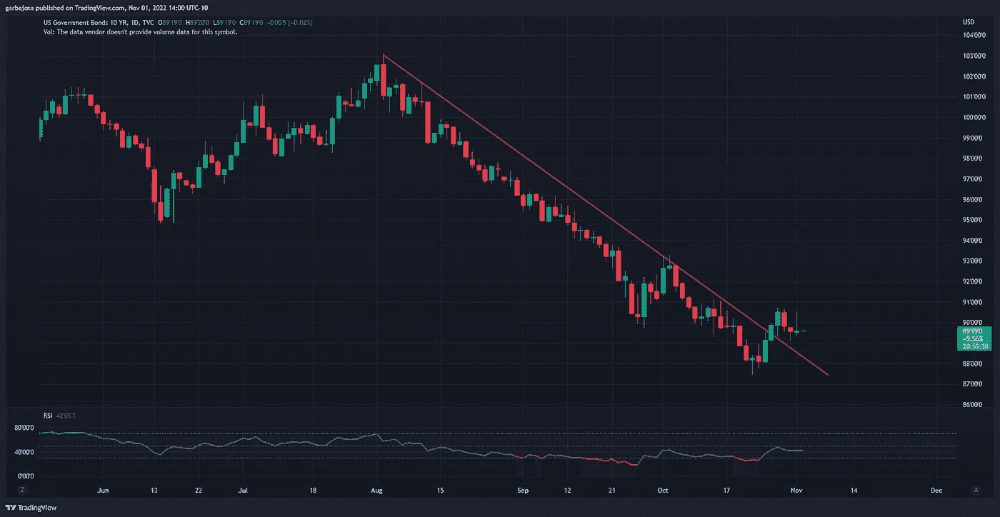
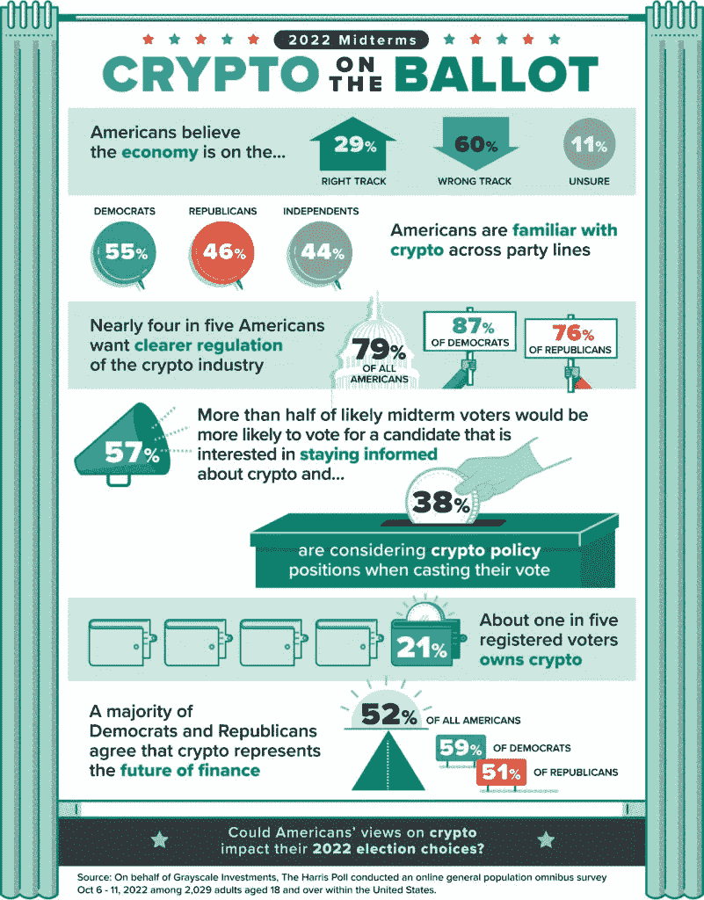
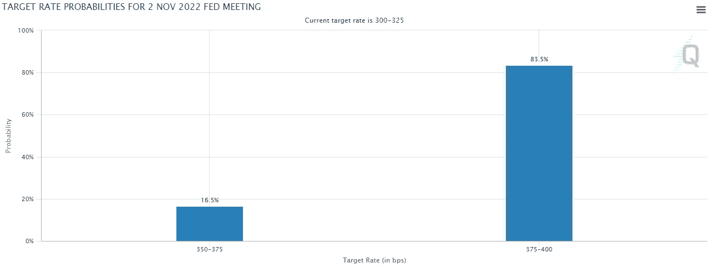

# 比特币/以太坊期权交易商强烈看涨 2022 年底。

> 原文：<https://medium.com/coinmonks/bitcoin-ethereum-options-traders-flip-strongly-bullish-for-the-end-of-2022-7e5ee659d123?source=collection_archive---------18----------------------->

## 每日征服#116

最好的每日新闻、见解和阿尔法信息来源。

Photo by [Hans Eiskonen](https://unsplash.com/@eiskonen?utm_source=medium&utm_medium=referral) on [Unsplash](https://unsplash.com?utm_source=medium&utm_medium=referral)

*密码市场是一个狂野、奇妙而令人生畏的地方；不要一个人跋涉！订阅加密征服者，让我们成为您的向导。*

订阅这份每日时事通讯，永不错过任何一期。(零成本)

**概述**

*   BTC/ETH 期权交易商对年底前景变得乐观。
*   在 FOMC 宣布之前，市场很平静。
*   中期选民在投票时会考虑加密。
*   南非杂货巨头 Pick n Pay 接受比特币。

早上好，家人，

在波动性降至加密历史最低水平之一后，BTC 和瑞士联邦交易所期权交易员纷纷涌入年底看涨期权。

波动率是用于计算期权合约成本的指标之一，因此当指标下降时，期权合约的价格变得更便宜。

随着更便宜的期权带来了更多的投机，好家伙，交易者已经盯上了 2022 年 12 月的看涨期权。2022 年 12 月 BTC 和瑞士联邦理工学院罢工的未平仓权益分别以 22.4 亿美元(见下图)和 29 亿美元的名义价值激增。对 BTC 来说，看涨期权与看跌期权的比例超过了 2 比 1，对瑞士联邦理工学院来说，这个比例是惊人的 5 比 1。

*买入看涨期权被视为看涨押注，而买入看跌期权则被视为看跌押注。*

*来源:*[*base money . io*](https://basedmoney.io/metrics)

**2022 年 12 月** **BTC 最受欢迎的执行价格从 3 万美元到 4.5 万美元不等。这些是买入期权在到期日达到盈亏平衡所需的价格水平(加上期权成本)。0.43 的卖出/买入比率。**

ETH 在 2022 年 12 月最受欢迎的罢工是 3000 美元，与任何其他罢工相比，开放利息超过 2 比 1(如下图)。看跌/看涨期权比率为 0.19。

*来源:*[*base money . io*](https://basedmoney.io/metrics)

不用说，交易商对这两种资产的未来价格都持看涨态度，但对 ETH 在年底达到 3000 美元持相当坚定的立场。

# 市场更新🌍

BTC/USDT·1D

在等待美联储今天宣布加息的同时，市场似乎处于停滞状态。与此同时，BTC 继续在低波动性的一天中跨越 2 万美元的水平。美联储的下一步行动很大程度上取决于杰罗姆鲍威尔(Jerome Powell)在加息后讲话中的言辞。BTC 收盘下跌 0.45%，至 20，481 美元。

*高清* [*图表*](https://www.tradingview.com/x/QVbbCUK2/) 。

**1D 10 年期债券(US10)**

在收益率达到 4.34%的高点后，10 年期债券显示出好转的迹象。价格是否开始持续上升趋势，或者债券是否正在经历一次轻松的反弹，还有待观察。至少，买家几个月来首次挑战这一趋势。债券和美元指数(DXY)的方向对加密和美国股票具有最重要的意义。

*高分辨率* [*图表*](https://www.tradingview.com/x/vyN2zUHc/) 。

# 新闻观察📰

**马克尔道联合创始人去世。据当地警方称，MakerDAO 的联合创始人之一 Nikolai Mushegian 是各种基于密码的项目的重要贡献者，他于周五早上被发现死于波多黎各海滩附近。Mushegian 是加密领域的重要人物，为 BitShares 和 Balancer 等项目做出了贡献。**

**中期选民考虑加密。根据灰度发起的一项调查，38%的美国中期选举选民在 11 月 8 日投票时会考虑加密政策。此外，57%的选民更有可能投票给了解加密货币的候选人，52%的人认为加密是金融的未来。**

> *来源:* [*灰度*](https://grayscale.com/2022-midterm-elections-survey/)

**新闻花絮:**

*   南非杂货巨头 Pick n Pay 在其所有商店接受比特币。
*   股价下跌 80%后，银河数码可能会裁员五分之一。
*   CoinFund 风投公司[期待](https://www.coindesk.com/business/2022/11/01/crypto-vc-firm-coinfund-looks-to-raise-250m-seed-fund/)募集 2.5 亿美元资金。
*   速汇金[推出](https://twitter.com/MoneyGram/status/1587462553482969090?s=20&t=DE3sT_QCN-rgQiIOCss6pQ)应用内加密交换。

**NFT &元宇宙更新🐵**

*   由 Rick 和 Morty 动画师共同创作的 NFT 项目 [**艺术饕餮**](https://artgobblers.com/) **以 15000 英镑(2250 万美元)的 ETH 成交量跃居 OpenSea 排行榜首位。**

我的五分钱…

今天对市场来说是重要的一天，美联储宣布对 10 月份的数据进行联邦基金利率调整。根据 CME 的 FedWatch 工具，市场认为上涨 75 个基点的可能性为 83.5%。

*来源:* [*FedWatch 工具*](https://www.cmegroup.com/markets/interest-rates/cme-fedwatch-tool.html)

有趣的是，摩根大通的一位分析师甚至表示，如果加息 50 个基点，标准普尔 500 可能会在一天内反弹 10%。

交易员将对杰罗姆·鲍威尔(Jerome Powell)的调整后讲话特别感兴趣，随着美国中期选举于 11 月 8 日开始，可能会有一些惊喜。因此，预计波动性将会很大，因为投资者希望美联储主席的每一句话都能带来温和的调整。

# 加百列

*关注我的* [*推特*](https://twitter.com/web3_gabri) *获取每日更新！*

> 交易新手？尝试[加密交易机器人](/coinmonks/crypto-trading-bot-c2ffce8acb2a)或[复制交易](/coinmonks/top-10-crypto-copy-trading-platforms-for-beginners-d0c37c7d698c)