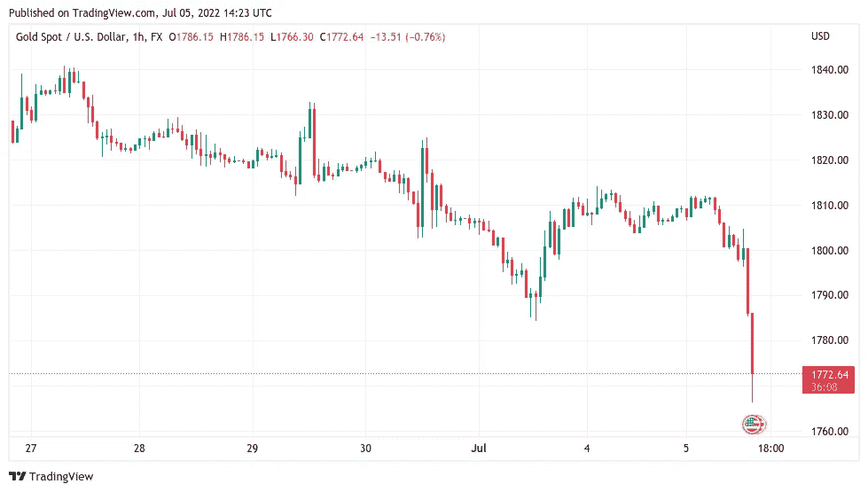

# 随着美元碾压黄金，比特币面临新的压力

> 原文：<https://medium.com/coinmonks/bitcoin-faces-fresh-pressure-as-us-dollar-crushes-gold-fc3e0a4528c9?source=collection_archive---------44----------------------->

BTC/美元下跌 1000 美元，而现货黄金下跌 2%，原因是美元走强，突破了今年以前的峰值。

由于美元汇率大幅上涨，比特币(BTC)在 7 月 5 日的华尔街开盘时跌至每日低点。

# 美元再创 20 年纪录

Cointelegraph Markets Pro 和 TradingView 的数据显示，随着独立日长周末以大幅上涨结束，BTC/美元在 Bitstamp 上回落至 19，281 美元。

该对货币在前一天看到了最后一分钟的收益，但由于华尔街交易的回报伴随着美元的走强，使风险资产和避险资产的收益化为乌有，这些收益化为乌有。

比特币当天交易下跌 1000 美元，现货黄金下跌超过 2%，美国股市也下跌。在撰写本文时，标准普尔 500 下跌了 2.2%，而纳斯达克综合指数下跌了 1.7%。

相反，美元指数(DXY)触及 106.59，这是自 2002 年 12 月以来从未见过的水平，也高于今年 Q2 的历次突破。

比特币分析师因此等待趋势逆转的迹象，以缓解加密市场的压力。

“欧元触及纪录水平，目前为 1.033 美元。最后一次出现是在 2002-2003 年，当然，美元 DXY 像火箭一样飙升，”Cointelegraph 撰稿人 Michal van de Poppe 评论道，并指出欧元正朝着与美元平价的方向发展。

> 交易新手？试试[加密交易机器人](/coinmonks/crypto-trading-bot-c2ffce8acb2a)或者[复制交易](/coinmonks/top-10-crypto-copy-trading-platforms-for-beginners-d0c37c7d698c)

在附加评论中，Cubic Analytics 高级市场分析师 Caleb Franzen 指出，DXY 揭示了投资者对经济健康状况的看法。

> “过去一周，收益率在下降，但美元持续上涨。这一动态证明，随着对衰退的担忧加剧，投资者正奔向安全之地，”一条推文的一部分写道。

加密恐惧和贪婪指数创两个月新高
虽然波动性逐渐回到加密市场，但情绪尚未反映出美元走强的影响。

当天的秘密恐惧和贪婪指数为 19/100，仍然表明“极度恐惧”，但尽管如此，这是自 5 月 Terra LUNA 崩溃前以来的最高读数。

据 Cointelegraph 补充报道，投资经理 ARK Invest 透露，在当前情况下，它对 BTC 的看法仍然是“中性至积极”。

与此同时，分析比特币期货市场情绪的连锁分析平台 CryptoQuant 的贡献者 Edris 表示，对任何形式的复苏下结论都要谨慎。

Edris 表示，买家/卖家的买入/卖出比率，表明买家或卖家是否处于控制之下，当天有所缓解，但这一举动应该有所保留。

> 不过，请注意，这可能只是一次盘整或牛市回调，然后又是一次持续走低。
> 
> 因此，在接下来的几周里，我们应该密切关注许多其他因素，以确定是否会出现牛市逆转或另一个牛市陷阱