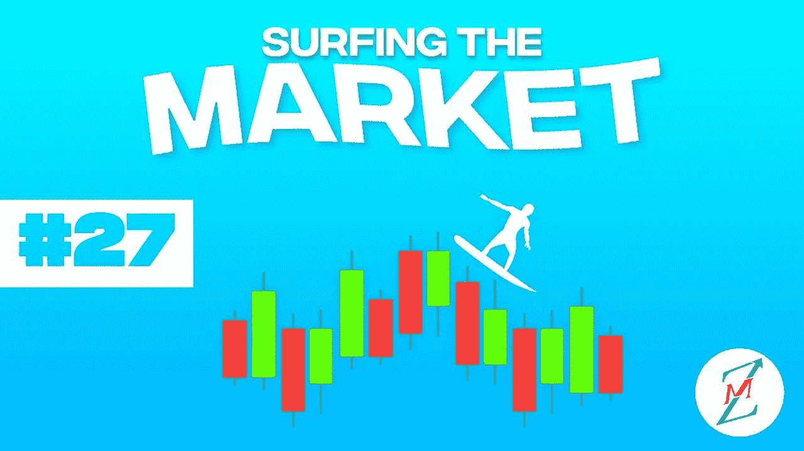

# 美国加息 75 个百分点后，比特币面临喘息之机

> 原文：<https://medium.com/coinmonks/bitcoin-faces-some-breathe-after-the-75-points-increase-of-usa-interests-ab99c444fded?source=collection_archive---------33----------------------->

我们将进入什么样的市场阶段一直是我们上次约会的开场白问题。我们要听牛市还是熊市？我们会看到牛市还是熊市？
欢迎来到“市场冲浪”,我们已经进行了第 27 次约会，我希望这些简单的技术分析能在某种程度上帮助你，甚至只是评估不同的市场观点。

## 让我们从我们通常的每周视角开始

Weekly Chart — Source: Tradingview

价格仍在运行至蓝色阻力线。

在利率上升 75 个点后，价格现在也在喘息，但现在是更加小心的时候了:牛市陷阱可能即将到来。

我会一直引用我自己的话:

> **如前所述，我个人认为，如果出现重大坏消息，如巨大的电力危机、移动网络危机或俄罗斯的天然气限制，比特币价格只能跌至 15000 美元。**

## **从日常角度来看，我期望什么？**

Daily Chart — Source: Tradingview

价格试图突破，但正如所说，首先，我会小心多头陷阱，当决定性的波动发生时，我会开始建立更大的多头头寸。

Daily Chart — Source: Tradingview

50MA 和 200MA 此时不再提供更多信息。所以我会搬到一片云

Daily Chart — Source: Tradingview

市云已经过去，21700 美元水平(市云是平的)必须强力通过，因为该水平可能代表另一个局部阻力。

## **特别观察什么？**

上周我写道:“我认为蓝色水平是短期趋势的一个潜在转折点。”而且是反弹到 20100 美元的时候发生的。

> 我仍然悄悄看涨，但我现在担心牛市陷阱可能会发生。当市场开始出现一些信心时，大玩家就会采取行动。

让我知道你对这个新的每周约会的想法，以及你希望更多地考虑(或甚至解释)哪些指标。

请继续关注，当我的内容出来时，请务必关注。

## 促销建议

还有一点:如果你真的不关心技术分析，或者你不喜欢花时间在市场上，一定要去看看 Zignaly 平台，这是一个币安官方的经纪合作伙伴，管理着大量的交易量。他们提供很好的利润分享交易服务，你可以模仿其他专业交易者，与他们分享利润！一定要给个眼神！

如果您有兴趣提前了解我们合作伙伴的指标发布情况，请在此留下评论，以便我们了解您是否有兴趣！

> 我写的任何东西都不能代表任何形式的财务建议。所以，在采取任何行动之前，先做好自己的研究。

> 交易新手？试试[加密交易机器人](/coinmonks/crypto-trading-bot-c2ffce8acb2a)或者[复制交易](/coinmonks/top-10-crypto-copy-trading-platforms-for-beginners-d0c37c7d698c)