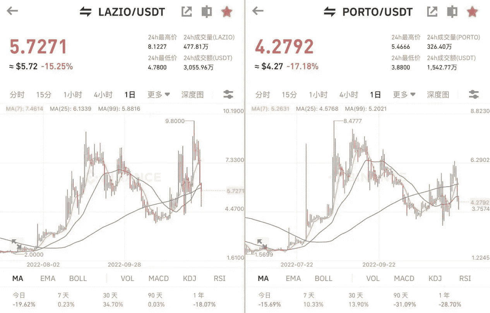
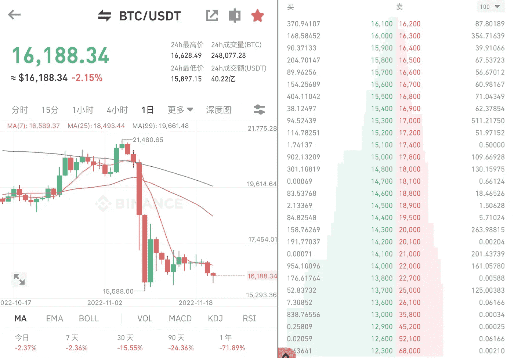
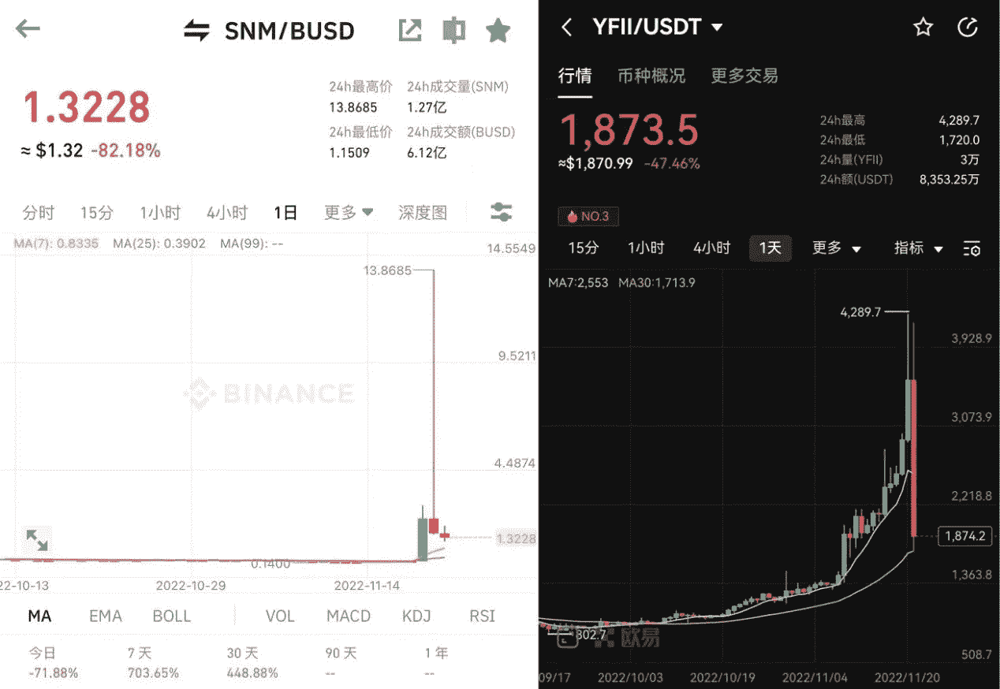
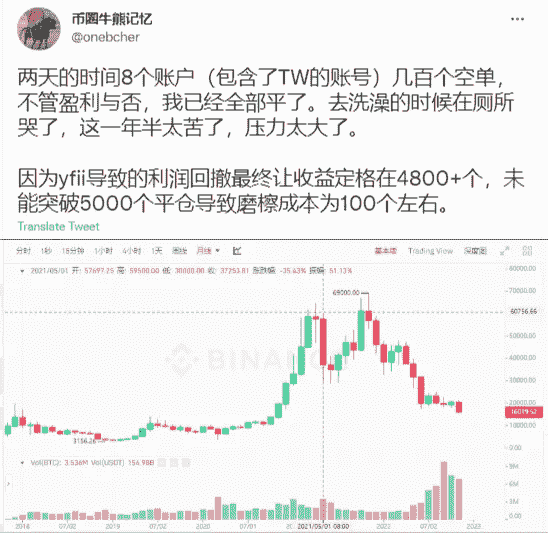
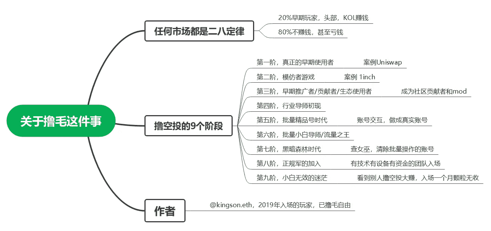

# 比特币跌破 16000 美元，世界杯主题代币减半

> 原文：<https://medium.com/coinmonks/bitcoin-falls-below-16-000-world-cup-themed-tokens-have-been-cut-in-half-d6562658778a?source=collection_archive---------10----------------------->

2022 年卡塔尔世界杯第一场比赛结果已经揭晓。主队卡塔尔不敌厄瓜多尔，0:2 告负，主场首战告负。

2022 Qatar World Cup

随着世界杯开幕，世界杯主题系列 TOKEN 全线下跌，福利已经提前释放。曾经很热门的物品，世界杯开赛前几天还涨，这两天连续下跌。

那些提前做好计划的人已经把腰包定了，追高的人只能看着曲线叹气，不知道下一个热点会是什么时候。

World Cup theme LAZIO and PORTO price trends

今天，BTC 价格再次跌破 16k 美元，一度跌至 15897 美元。市场已经对下跌免疫，再跌也不会有惊喜。熊市不讲底，没有最低，只有更低。

如果按照上一轮的叙述，牛市从高点下跌超过 85%，那么这次熊市有可能跌到 11k 吗？

在 BN 交易平台上，看到有玩家在 13k-15k 区间下单买入，有一个买家在 15k 下单 1398 BTC；有人把 959 BTC 放在 14k，都是在等低价。

可能要几个月才能达到低点，也可能瞬间暴跌，或者现在就是底部区间，谁知道呢？

Information on pending orders at BTC lows

熊市风险太大，大部分人亏钱比较快。没有这个坑，总会有另一个坑在等着；时不时有人带着巨大的利润离开市场，也有人归零后悲伤的离开市场。

**追高风险大。**

比如昨天 SNM 一天之内从 0.2 涨到 13.86，最大涨幅 6800%。当初没忍住追高的人，现在都在半山腰站岗。

还有这个 yfl，连续上涨 5 天后，不到一天从 4289 暴跌到 1873，单日跌幅超过 56%，被砍了一半。

SNM and YFLL pump and crash

**接了一年半的空单，结算了。**

这个大家伙用了一年半，最后成交了几百个空单。平仓后他哭了很多，他好累！

他没说什么单位最终收入固定在 4800+，也许是 BTC？不然他不可能这么情绪化。

按时间算，一年半前是 2021 年 5 月，是去年牛市的双峰之一，BTC 价格一度达到 64k。建仓做空后，没想到去年 11 月份再次刷新历史新高，涨到 69k 的历史高点，他又把它扛了下来。11 月以后一路下跌，跌破 60k，50k，现在 16k。

这期间不断有涨有跌，有时候一天十几个点，没有止损单，所以风险还是存在的。现在他已经全部套牢，可以认为是锁定利润，等待下一次机会。

持有空单这么长时间真的很折腾，压力大，很累，很不容易。能够在这么长的时间里，不被市场迷惑，不情绪化操作，对市场保持敬畏之心，也是一种大师级的操作。

他说要好好休息，毕竟小目标达到了，也要调整一下这么长时间高度紧张的神经。

The one-and-a-half-year-old order has been closed

**空投真的会爆炸吗？**

一位空投玩家整理了自己的空投路径，言辞诚恳，对想玩空投的玩家来说是很好的指导。

空投是光明之路吗？

任何市场都是 20-80 法则。肯定有 20%的人赚到了 80%的收入，剩下的要么在观望要么不够努力，要么在抱怨自己运气不好。

新玩家要想在空投的道路上有所收获，就必须脚踏实地的学习怎么玩，不断提升自己的技能。

大部分等着被喂的人都只有亏，要么被退回，要么油费不够。但也有真正通过空投致富的玩家。

不要羡慕别人的收获，看看他们日复一日怎么做基本功。

Several stages of airdrop

不景气的市场，看的越多，越焦虑。市场波动太大，大家都在炫富，你很迷茫，找不到方向。

新玩家不妨给自己找个定位，研究深耕一个小领域，会有收获的。

比如专注空投，定个目标每天做几个互动；或者关注 web3 项目，每天研究一个项目，看看不同的玩法。

或者决定投给某个目标，和时间做朋友；还是找一份兼职的 web3 工作，投入时间，获得经验和经济收益？

以上只是我个人观点，没有投资建议。我是楚小莲，我正在关注元宇宙和 web3。

> 交易新手？试试[密码交易机器人](/coinmonks/crypto-trading-bot-c2ffce8acb2a)或者[复制交易](/coinmonks/top-10-crypto-copy-trading-platforms-for-beginners-d0c37c7d698c)