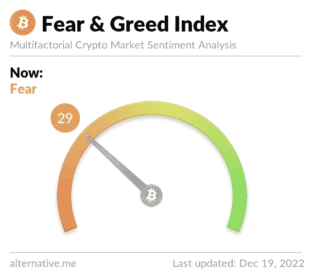

# 今日比特币恐惧和贪婪指数—2022 年 12 月 19 日

> 原文：<https://medium.com/coinmonks/bitcoin-fear-and-greed-index-today-december-19-2022-ec38f729c2f3?source=collection_archive---------43----------------------->

恐惧和贪婪指数是一个帮助投资者和交易者理解市场情绪的工具。它显示了市场恐惧和贪婪的程度。因此它被称为恐惧和贪婪指数。这个想法是，当市场感到恐惧时，它可能表明比特币有一个很好的购买机会。如果恐惧和贪婪指数是市场的信号…