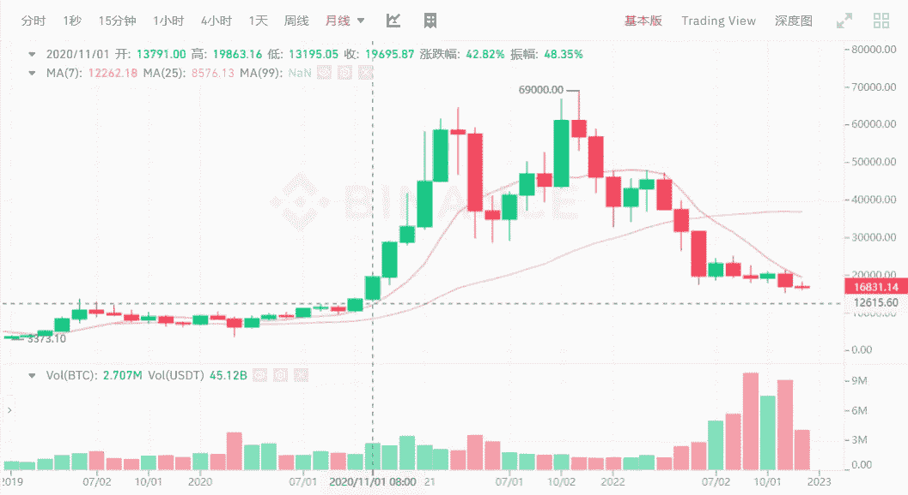
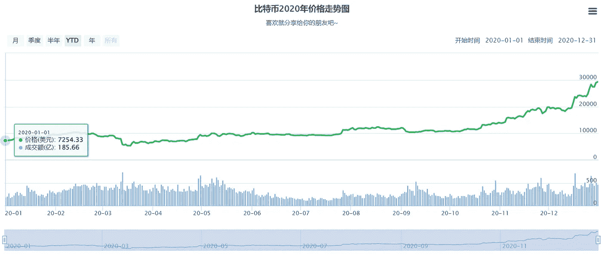
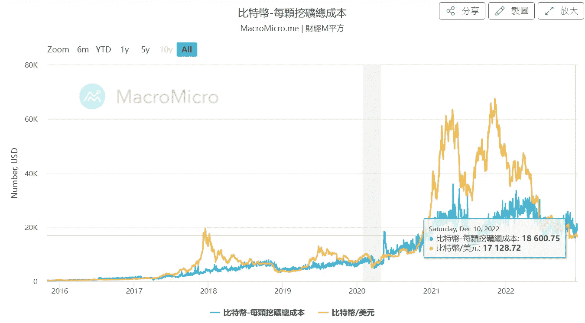
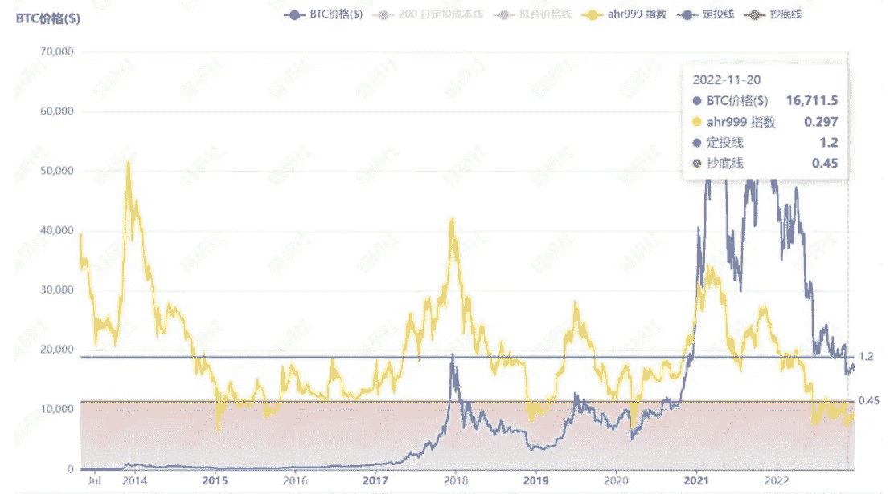
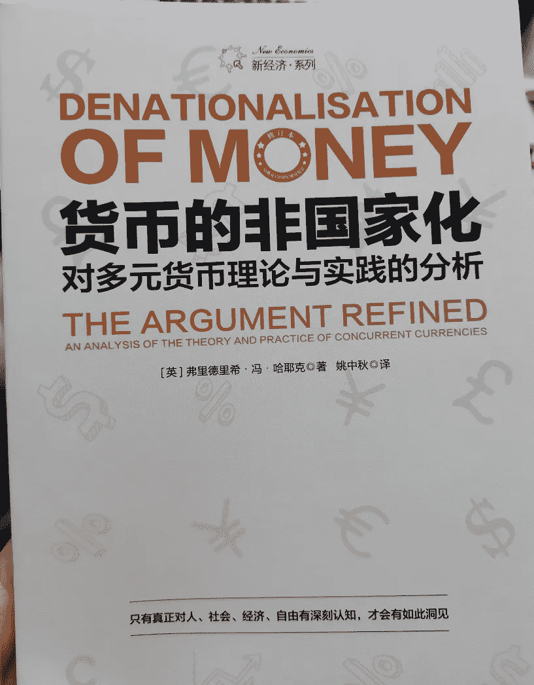
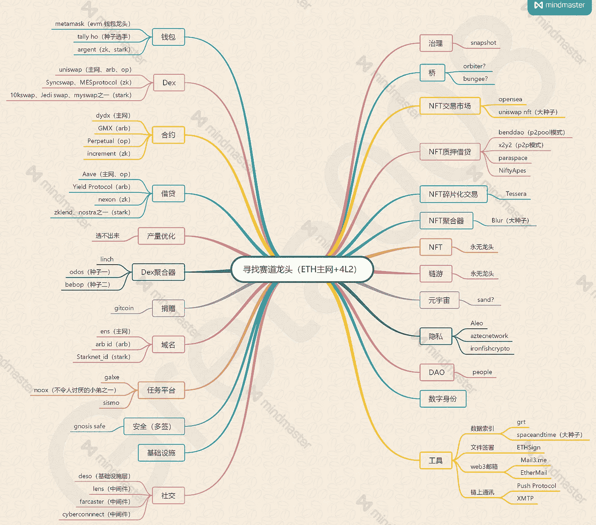

# 比特币跌到 16800 美元，是买底的时候了吗？

> 原文：<https://medium.com/coinmonks/bitcoin-fell-to-16-800-is-the-time-to-buy-the-bottom-123108f4afe3?source=collection_archive---------39----------------------->

今天 BTC 价格一度跌至 16256 美元，距离上月 15476 的历史低点仅 780 美元。

与去年 11 月 10 日 69000 美元的历史高点相比，已经下跌了四分之三，跌幅超过 75.6%。当时以 1000 美元购买，现在只值 244 美元。

这次 BTC 继续在低位徘徊，已经回到了 2020 年 11 月的价格区间，但是 2020 年是上升趋势，一路向上，从 16k 到 64k。

目前来看，涨跌对市场没有太大的反应。大部分用户习惯了熊市的缓慢下跌。没有最低，只有更低。

Bitcoin’s current price is $16,800

没有人能准确预测这个周期的底部会在哪里，也许是现在，也许更低。

去年 1 月初小联刚入圈的时候，听一个老玩家说，2017 年市场在上一轮牛市中是如何一路上涨的，市场又是如何一路下跌的。

他有一个朋友，当所有人都离开时，他选择在 BTC 投资。当时 BTC 的价格只有几千美元，很多人都不敢买。他的朋友坚持定投，然后在 2021 年慢慢迎来牛市暴涨。

不知道定投的朋友在 6 万多的时候有没有实现一部分。高点卖，低点买，就是赢家。

Bitcoin trend in 2020

数据显示，目前比特币挖矿成本已经趋于市场价。

根据财经 M 方整理的数据，受计算能力和各种因素影响，BTC 12 月平均挖矿成本为 1.8 万多，而市场价为 1.68 万多。

如果开采成本大于市场价格，部分矿主将会关闭，市场价格可能会进一步受到影响。

对于个人玩家来说，目前的买入价格比挖矿更合适。

有人整理了比特币抄底指数，目前数值为 0.304。根据指标给出的提示，现在适合抄底。

Bitcoin mining cost and market price

从比特币的发展周期来看，目前 16800 的价格是固定的，2 年内可能有 3–5 倍的收益，但未来的发展不能直接参考历史。

悲观者认为，比特币已经发展了 12 年，一个事物的发展周期会在 12 年后走下坡路。或许比特币的辉煌已经过去，但谁知道呢？区块链可能带来新变化？

Bitcoin fixed investment curve

在哈耶克的《货币的非国有化》中已经讨论过，除了法定货币，私人公司也可以发行自己的代币，货币也会像普通商品一样接受竞争，优胜劣汰终将被淘汰。

在市场竞争中，用户只能选择稳定的货币，结果市场化，从而实现货币改革，改善当前货币发行带来的各种通货膨胀问题。

而加密市场，或者也是一种尝试。

“The Denationalization of Money”

不知道市场的确切走向，也不知道下一个周期哪个项目会脱颖而出，一切都充满不确定性。其中，多互动，多参与，可能会遇到一定的机会。

比如这个专门做空投互动的玩家，在各个赛道梳理 ETH 链条上的龙头项目，有些还没发空投，可能是重点互动对象。

如果你是空投玩家的粉丝，可以找个互动教程，先做个互动，万一空投后来发了；如果没有做过任何互动，也可以找几个项目深入跟进。

The leading track on the ETH chain organized by a certain player

如果不知道怎么玩，怎么互动，不妨选择几个项目，重点跟进，体验参与，说不定能在其中找到机会。

比如数字钱包、web3 域名、任务平台、社交网络、NFT、游戏，专注赛道上的两三个领先项目，深度参与，不断完善。

无论是定投还是参与 web3 项目，这都是一个区块链游戏。如果找到合适的方法，深入探索，可能真的会发现各种机会。

任何投资都是自己的事。选择哪个方向或者轨道，会出现什么结果，都要等待时间给出答案。只要你保持探索的动力，学习就是赚钱的方法。

以上只是我个人观点，没有投资建议。我是楚小莲，我正在关注元宇宙和 web3。

> 交易新手？试试[加密交易机器人](/coinmonks/crypto-trading-bot-c2ffce8acb2a)或者[复制交易](/coinmonks/top-10-crypto-copy-trading-platforms-for-beginners-d0c37c7d698c)