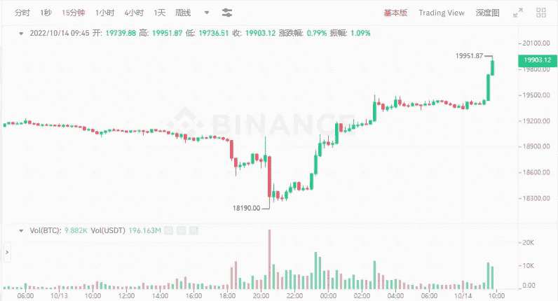

# 比特币跌至 18190 美元，以太坊的日活跃地址数量跌至 50 万个

> 原文：<https://medium.com/coinmonks/bitcoin-fell-to-18-190-the-number-of-daily-active-addresses-on-the-ethereum-bottomed-at-500k-559dfe7e8f6e?source=collection_archive---------33----------------------->

我看到一组数据，每个公链当前的日活跃地址。其中，连锁龙头以太坊连锁目前日活跃地址只有 500k，其他连锁的总活跃地址也只有 200k。他们中的许多人有多个钱包。

在其他公共链上，比如 Cosmos 和 Arbitrum，链上还有很多地址在相互交互，不一定是真正的项目交互。只能说目前加密市场的热度太低了。

Current daily active addresses of each public chain

受外部环境影响，比特币 pin 昨日暴跌，一度跌至 18190 美元。虽然还没有跌破上次低点 17622 美元，但是市场也很低迷。

今天 V 重回 19950 多美元，行情震荡，简直是天堂地狱。如果没有平和的心态，就会在这个圈子里疯掉。暴跌时不信任市场，极度失望，暴涨时没有提前上车，极度沮丧。

Bitcoin 15-minute deep V line

对于短线的挥杆游戏或者合约，如果预测准确，确实有很大的几率。比如这位朋友，昨天暴跌就赚了个盆满钵满。

他在 10 月初继续建仓，在昨天的短线暴跌中获利翻倍，累计获利 300 多万美元。

但这个赢家可能只是短期的。如果没有止损平仓，利润就还给市场。从 V 型上涨的底部，又涨了 8 个点，行情瞬间结束。

Temporary profit of 3 million USDT when the contract is shorted

这两天全民参与的 XEN 热已经过去了。这个实验项目在 5 天内完成了一个周期。

XEN 的价格下降了 162 倍。刚开始认捐时价格是 668 美元一天，现在只剩下 4.12 美元，还不够油费。只有第一天参加，认捐一天的人受益，其余的人没有汤，池子空了。

圈内热点很多，fomo 也很快，但是归零速度更快。那些在热火跟上 XEN 的人，现在都进退两难。多亏了收 XEN 的燃气费，如果他们不收完全是零。

短期内玩 XEN 是没有利润的。该项目已在包括 BSC 和 Polygeon 在内的 5 个网络上启动。未来剩下的就看实验结果了。

XEN price fell 162 times

有朋友说跟不上热点波动的速度，干脆不玩了。当你看到一个热点的时候，它已经涨了，再跟上操作就来不及了。还不如定投。

比如这群朋友昨天花了 18438 美元买了 5 个以上的比特币。今天，他们已经获得了 8 分，他们是一个适当的赢家。小玩家没有这个实力，小投入也是机会。前提是选择一个相对确定的目标，三天不会结束。

当然，定投一定要放在一个长期的周期里，看好市场的未来，做好长期的规划，才能有所收获。

$18,438 bought more than 5 bitcoins

同样的市场同样的机会，结果却完全不同。市场冷清，但无情的玩家很多。他们抓住了这个机会。

就像 Justin Sun 阁下一样，他比大多数普通人更成功，但他也是早上 5 点开始工作。真正优秀的人会更加努力。这个世界不缺机会，缺的是努力和运气。

处在时代的大潮中，你不知道未来的变化会怎样。与其被别人 fomo，不如选择一个方向，挖掘自己的机会。

以上只是我个人观点，没有投资建议。我是楚小莲，我正在关注元宇宙和 web3。