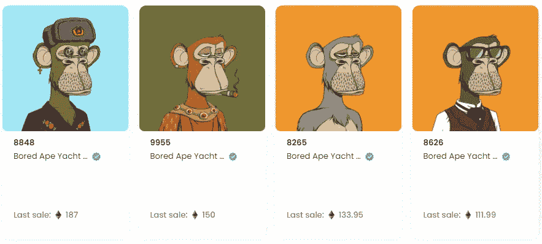

# 比特币跌到了 19300 美元，我买的 NFT 已经跌了 80%

> 原文：<https://medium.com/coinmonks/bitcoin-fell-to-19-300-the-nfts-i-bought-have-fallen-by-80-1ce31be7f4c?source=collection_archive---------17----------------------->

一个朋友问他现在是否可以买志那都红豆，这真是一个两难的选择。

志那都红豆目前的底价是 10ETH，13k 美元。相比之前近 40ETH 的楼面价，现在价格下降了 75%，也是比较低的一个点。

但都是相对的。

目前 ETH 价格持续波动，整个密码市场都在震动。现在谁也不知道买什么，是底部吗？以及 NFT 是否能像 BTC 一样继续叙事等。，能不能挺过整个低迷和熊市，我不知道。

但如果你能轻松拿出 10 ETH，或者如果你是一个真正的志那都红豆迷，如果你不心疼损失，你只是想加入志那都红豆社区，热爱这个系列，那就没什么好说的了。顺便说一下，志那都红豆在设计方面真的很棒！

Azuki’s current floor price is 10ETH

楚小莲搜索了自己和朋友购买的各种 NFT。大部分都跌了 80%。

蓝筹 NFT 跌幅相对较小，如村上隆的 CloneX 系列，跌幅仅 61%；有些没那么受欢迎，降幅超过 91%，比如 MURI 和阿尼梅塔；以及小众系列 Dipppies，跌幅 99.8%。

而且 ETH 购买时的价格是 2800 多美元，现在只有 1300 多美元，跌了一半。购买 NFT 要承受双重下行压力。

Some of the purchased NFTs have shrunk severely

NFT 拜克目前的地板价是 77.9ETH，10 多万美元。买不起的还是买不起。之前用 150ETH 购买的人并不关心价格的涨跌，这只是一种投资或实验方法。例如，中国互联网大亨蔡文胜的钱包里有 4 个 BAYC，都是上半年购买的。他们一共花了 583 ETH，平均价格在 145 ETH 左右。其中 BAYC#8848 是 187 ETH 高价买的。

如果单纯计算楼面价，已经亏了 271ETH。按照现在的 ETH 价格，已经亏了 36 万多美元。

The BAYC NFT held by Cai Wensheng

蔡文胜也在六月购买了大量的妖精城镇。总共有 53 个妖精城镇。购买价格从 2 到 15 ETH 不等。妖精下降了 82%。

当然，蔡文胜是一个长期投资者，NFT 只是他在区块链和 WEB3 的尝试。盈亏不是主要目的，探索和布局才是他的目标。

Goblin NFT floor price 0.98ETH

还有隐形朋友，现在楼面价 3ETH。这一系列中最高的交易是#1125。当时交易了 200 ETH。按照目前的跌幅，已经缩水了 98.5%。

看不见的朋友#1125 钱包的主人还持有志那都红豆、嘟嘟、月鸟等系列的蓝筹 NFT，其中不少都开出了该系列的最高价。

比如当时成交 420.7ETH 的志那都红豆#9605，是志那都红豆系列中成交最高的，现在已经缩水 97.5%。

还有 Dippies，当时卖出了该系列最高价 22.22ETH，现在楼面价 0.035ETH，跌幅 99.8%，几乎为零。

整体来看，蓝筹股的抗跌性更强，部分系列直接跌破零。

Invisible friend #1125 last traded 200ETH

有人说，只有项目共同建设者和长期持有者才有机会获得巨额回报。中短期玩家可能会有少量收入，但无法享受项目的长期价值。

长期持有的人有两种结局，要么回报巨大，要么体验为零。

回到开头，现在是否是买入 NFT 的好时机，还不清楚。

有一些艺术创作者，阿林·NFT，他们认为他们可以在这个市场上创造伟大的成就；有的短线选手只想找一个快速起飞的项目，完成羊毛后快速离场，不会陪伴项目成长；而一些玩家希望通过社区力量，共同建设项目，创造和开拓新的市场。

Turnover series top1 Azuki9605 and Dippie8321

这些都是探索方法。如果新玩家真的想买个 NFT 感受一下，可以根据自己的实力选择一个相对靠谱的项目。

如果有多余的 ETH，买几个 NFT 也不错。如果 NFT 的叙述持续到下一个牛市，你可能会获得几十倍的机会。

如果 ETH 量有限，不如放弃不确定性，在熊市中保持钱包平衡，等待下一个周期的腾飞。

以上只是我个人观点，没有投资建议。我是楚小莲，我正在关注元宇宙和 web3。

> 交易新手？试试[加密交易机器人](/coinmonks/crypto-trading-bot-c2ffce8acb2a)或者[复制交易](/coinmonks/top-10-crypto-copy-trading-platforms-for-beginners-d0c37c7d698c)