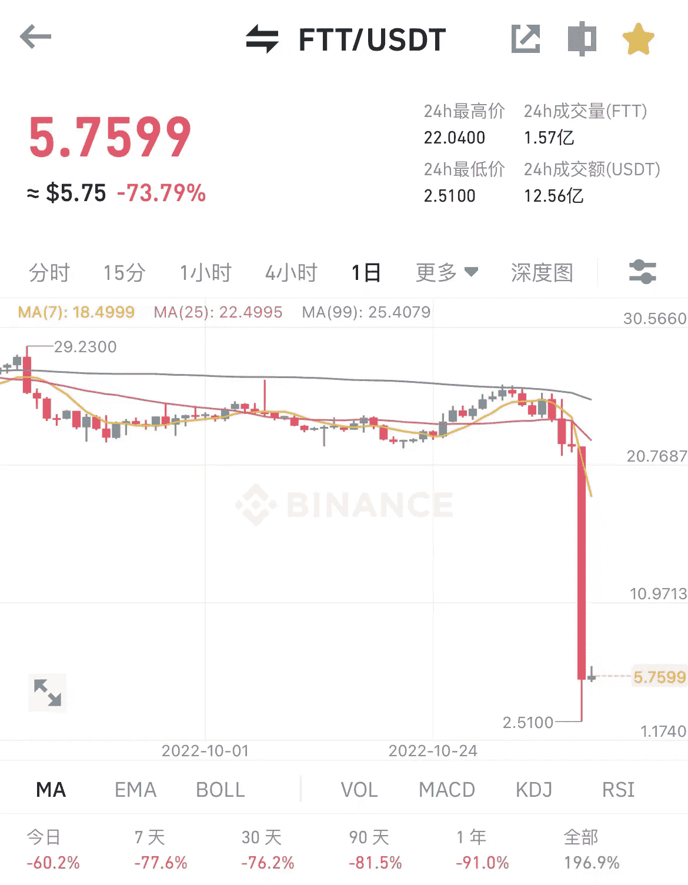

# 比特币跌至年内新低 17166 美元，加密市场的黑天鹅来了

> 原文：<https://medium.com/coinmonks/bitcoin-fell-to-a-new-low-of-17166-during-the-year-the-black-swan-of-the-encryption-market-is-34f428a66abf?source=collection_archive---------40----------------------->

这两天 FTX 平台被雷，FTT 从 25 跌到 2.5，跌幅超过 90%。

这是资产不透明导致的连锁爆炸。起初，FTX 在证明其资产实力的同时，被曝出挪用客户资金的问题导致用户恐慌。大量用户希望从 FTX 提取他们的余额，FTT 出现了挤兑。FTT 继续下跌。

The daily price of FTT fell by more than 90%

从披露的内容来看，CoinDesk 最初在 11 月 6 日发布文章称，FTX 母公司阿拉米达可能资不抵债；随后币安表示，考虑到风险，将出售 FTT。

11 月 7 日，更多的用户想卖掉 FTT，从 FTX 取出余额。大量提现导致平台暂时关闭，部分用户资产无法提现。

11 月 8 日，CZ 和 SBF 在互相推诿，火药味逐渐浓厚。FTT 一度跌至 17，FTX 很焦虑。

11 月 9 日 12:03，中车表示 14-21 可以收购 FTX，FTT，19k-20k 可以收购 BTC；

后来有消息透露，收购无法顺利完成。有人说 FTX 债务太重，有人说触发了反垄断法。FTT 从 21 跌至 2.5，BTC 从 2 万跌至 17166。

目前 FTT 价格暂时挂在 5.5，已经停止提现。市场对其缺乏信心，归零可能只是时间问题。BTC 现在的价格是 18400，圈内记录为 119 事件。

FTX has been withdrawn in large quantities and currently only holds 36.14BTC

一个朋友的主要资产在 FTX，他现在不能求婚。他只能看着市场暴跌，事情愈演愈烈，却无能为力。把资产放在一个集中的平台上，一旦平台发生变化，你就无能为力了。

另一名球员看到了 FTT 的价格，随着坏消息和好消息的不断爆出，他来回看了看，选择了买长 FTT。结果他 10 秒输了 100k Usdt，剩下的 10ustd 手动含泪平仓。

空单被爆，长单也未能幸免。

数据显示，BTC 集中平仓价格为 17k-19k，24 小时平仓价格为 7.68 亿。其中卖出 5.8 亿手多头，占比 75.51%；空单卖出 1.88 亿，占比 54.49%，市场一片哀嚎。

Explosion data on November 9th

大多数其他玩家眼睁睁地看着他们的钱包余额减少..市场的任何巨大波动，普通玩家都受伤；黑天鹅事件，无幸存者。

前几天市场回暖，有一种牛市回来的错觉。楚小莲的钱包余额增长了 10%。没想到的是，FTX 雷雨，即使不是平台用户，也不能幸免，余额直接下跌。

BTC 刚刚达到 21480 美元，但还没有企稳，新一轮暴跌又开始了。目前，FTX 似乎已经让整个市场崩溃了。不知道以后会不会有其他的揭露，会不会有更无情的结局。

BTC daily fluctuation

密码市场波动性很大，随时可能归零，即使是一个业绩持续一路上升的项目。

比如当年的露娜，如今的 FTX，在项目成长期，无论是好评还是收入都增加了光环。一旦操作失误，跌落神坛是迟早的事。

FTX 平台挪用客户资产，自行进行市场套利。如果他赚了钱，那就是你的，如果他赔了钱，顾客会付钱。

每一次熊市，都有大平台意想不到的倒闭、跑路、黑天鹅事件。如果 FTX 这次没有更多的筹码，或者剧情反转，就很难自救了。

the top figures in the crypto world

普通玩家开多份合同，归零真的是时间问题；前一分钟拉了 10 个点，下一分钟别针掉了 20%，完全违背人性。如果你不能承受市场趋势，就承认错误，止损。

现货玩家也要做好风险管理。可能要过几年才能摆脱被子。永远不要借鞋钉，因为无法预测终点会在哪里。没有最低，只有更低。
以上仅是我个人观点，无投资建议。我是楚小莲，我正在关注元宇宙和 web3。

> 交易新手？试试[加密交易机器人](/coinmonks/crypto-trading-bot-c2ffce8acb2a)或者[复制交易](/coinmonks/top-10-crypto-copy-trading-platforms-for-beginners-d0c37c7d698c)