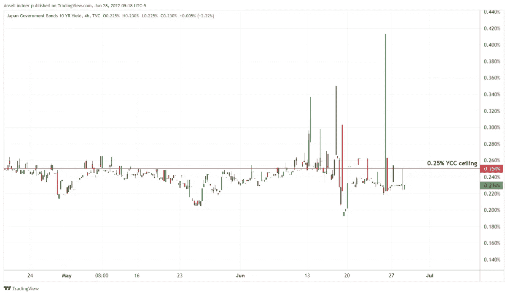

# 比特币修复了世界各地发生的经济飓风

> 原文：<https://medium.com/coinmonks/bitcoin-fixes-the-economic-hurricane-happening-around-the-world-9690c07f9b9d?source=collection_archive---------63----------------------->

随着日本银行试图控制收益率曲线，美国国内生产总值负增长，欧元区出现裂缝，比特币看起来是一个明智的赌注。

[在 YouTube 上看这一集](https://www.youtube.com/watch?v=dcPSSBKalRI)或者[隆隆](https://rumble.com/v1ahyic-is-bitcoin-the-ultimate-safe-haven-asset-fed-watch-100.html)

请听这一集:

*   [苹果](https://podcasts.apple.com/de/podcast/the-powell-pivot-ft-dylan-leclair-fed-77/id1543640492?i=1000548375330)
*   [Spotify](https://open.spotify.com/episode/7JSYduSIGR7r3ji6bYWVI1?si=4271451ef783459d)
*   [谷歌](https://podcasts.google.com/feed/aHR0cHM6Ly9mZWR3YXRjaC5saWJzeW4uY29tL3Jzcw/episode/YmEwYjgzYWUtYzE3NS00YjNlLTlkOWQtNTFhOWY5NzQ0YjMy?sa=X&ved=0CAgQuIEEahcKEwjYxcqm_7_1AhUAAAAAHQAAAAAQLA)
*   [Libsyn](https://fedwatch.libsyn.com/the-powell-pivot-ft-dylan-leclair-fed-77)
*   [阴天](https://overcast.fm/+m2acPUM10)

“美联储观察”是比特币创造者的宏观播客。每集我们讨论全球宏观时事，重点是中央银行和货币。

在这一集里，我和 Christian Keroles 将介绍日本在收益率曲线控制方面的发展(YCC)；在美国，关于增长和通胀预测；在欧洲，关于对分裂的担忧。在这一集的最后，我们通过回顾节目历史中的一些嘉宾和电话来庆祝“美联储观察”的第 100 集。

# 日本的大麻烦

在这一点上，日本的经济困境是传奇式的。他们已经经历了几个[低增长和低通胀的失落的几十年](https://en.wikipedia.org/wiki/Lost_Decades)，由当时最好的货币政策工具，由一些最好的经济学专家解决(也许那是错误的)。所有这些都不起作用，但是让我们花一分钟来回顾一下我们是如何走到这一步的。

日本在其巨大的资产泡沫破裂后，于 1991 年进入衰退/萧条。从那时起，日本经济年平均增长率约为 1%，失业率低，活力极低。这不是国内生产总值(GDP)负增长，但这是拥有经济脉搏的最低要求。

为了解决这些问题，日本在 2001 年成为第一个实施量化宽松(QE)的主要央行。在这种情况下，央行日本银行(BOJ)将从银行购买政府证券，试图纠正任何资产负债表问题，为这些银行放贷(又称印钞)扫清道路。

QE 的第一次尝试悲惨地失败了，事实上，导致增长率从 1.1%下降到 1%。保罗·克鲁格曼(Paul Krugman)等西方经济学家说服了日本人，他们声称日本央行失败是因为他们没有“可信地承诺不负责任”。他们必须通过让人们担心通胀来改变他们的通胀/增长预期。

2013 年的第二轮货币政策被称为“QQE”(定量和定性宽松)。在这一策略中，日本央行将对他们的挥霍行为造成“震惊和敬畏”，不仅购买政府证券，还购买其他资产，如东京证券交易所的交易所交易基金(ETF)。当然，这也失败了。

第三轮是 2016 年 YCC 的加入，日本央行将把 10 年期日本国债(JGB)的收益率固定在正负 10 个基点的范围内。2018 年，这一区间扩大到正负 20 个基点，2021 年扩大到正负 25 个基点，也就是我们今天的水平。

# YCC 之战

*(*[*Source*](https://www.fisherinvestments.com/en-us/marketminder/the-bank-of-japan-keeps-swimming-upstream)*)*

由于世界正在应对经济飓风导致的价格大幅上涨，日本政府债券收益率曲线正在上升，考验着日本央行的决心。截至目前，天花板已经被突破了几次，但还没有完全突破。

*(*[*Source*](https://bitcoinandmarkets.com/)*)*

*(*[*Source*](https://bitcoinandmarkets.com/)*)*

日本银行现在拥有超过 50%的政府债券，此外还有他们在股票交易所的巨大份额的 ETF。按照这种速度，整个日本经济将很快被日本央行所拥有。

[*(Source)*](https://twitter.com/DuncanLamont2/status/1541486843551686660?ref_src=twsrc%5Etfw)

日元对美元汇率也大幅下跌。下面是一美元兑换多少日元的汇率。

*(*[*Source*](https://bitcoinandmarkets.com/)*)*

# 美联储·DSGE 预测

美联储董事长杰罗姆·鲍威尔本周在国会面前表示，尽管上个月几乎所有经济指标都出现了下滑，但美国经济衰退不是他的“基本情况”。

在这里，我们来看看美联储自己的动态随机一般均衡(DSGE)模型。

自 2011 年以来，纽约联邦储备银行 DSGE 模型一直被用于预测经济，自 2014 年以来，其预测一直被公开。

当前版本的纽约联邦储备银行 DSGE 模型是一个封闭的经济，代表性的代理人，理性预期模型(尽管我们在建模最近的政策变化(如平均通胀目标)对经济的影响时偏离了理性预期)。该模型是中等规模的，因为它涉及几个总变量，如消费和投资，但它不像其他更大的模型那样详细。

正如您在下面看到的，该模型预测 2022 年第四季度到第四季度的 GDP 为负，以及 2023 年的 GDP 为负。这与我自己的估计和预期相符，即美国将经历长期但轻微的衰退，而世界其他地区将经历更严重的衰退。

在下图中，我指出了低增长和低通胀回归全球金融危机后(GFC)的常态，顺便提一下，这也是日本的常态。

*(*[*Source*](https://www.newyorkfed.org/research/policy/dsge#/interactive)*)*

*(*[*Source*](https://www.newyorkfed.org/research/policy/dsge#/interactive)*)*

# 欧洲防碎裂裂纹

在我们向“美联储观察”的观察者、听众和读者展示了欧洲央行(ECB)行长克里斯蒂娜·拉加德(Christine Lagarde)对反复出现的反分裂问题的沮丧情绪后仅一周，欧盟重量级人物、荷兰首相马克·吕特就像瓷器店里的公牛一样出现了。

我读了一篇来自彭博的文章的部分内容，其中吕特声称应该由意大利而不是欧洲央行来控制信贷息差。

碎片化有什么好担心的？欧洲货币联盟(EMU，又名欧元区)是一个没有财政联盟的货币联盟。欧洲央行的政策必须服务于不同负债水平的国家。这意味着欧洲央行的利率政策将对欧盟内的每个国家产生不同的影响，意大利、希腊和西班牙等负债更多的国家将承受更大的利率上升负担。

令人担忧的是，这些信用利差将导致另一场欧洲债务危机 2.0，甚至可能导致政治分裂。在这个问题上，各国可能会被迫退出欧元区或欧盟。

# 100 集回顾

这一集的最后一部分回顾了我们做出的一些预测和伟大的决定。然而，事情并没有按照我的计划进行，我们在草丛中迷路了。总的来说，我们能够突出展示我们在比特币领域提出的独特理论的成功之处:

1.  强势美元
2.  比特币和美元稳定的主导地位
3.  美国的相对分散化使其更适合比特币
4.  看空中国和欧洲

我们也强调了一些特别的来电，你必须听这一集才能听到。

我想强调这些事情，以展示我们反向观点的成功，尽管在比特币玩家中不受欢迎。这个节目是比特币领域的一个重要声音，因为我们正在推动和挖掘这些故事，以找到全球货币体系的真相。

这一集的图表可以在[这里](https://bitcoinandmarkets.com/fed100)找到。

这个星期到此为止。感谢观众和听众。如果你喜欢这个内容，请订阅，评论和分享！

*这是安塞尔·林德纳的客座博文。表达的观点完全是他们自己的，并不一定反映 BTC 公司或比特币杂志的观点。*

*原载于 2022 年 7 月 1 日*[*【https://bitcoinmagazine.com】*](https://bitcoinmagazine.com/markets/bitcoin-fixes-the-worldwide-economic-hurricane)*。*

> 交易新手？尝试[加密交易机器人](/coinmonks/crypto-trading-bot-c2ffce8acb2a)或[复制交易](/coinmonks/top-10-crypto-copy-trading-platforms-for-beginners-d0c37c7d698c)