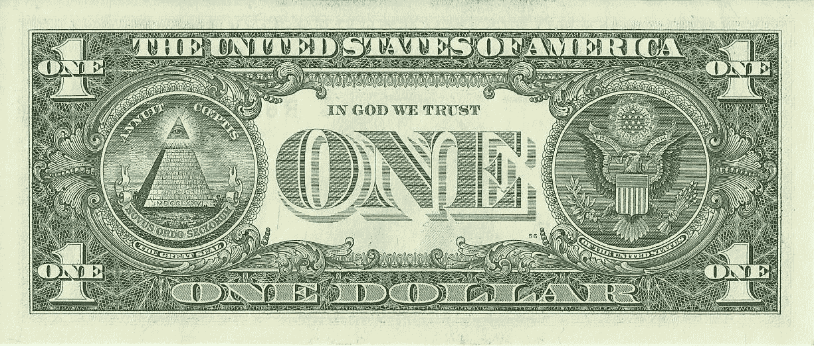
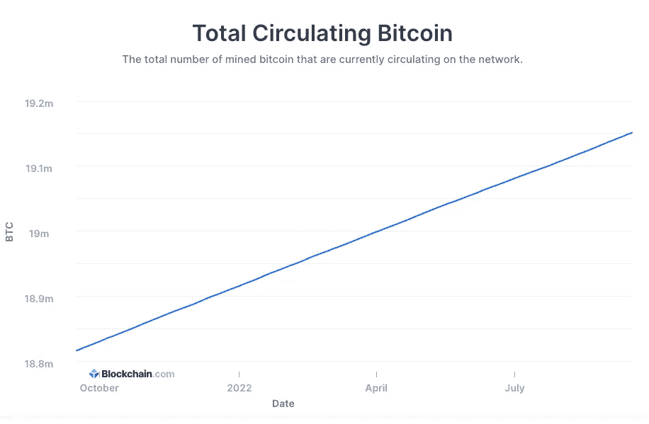

# 比特币和金钱的睡前故事，适合初学者

> 原文：<https://medium.com/coinmonks/bitcoin-for-beginners-3da4f9003224?source=collection_archive---------38----------------------->

那么，比特币是什么，它为什么有价值？你可以找到大量的定义，但是这篇文章旨在帮助你理解这个意思，而不是提供一个定义。

钱是什么？它是有价值的东西，其价值目前已被接受。没错。金钱从什么中获取价值？

起初，货币本身实际上有价值，因为硬币是由贵重材料制成的:金、银等。后来，让贵金属流通似乎不是一个好主意，甚至因为人们养成了“侵蚀”硬币边缘和抓取金粉的令人不安的习惯(这就是为什么，即使在最近的硬币中，经常可以看到边缘有缺口)。所以新的想法是:让我们把黄金存入银行，并发行相应数量的货币。英国在 1816 年率先这样做，我们称之为“金本位制”。

几个世纪后，其他问题出现了，因为有人必须检查储存的黄金数量，一些国家有黄金和其他有价值的货币，如英镑:这是金条标准。然后我们来到了布雷顿森林体系，在 1944 年，上帝兑换标准开始发挥作用:所有的货币都将参考美元，这将维持金本位制。

这并没有持续多久:1971 年，尼克松对此感到厌倦，在石油危机期间，暂停了与黄金的兑换，美元本身变得有价值:其他货币也是如此。充满讽刺的是，你可以在美国钞票上读到“我们相信上帝”——而不是黄金。

那么，货币从哪里获取价值呢？这是人民和政府向他们致敬的一种价值观。这就是为什么通货膨胀实际上没有刹车，这意味着一个国家可以决定在某一天发行两倍的货币:这意味着在同一时间框架内，这些货币的内在价值将减半。

2008 年，随着次贷危机和随后的金融冲击，一些人厌倦了这些习惯，厌倦了政府对那些制造这种崩溃的人的保护和纵容，决定发行一种独立的、非通胀的货币:一种发行数量有限、固定的货币，其发行量被设定为永久固定。此外，是政府和银行可以操纵货币:他们不仅可以发行更多，甚至可以阻止所有者提取或转移他们的钱。因此，这些人决定实现一个公共分类账，所有的交易都被永久记录下来，并向任何人开放以供核实。这种公共分类账会一天一天地建立起来，一笔又一笔地交易，并由多个“节点”核实，这些“节点”会因为维护这个链条而获得报酬:这就是区块链。我们所指的“人”取了中本聪的名字，货币是比特币。BTC 的发行总量为 2100 万，发行速度从一开始就在缓慢下降。今天，大约有 1915.2 万人在流通。

我不详述比特币区块链的技术层面，但回到开头，谁赋予了比特币价值？人们。但是，没有一家机构可以操纵、阻止、膨胀、从市场上撤回它。BTC 可以在几分钟内以最低的费用从一个人送到另一个人手中，在任何时候，任何一天。

这就是为什么 BTC 和 crypto 的支持者声称要把权力还给人民:因为没有中间人会站在中间，改变你辛苦赚来的钱的价值。

如果你想深入这个主题，你可以找到大量的信息。我建议在布法罗大学的 Coursera 上开设一门免费的在线课程， [**区块链基础知识**](https://www.coursera.org/learn/blockchain-basics?) ，内容涉及许多有趣的哲学和技术话题，其中就包括比特币。

如果你想阅读 [**比特币白皮书**](http://www.bitcoin.org/bitcoin.pdf) ，它是改变世界金融体系的负担得起的东西。

如果你想更多地了解中本聪，你不是唯一的一个。

> 交易新手？尝试[加密交易机器人](/coinmonks/crypto-trading-bot-c2ffce8acb2a)或[复制交易](/coinmonks/top-10-crypto-copy-trading-platforms-for-beginners-d0c37c7d698c)