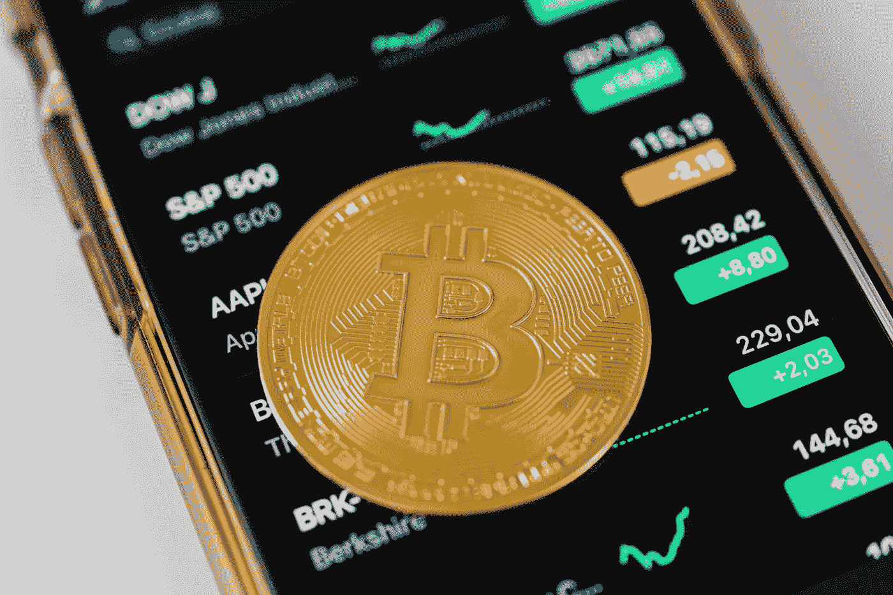

# 比特币初学者:使用和投资加密货币的循序渐进指南

> 原文：<https://medium.com/coinmonks/bitcoin-for-beginners-a-step-by-step-guide-to-using-and-investing-in-cryptocurrency-41cdeffaf5a3?source=collection_archive---------18----------------------->

Source photo [Gold Round Coin on Top of a Cellphone · Free Stock Photo (pexels.com)](https://www.pexels.com/photo/gold-round-coin-on-top-of-a-cellphone-5980856/)

比特币是一种没有中央银行或单点故障的数字货币。它促进了个人和实体之间的货币交易，而没有中央金融机构的参与。用这本书学习使用和投资比特币的基本原理。